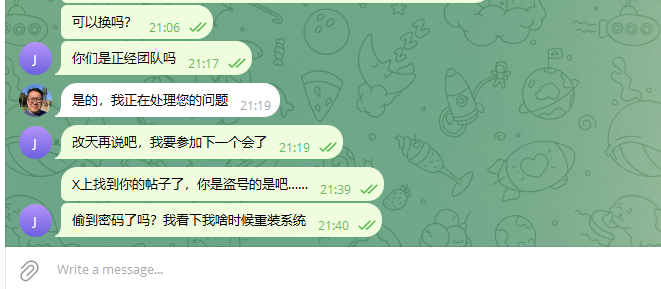

## 经过

9号早上收到一封招聘邮件，说是看到我的github账号，觉得我做的事情很有意义，想邀请我加入他们团队，我本身是做着一份远程工作的，看到有人主动联系我，还是想多赚点外快，所以加了他的tg准备约时间面试。


然后我就加了他的 tg 账号，开始跟他约面试时间


约了12号早上10点的zoom会议，来了一个老外，都没开摄像头，中文比较蹩脚，听起来像是东南亚的，然后就问了我一些经历啊，技术的问题，没聊多深，基本都是我在说，十几分钟后他说很满意，然后说让我等一下
马上给我约第二场会议。因为考虑到HR可能只是认识下候选人，所以我也没起疑心，去tg问了一下，然后就等他们联系我第二次面试。


第二场面试当天一直没等到，后来他跟我约了周一晚上8点45面。8点30多我上线，看到他问我要不要提前开始，我就说好，然后他就把会议链接发给我了，我也没多想，就点进去了，是一个没听说过的会议软件，叫什么 Weconne，我也没多想，以为是团队内部的聊天工具，然后点进去，能看到几个人，但是听不到他们说话，点击那个麦克风、视频按钮也都没有反应，我感觉很奇怪。我就回到tg问他能不能换一个聊天软件，说我这边网络不好。他就让我下载上面的APP，说这样网络会更好，我也没多想，当时有点着急，因为好几个人在会议室里等我，我就点了下载按钮去下载客户端。

下载到最后的时候，windows 的 Smart Screen防火墙提示了我不安全，让我不要保存这个文件。我也是没多想，我以为是误报，因为上个月买那个键盘升级固件，下载的exe文件也被防火墙提示风险了，所以我就点了依旧保存。

下下来之后，我运行这个 exe 文件，瞬间就又被防火墙给清除了。这时候我才反应过来可能是遇到钓鱼网站了。上google搜了一下 weconne.app，发现没有太多资料，有人在 X 上发文说遇到了招聘的钓鱼攻击，这时候我才反应过来，我也被钓鱼攻击了。



能咋办呢，只能怪自己缺心眼，安全意识太低。那么这个钓鱼软件，攻克我的系统了吗？我想应该是没有的，因为我双击那个exe文件之后，应该是打开了一个图形界面，但是很快瞬间就被我的防火墙发现然后退出了。我去tg问他盗号成功了没，他也没理我，我也不知道这个木马到底有没有瞬间找到我的敏感文件然后上传给服务器。

后来我立刻打开windows自带的防火墙，全盘扫描了一遍，没检测到风险。我又去下载了火绒剑，全盘扫描了一遍，也没发现风险。莫非是木马程序真的被windows防火墙清理了？

因为我9点半还有一个会，虽然知道自己这台电脑可能被黑客攻击了，但是我没法立刻切换到另一台电脑上，所以还是硬着头皮开了一个小时例会。会后，虽然杀毒软件都提示安全，但是我也是不敢再用了，正好也10点多了，赶紧关机。

第二天起来，重新开机，看了一下群里没人找我，应该没啥急事，左思右想觉得这台电脑不太安全，还是重装一下系统吧。于是我打开了我另一台笔记本，下了一个 opensuse linux的安装镜像，刻录到 USB上，然后给这台电脑重装了系统。

## 我的工作配置

现在来说下我的工作机器配置。我有一台 Dell XPS 15的笔记本，这台电脑装的是 Win11 系统，用了很久，主要是办公，写文档，看视频用，上面积累了几年来攒的各种乱七八糟的文件夹。我还有一台 Minisforum 的小主机，这台电脑的性能比我的笔记本要强劲，所以我给它安装了 windows 操作系统，并且配置了基本的开发环境，我拿它来日常办公写代码。

这上面的敏感文件大概有下面几类：

- `~/.ssh` 这个文件夹包含了我的ssh 私钥，因为我要访问 github，所以有一个私钥
- `.env` 这台电脑的磁盘上有几个我开发用的代码库，里面配置都在这个文件里，有一些数据库密码啊，测试的钱包私钥之类的
- 浏览器 cookie，浏览器的 cookie 信息如何保存的我不知道，也不知道有没有加密保存，万一被黑客上传到他的服务器了，是否能以我的身份登录我的 google, github, cloudflare 账号？
- metamask 钱包私钥，我因为要测试一些钱包功能，在这台电脑上安装了metamask，并且导入了我的钱包，不知道假设我的电脑被攻克了，黑客是否能拿到我的钱包控制权限。我的钱包有访问密码，还是比较长的，按理来说不太可能被攻破，这样就算拿到我的metamask缓存，也没法破解出私钥来。

其它的文件都不太敏感，给他看了就看了，无所谓。

## 观察结果

因为我不确定是否被攻击成功，所以这两天我都在观察是否账号有异常。首先 google, github, cloudflare 都有异地登录邮件提醒，我没收到邮件，所以这些账号应该还是安全的。其次我的这个钱包里大概有2000多块钱零钱，这点钱一直没人动，可能是钱太少引不起黑客的兴趣，也可能是黑客压根没拿到我的钱包私钥。

不管怎么说，电脑已经重装系统了，应该是已经安全了吧，那天晚上我只有这一台电脑在线，除非这个钓鱼软件把我家的局域网也给攻克，在我的手机上也安装木马程序，但是我想应该不可能这么厉害吧。不管怎样我已经把这台工作电脑的系统重装了，现在家庭网络应该是安全的了。

## 重新管理 ssh keys
上面说到我在 github 删除了老的 ssh keys，本地重新生成了一个，然后上传。这种方式我觉得还是不够安全，因为私钥文件还是保存在本地磁盘的，例如：`~/.ssh/id_ed25519`，如果电脑还是中了木马病毒，黑客还是能访问到这个文件，然后上传到自己的服务器上。最好的办法应该是保存到类似 bitwarden 这种专业的密码存储软件，或者 windows 凭据管理器里。但是我查了一下，这二者都无法保存 ssh key，不过推荐的做法是启用 `ssh-agent`，然后将私钥保存到 windows hello里，这样每次应用程序需要访问这个私钥，都会触发 windows hello授权一下，私钥本身我再保存到 bitwarden 里备份到别的电脑就行。

启用 ssh-agent 稍微麻烦点，首先要在 windows 可选功能里面，启用 openssh client服务。
然后到服务配置列表里面，确保这个服务已经开启而且配置了开机自动运行

Win+R:

```
services.msc
```


确保它已经启动

然后再把私钥添加到 agent 里

```shell
ssh-add $env:USERPROFILE\.ssh\id_ed25519
```

测试效果：
将 `~/.ssh/id_ed25519` 这个私钥，保存到 Bitwarden 里面，然后本地磁盘删除 `~/.ssh/id_ed25519` 这个文件。

因为我已经将这个pub key添加到 github ssh 作为 authentication key了，所以我只要push一个提交到 github，然后看看会不会唤起 windows hello 授权就行了


## 后续做的事情

到现在2天过去了，系统也重装了，账号钱包看起来都是安全的，但是我还是有点不放心，我怕我的 ssh keys 已经泄露了，如果这个文件泄露，黑客将能够访问到我的 github 账号，到时候可能会从我的私密仓库里偷东西。所以我把 github 的 ssh keys 也删了，重新生成了一个。

接下来我想做的事包括：

- 学习 windows 凭据管理软件的使用
    现在 `.env` 文件都保存的明文密码，虽然在自己电脑上无所谓，但是万一被黑客攻击也是风险，可以想想如何将密码添加到操作系统的保险箱里
- 放弃掉我现在的 metamask 钱包，换个新的。这个钱包用了4年，也绑定了我自己的 ens，平时还是比较常用的，但是安全无小事，接下来还是创建一个新的钱包，更妥善的保管私钥为好，慢慢把之前钱包上的各种代币转过去。
