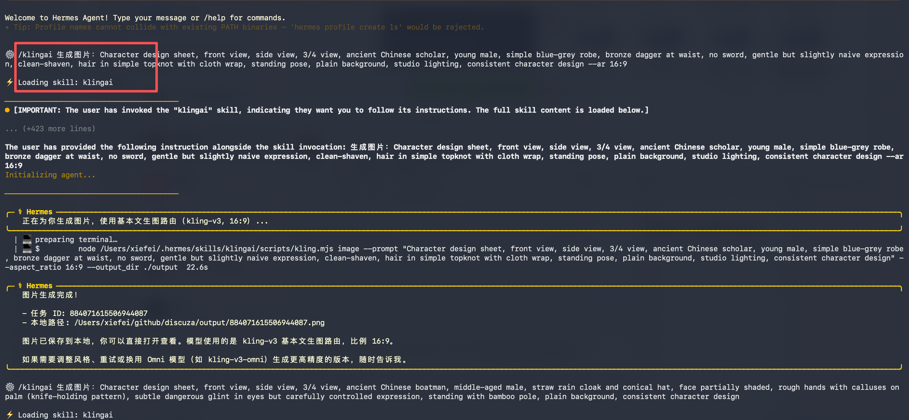
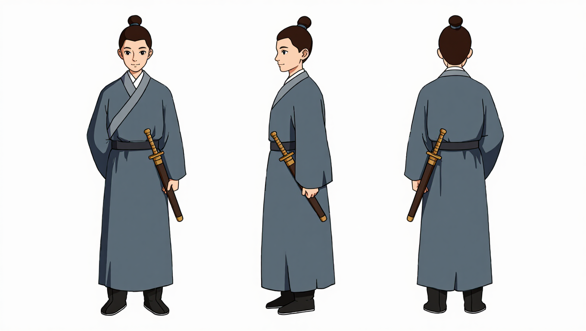
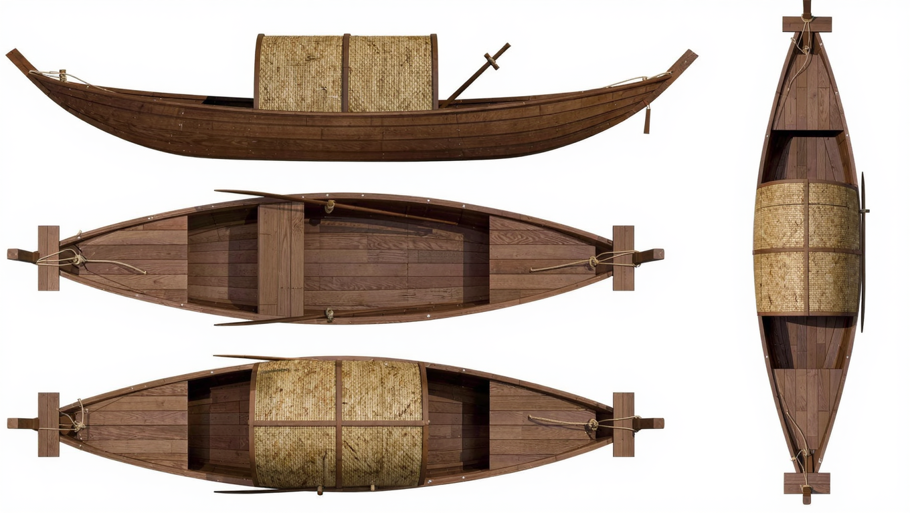
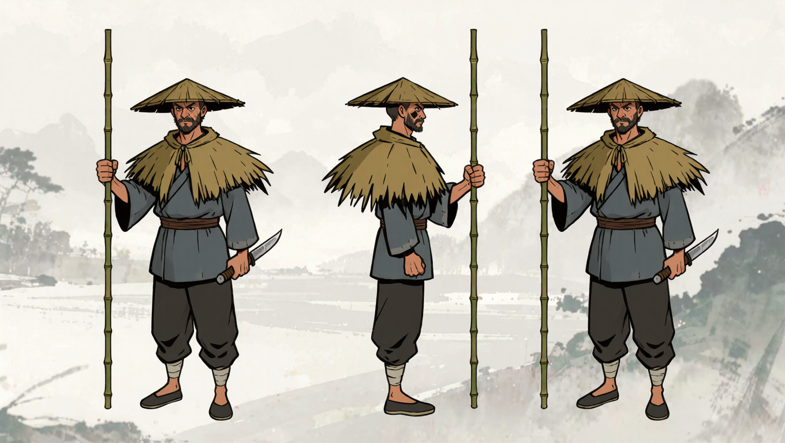
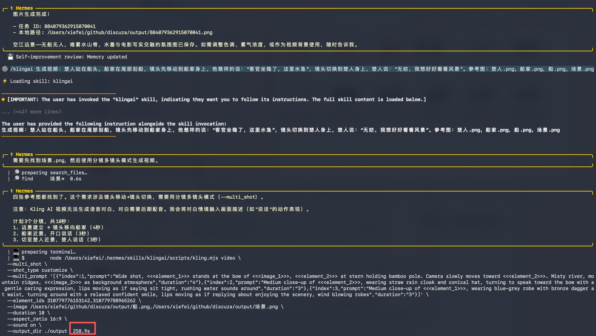
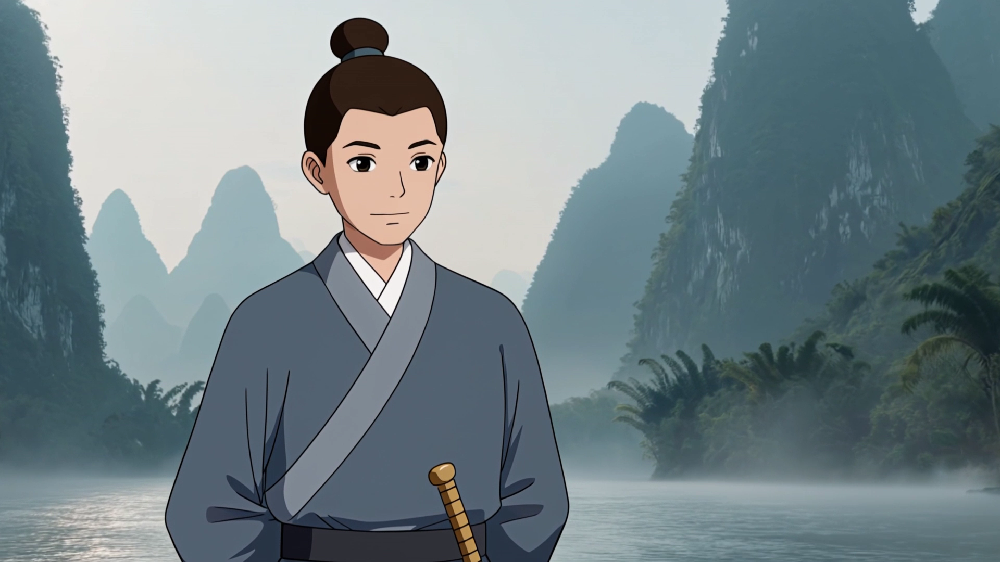
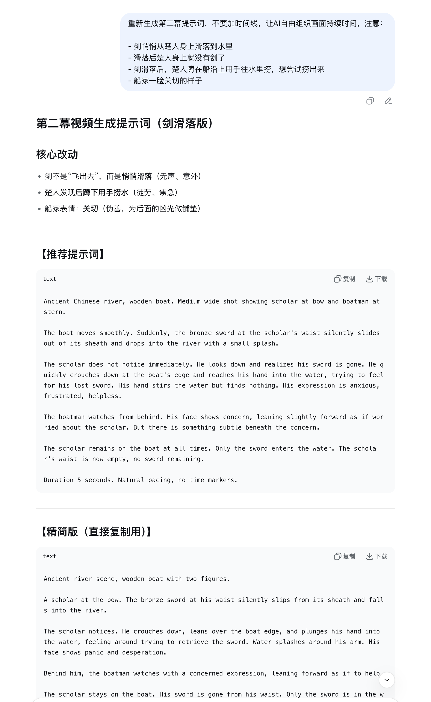
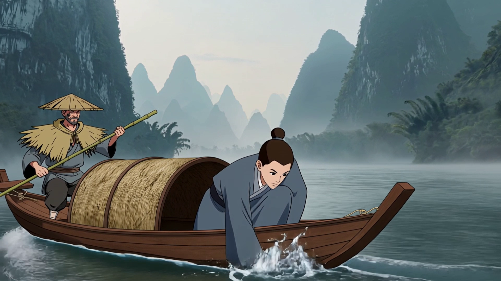

AI 生成漫剧的原理很简单，看过很多教学视频都是大同小异，核心就是生成主体定妆照，然后使用参考图生图 和 首尾帧生成视频的功能来生成每一幕场景，知道原理不够，这个过程需要大量练习，所以我决定找一个故事自己来生成一个视频试试

## 故事剧本

最近刷到一个抖音视频说《刻舟求剑》里面那个傻乎乎的船客其实并不傻，而是因为他怕船家发现他剑丢了没法自卫会有危险所以装傻，这个暗黑版的剧情，我感觉挺有意思，就用这个故事作剧本好了。

有了想法就让 deepseek 来生成剧本


AI 自动规划了6幕，一次生成的视频时长是5s或者10s，所以这6幕视频加起来总时长会在 30s到1分钟之间，基本够讲完这个故事了

## 生成主体图片

在这个动画中有4个主体，楚人，船家，船，江面，让我们来挨个生成这些图片，后续生成图片和视频都要用到这些素材，保持主体一致性。

我使用的工具是 hermes + klingai skill，因为我没有买可灵创作会员，我只买了一个70块钱一个月的接口资源包，所以只能使用接口，但是也够用了，我觉得这样还更简单，网页上那个工具点来点去还麻烦。

### 生成提示词

自己写生图的提示词当然可以，但是推荐用 deepseek 写，因为太长了，自己打几百个字很麻烦，直接给 deepseek 提需求：


楚人：

```markdown
Character design sheet, front view, side view, 3/4 view, ancient Chinese scholar, young male, simple blue-grey robe, bronze dagger at waist, no sword, gentle but slightly naive expression, clean-shaven, hair in simple topknot with cloth wrap, standing pose, plain background, studio lighting, consistent character design --ar 16:9
```

船家：

```
Character design sheet, front view, side view, 3/4 view, ancient Chinese boatman, middle-aged male, straw rain cloak and conical hat, face partially shaded, rough hands with calluses on palm (knife-holding pattern), subtle dangerous glint in eyes but carefully controlled expression, standing with bamboo pole, plain background, consistent character design --ar 16:9
```

船：

```
3D turnaround of ancient Chinese wooden boat, flat-bottomed river boat, about 15 feet long, curved bow and stern, wooden texture, bamboo awning at rear, oarlock, mooring rope coiled at bow, plain white background, orthographic views: front, side, top, isometric --ar 16:9
```

### 使用 klingai 工具生成图片

这个 skill 是官方提供的，使用方法见：https://klingai.com/document-api/apiReference%2Fskill 特别注意要配置好 apiKey 这些，否则调不通

按照教程安装好这个技能，打开 hermes，输入 /klingai 能看到自动补齐，说明就成功了，



这个skill的作用本质上就是使用自然语言，让 AI 调用了一个命令行脚本，我输入的是

```shell
/klingai 生成图片：Character design sheet, front view, side view, 3/4 view, ancient Chinese scholar, young male, simple blue-grey robe, bronze dagger at waist, no sword, gentle but slightly naive expression, clean-shaven, hair in simple topknot with cloth wrap, standing pose, plain background, studio lighting, consistent character design --ar 16:9
```

hermes 检测到我调用了 /klingai 这个命令，就将它转为了一个命令行调用，见下方的 `node kling.mjs image --prompt .....`

在当前文件夹新建了一个叫 `output` 的子文件夹，然后随机生成了一个图片名。

最终我得到的图片效果如下：

   

## 生成第一幕视频

第一幕的视频生成有2个可选路径，首尾帧生成视频和参考图生成视频，因为是第一幕还没有之前的视频，所以我决定使用参考图生成视频的方案，也就是把上面生成的4个主体图片，加上视频描述的提示词都丢给AI，让生成视频，命令：

```shell
/klingai 生成视频：楚人站在船头，船家在尾部划船，镜头先移动到船家身上，他慈祥的说：“客官坐稳了，这里水急”，镜头切换到楚人身上，楚人说：“无妨，我想好好看看风景”。参考图：楚人.png, 船家.png，船.png, 场景.png
```



花了4分多钟，生成了这个视频，效果如下：

<video controls src="/videos/刻舟求剑第一幕.mp4" title="第一幕"></video>

视频看起来可以，但是搞笑的是他们对话的语言竟然是英语，不知道咋改，先这么用吧，看后期能不能替换掉音轨

## 生成第二幕视频

第二幕就又有考虑了，是首尾帧生成视频，还是继续参考图生成视频？我觉得还是用首帧+主体图的方案吧

### 使用 ffmpeg 提取尾帧

第一幕视频有10s，要截取尾帧要自己想办法截取，我让 deepseek 给我写了一个 ffmpeg 命令做这件事：

```shell
ffmpeg -i "第一幕.mp4" -ss 9.9 -vframes 1 -qscale:v 2 "尾帧.png"
```



### 生成第二幕的视频提示词

还是找 deepseek 生成的

```markdown
[SHOT DESCRIPTION]
Shot type: Medium wide shot (boat from side, both figures visible)
Camera: Static for first 2 seconds, then slow pan right 5% in last 3 seconds

[ACTION SEQUENCE - 5 seconds total]
t=0s: Same as input frame. Boat moving smoothly.
t=0.5s: Boat hits rock. Sudden upward jolt. Water ripples outward from hull.
t=1.5s: Scholar's body lurches forward. Both hands grab boat edge. He is still ON boat.
t=2.0s: Sword sheath tilts to 45 degrees. Bronze sword slides out.
t=2.3s: Sword hits water surface. Splash. Ripples expand.
t=3.0s: Scholar looks down at water, arms still gripping boat edge.
t=5.0s: End frame. Scholar kneeling on boat looking into water.

[CONSTRAINTS]
- The scholar NEVER enters water. He stays on boat entire time.
- Boatman at stern visible in background, expression neutral.

Duration: 5 seconds
```

我还是不理解为什么 deepseek 和 可灵都喜欢生成英文的提示词，我明明没有说要用英文

### 生成视频

在 hermes 里继续调用 kling skill

```shell
/klingai 生成视频：[SHOT DESCRIPTION]
Shot type: Medium wide shot (boat from side, both figures visible)
Camera: Static for first 2 seconds, then slow pan right 5% in last 3 seconds

[ACTION SEQUENCE - 5 seconds total]
t=0s: Same as input frame. Boat moving smoothly.
t=0.5s: Boat hits rock. Sudden upward jolt. Water ripples outward from hull.
t=1.5s: Scholar's body lurches forward. Both hands grab boat edge. He is still ON boat.
t=2.0s: Sword sheath tilts to 45 degrees. Bronze sword slides out.
t=2.3s: Sword hits water surface. Splash. Ripples expand.
t=3.0s: Scholar looks down at water, arms still gripping boat edge.
t=5.0s: End frame. Scholar kneeling on boat looking into water.

[CONSTRAINTS]
- The scholar NEVER enters water. He stays on boat entire time.
- Boatman at stern visible in background, expression neutral.

Duration: 5 seconds
```

<video controls playsinline preload="metadata" style="width: 100%; max-width: 960px; border-radius: 12px;">
	<source src="/videos/刻舟求剑第二幕-1.mp4" type="video/mp4" />
	你的浏览器不支持 video 标签，请直接打开视频文件查看。
</video>

整体没有什么大问题，接上了第一幕的尾帧，人物场景都是一致的，但是就是剧情太傻逼了，剑是怎么掉水里的，掉水里后人应该很着急紧张都没拍出来，应该是上面那段英文提示词的问题，修改后继续生成


生成了3份提示词，随便选一个试试

```shell
/klingai 生成视频 Wide shot, ancient Chinese river, wooden boat.

0-1s: Boat jolts.
1-2s: Scholar's bronze sword flies out of its sheath, spins in air over water.
2-3s: Scholar reaches to grab it but fails. Sword falls into river with splash.
3-4s: Scholar leans over boat edge, distraught. 
4-5s: Boatman's eyes show cold, predatory glint. He smiles slightly.

IMPORTANT: Scholar stays on boat. Only sword enters water.
```

<video controls playsinline preload="metadata" style="width: 100%; max-width: 960px; border-radius: 12px;">
	<source src="/videos/刻舟求剑第二幕-2.mp4" type="video/mp4" />
	你的浏览器不支持 video 标签，请直接打开视频文件查看。
</video>

更离谱了，把剑甩出去，可怕，还要继续尝试



再生成一次

```shell
/klingai 生成视频 Ancient Chinese river, wooden boat. Medium wide shot showing scholar at bow and boatman at stern.

The boat moves smoothly. Suddenly, the bronze sword at the scholar's waist silently slides out of its sheath and drops into the river with a small splash.

The scholar does not notice immediately. He looks down and realizes his sword is gone. He quickly crouches down at the boat's edge and reaches his hand into the water, trying to feel for his lost sword. His hand stirs the water but finds nothing. His expression is anxious, frustrated, helpless.

The boatman watches from behind. His face shows concern, leaning slightly forward as if worried about the scholar. But there is something subtle beneath the concern.

The scholar remains on the boat at all times. Only the sword enters the water. The scholar's waist is now empty, no sword remaining.

Duration 5 seconds. Natural pacing, no time markers.
```

<video controls playsinline preload="metadata" style="width: 100%; max-width: 960px; border-radius: 12px;">
	<source src="/videos/刻舟求剑第二幕.mp4" type="video/mp4" />
	你的浏览器不支持 video 标签，请直接打开视频文件查看。
</video>

这次效果好多了，虽然也还是有穿帮，明确告诉了AI剑掉了后主角身上就没剑了，还挂着，不过先这样凑合用吧，接下来做下一幕

## 生成第三幕视频


先生成提示词


再截取第二幕的尾帧

```shell
ffmpeg -i "第二幕.mp4" -ss 4.9 -vframes 1 -qscale:v 2 "第二幕尾帧.png"
```



应用尾帧图片和AI提示词，生成第三幕视频

```shell
/klingai 生成视频 Ancient Chinese river, wooden boat. Close-up shot of the boatman's face under his straw hat.

The boatman's expression shifts through three distinct stages:

Stage 1 (first 1.5 seconds): His face shows genuine concern, leaning forward slightly, mouth slightly open as if about to offer help to the scholar who lost his sword.

Stage 2 (next 2 seconds): His eyes narrow. The concern drains from his face. A cold, predatory gleam appears in his pupils. His lips press into a thin line. His right hand begins to move toward a hidden weapon inside his bamboo pole. This is the face of a river bandit who sees an easy victim.

Stage 3 (final 1.5 seconds): He notices the scholar pulling out a bronze dagger and carving a mark on the boat's rail. The boatman's eyes widen slightly, then relax. The predatory look vanishes, replaced by a carefully neutral, almost respectful calm. He withdraws his hand from the weapon. His expression now suggests he has reconsidered something.

The boatman's face remains in frame throughout. Lighting is cinematic, half his face in shadow from the straw hat, his eyes catching the morning light at key moments.

Duration 5 seconds.

参考图：楚人.png, 船家.png，船.png, 场景.png，第二幕尾帧.png
```

生成的视频辣眼睛

<video controls playsinline preload="metadata" style="width: 100%; max-width: 960px; border-radius: 12px;">
	<source src="/videos/刻舟求剑第三幕-1.mp4" type="video/mp4" />
	你的浏览器不支持 video 标签，请直接打开视频文件查看。
</video>

这一幕讲的是他没捞到剑，所以掏出匕首在船上刻线，害得继续优化提示词

```shell
/kling 生成视频 Close-up of ancient Chinese boatman's face under straw hat. Half face in shadow.

0-1.5s: Concerned expression, leaning forward.
1.5-3.5s: Eyes narrow. Cold predatory gleam appears. Hand moves toward hidden weapon.
3.5-5s: Sees something off-screen. Eyes widen slightly, then relax. Predatory look vanishes. Returns to calm, neutral expression. Hand withdraws from weapon.

Cinematic lighting. Eyes catch light at key moments.
```

换了上面这个提示词后，还是不太行

<video controls playsinline preload="metadata" style="width: 100%; max-width: 960px; border-radius: 12px;">
	<source src="/videos/刻舟求剑第三幕-2.mp4" type="video/mp4" />
	你的浏览器不支持 video 标签，请直接打开视频文件查看。
</video>

非常无奈，折腾了2个多小时了，20秒多视频都没生成，先把这3幕视频合在一起，算是上午的尝试告一段落

```shell
echo -e "file '第一幕.mp4'\nfile '第二幕.mp4'\nfile '刻舟求剑第三幕-2.mp4'" | ffmpeg -f concat -safe 0 -i pipe: -c copy output.mp4
```

<video controls playsinline preload="metadata" style="width: 100%; max-width: 960px; border-radius: 12px;">
	<source src="/videos/刻舟求剑前三幕.mp4" type="video/mp4" />
	你的浏览器不支持 video 标签，请直接打开视频文件查看。
</video>

## 总结

不知道是不是这个故事更难拍，反正为了做这20s视频，我已经花了很多时间，剩下的几个镜头有时间再试试