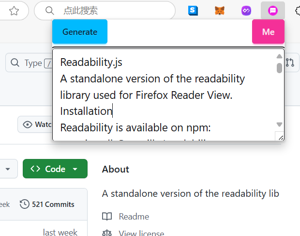
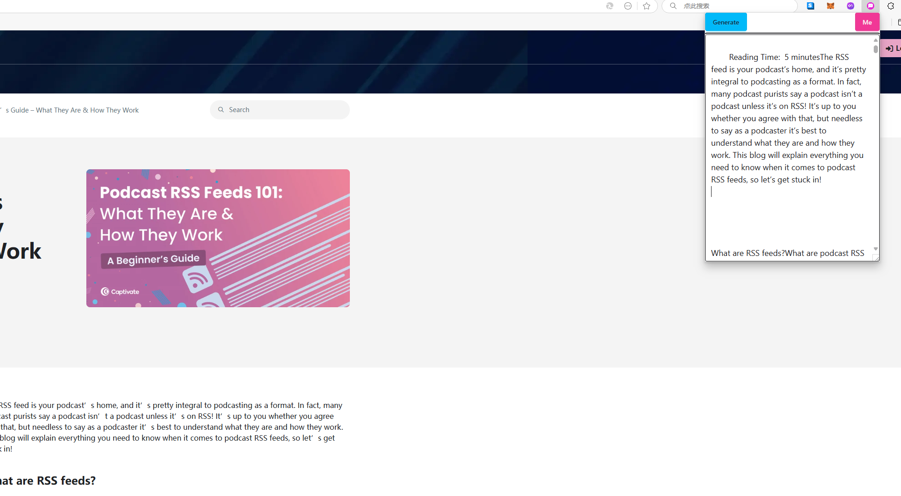
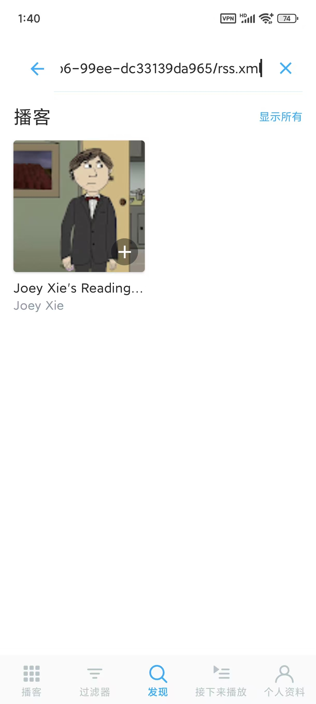
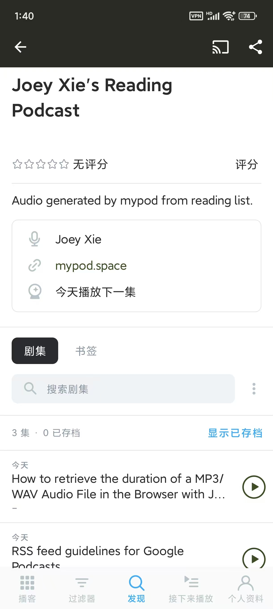
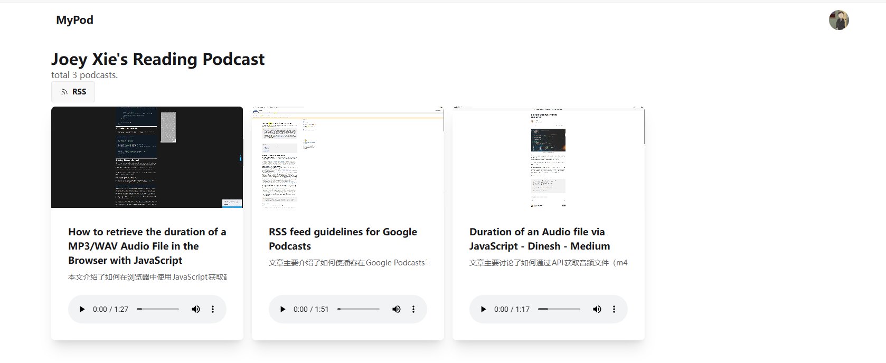

kokoro 是一个强大的本地文本转语音模型，模型小，大约只有300MB，推理速度快，生成效果也不错，看了几个博主的评测，因此自己也下下来体验了一下我试用了python版本，也在浏览器内体验了js版本，由此想到一个点子，能不能把这个模型打包成一个chrome扩展，这样就能在浏览器内实现文本转语音了。

## 评测 kokoro 模型

### kokoro-js

这是一个js的库，是一个 huggingface 员工开源的代码，但是比较简陋，他可能平时工作忙，只验证了最基本的功能就没继续做了。目前我试了他这个库，不管多长的文本，最多只能生成30s的音频。在我本地运行速度也比较慢，似乎实用性比较低。

### kokoro-onnx

这是一个python库，作者对于python运行AI程序应该比较熟悉，写了很多用例，生成效率也很高，速度大概是js版本的5倍吧。

## 点子

既然 kokoro 模型能在浏览器内运行，那么能不能打包成一个扩展程序呢？目前AI文本转语音接口的价格都还比较贵，比如说 ElevenLabs 的接口，一个月11美金才支持生成100分钟的音频，这个价格对我来说还是太贵了。我想将网页转为音频，然后丢到一个RSS服务器上让用户自己通过podcast客户端订阅，如果接口价格太贵，我可能还没收获几个客户，就被tts接口给弄亏本了。如果在浏览器内执行 tts，就算转一个网页5分钟，也是能接受的。

这个点子对我来说是可以实现的，但是第一步我要先学会写 chrome 扩展，以前从没写过，所以要从头学起。

## 学习写chrome扩展

chrome 扩展就是一个单页面应用，但是我以前没写过chrome扩展程序，所以要先花一两天时间看看教程，了解基本的用法，跟着做做练习，然后才能说自己写自己的扩张程序。

这里我将记录一下我把官方的教程看完后的体会

### 01-hello-world

[官方教程](https://developer.chrome.com/docs/extensions/get-started/tutorial/hello-world)

这是第一篇教程，教大家做一个 hello world 的插件，点击插件按钮会出现一个最简单的popup网页。
在这篇文章中，介绍了最基础的插件的知识。

清单文件 `manifest.json` 定义了插件的基本信息。必填 `manifest_version`, `name`, `version` 字段，剩下一些按需求选填。

这里因为是点击插件图标展示一个网页，所以 action 是一个网页

```json
{
    "action": {
        "default_popup": "hello.html",
        "default_icon": "hello_extensions.png"
    }
}
```

在这个 `hello.html` 里面还可以引入js文件，这个js是在插件上执行的，而不是在网页上执行的。

### 02-reading-time

[官方教程](https://developer.chrome.com/docs/extensions/get-started/tutorial/scripts-on-every-tab)

在这个教程中，我们实现了一个文章阅读时间统计的功能，并且把这个时间信息插入到标题下方了，在这里我们学到了插件如何通过 `content script` 来修改网页内容。

```json
{
  "content_scripts": [
    {
      "js": ["scripts/content.js"],
      "matches": [
        "https://developer.chrome.com/docs/extensions/*",
        "https://developer.chrome.com/docs/webstore/*"
      ]
    }
  ]
}
```

这个 `content script` 的意思是，在匹配到的网页下会执行这个 `content.js` 文件。我们都知道网页上的js是在浏览器构造好DOM后执行的，那么这个`content.js` 文件既然作用在当前网页的DOM上，是插入到DOM里了吗？答案是否定的，这个 `content script` 的执行环境跟网页里js的执行环境是独立的，这样避免了跟当前网页里的js产生冲突。

这个`content.js` 脚本的作用就是操作当前网页DOM，我们不需要它返回值，只需要用到它的副作用。据我自己测试发现，这个 `content.js` 只在网页加载进来后执行一次，要再执行一次就要刷新页面。

### 03-focus-mode

[官方教程](https://developer.chrome.com/docs/extensions/get-started/tutorial/scripts-activetab)

这个插件的作用是，点开后会修改当前网页的样式，让网页更简洁更专注。从这里开始学到了更多复杂的概念。

service worker:

这是插件的工作进程。跟网页的工作进程类似，我们都知道浏览器执行的js脚本是单线程的，如果页面上有一个js函数执行时间很长，占用的计算资源很多，可能就会抢占其它js函数被执行的机会，导致页面出现卡顿。为了解决这个单线程导致UI卡顿的问题，出现了 service worker 的概念，service worker 在另一个线程被执行，这样即使那个线程被阻塞，也不阻塞我们看到的网页UI，对于复杂计算很适合放这里执行。

```json
{
    "background": {
        "service_worker": "background.js"
    }
}
```

既然这个 `background.js` 是在后台执行的，那么什么时候执行的呢？这就看自己编写的代码了。可以定义事件处理函数，让插件安装完成后执行，也可以定义事件处理函数，当插件被点击后执行。为了避免后台脚本出现死循环一直执行，或者默默占用巨量资源，chrome定义了一个安全机制，就是这个后台调度执行不是连续的，可能30s后就被终止，也可能5分钟后被终止，具体看 service worker lifetime 那块的文档，因此我们设计代码时，可别放一个要执行好几分钟的函数进去，不然很可能每次都执行不完就被杀死。

action:

在第一个教程中介绍了 action 可以是一个 `hello.html`，在这里 action 变成了一段代码，点击icon的时候，不再弹出一个html窗口了，而是触发后台代码的执行

activeTab permission:

既然点击插件就触发代码执行，那么这些代码是在哪个tab上执行的呢？这里是通过定义权限，让这个插件仅仅在当前tab上执行，这样可以提高安全性，毕竟用户不会希望点击一个按钮，没打开的tab的数据也被插件访问到了。

```json
{
  "permissions": ["activeTab"],
}
```

scripting permission:

在 02 的教程中提到了可以用 content script 来修改当前网页的内容，但是这种方式要刷新页面才能生效，在这个教程中，不定义 content script 而是点击插件按钮后，触发一段js执行，然后修改当前网页DOM，所以需要给插件分配在网页上执行脚本的权限。

setBadgeText 保存状态：

这里介绍了一个最简单的办法就是通过设置插件的徽标文字来保存状态，这样脚本才知道点击插件图标是应该进入 focus mode 还是退出 focus mode

鼠标快捷键：

这个 `background.js` 现在定义的是点击插件图标触发执行，但是可以定义快捷键，模拟鼠标点击的操作。

```json
{
  "commands": {
    "_execute_action": {
      "suggested_key": {
        "default": "Ctrl+B",
        "mac": "Command+B"
      }
    }
  }
}
```

### 04-quick-api-reference

[官方教程](https://developer.chrome.com/docs/extensions/get-started/tutorial/service-worker-events)

这又是个更复杂的教程，涉及到了更多概念。在这个插件中，我们实现了一个 omnibox，让用户在地址栏里输入指定关键词进入 omnibox，然后按照建议打开对应的文档页面，然后在这个新打开的文档页又通过 content script 进行修改，在执行过程中，通过给 service worker 发消息进行交互，拿到一条随机的tip，插入到网页中。

omnibox：

之前教程讲的都是要点击一下插件按钮激活插件，这个插件是通过在浏览器地址栏输入特定关键词，进入插件的omnibox，根据程序，返回一系列 suggestions，点击某个suggestion后进入回调，这里是新标签打开网页。

```js
const URL_CHROME_EXTENSIONS_DOC =
    'https://developer.chrome.com/docs/extensions/reference/';
const NUMBER_OF_PREVIOUS_SEARCHES = 4;

// Display the suggestions after user starts typing
chrome.omnibox.onInputChanged.addListener(async (input, suggest) => {
    await chrome.omnibox.setDefaultSuggestion({
        description: 'Enter a Chrome API or choose from past searches'
    });
    const { apiSuggestions } = await chrome.storage.local.get('apiSuggestions');
    const suggestions = apiSuggestions.map((api) => {
        return { content: api, description: `Open chrome.${api} API` };
    });
    suggest(suggestions);
});

// Open the reference page of the chosen API
chrome.omnibox.onInputEntered.addListener((input) => {
    chrome.tabs.create({ url: URL_CHROME_EXTENSIONS_DOC + input });
    // Save the latest keyword
    updateHistory(input);
});

async function updateHistory(input) {
    const { apiSuggestions } = await chrome.storage.local.get('apiSuggestions');
    apiSuggestions.unshift(input);
    apiSuggestions.splice(NUMBER_OF_PREVIOUS_SEARCHES);
    return chrome.storage.local.set({ apiSuggestions });
}
```

输入关键字 `api` 激活插件，输入过程中，触发 `onInputChanged` 事件回调，在按下回车键时触发 `onInputEntered` 事件回调。

content.js 调用 service worker:

新标签页打开文档后，会执行 `content.js` 代码，修改当前DOM，这个教程是加了一个叫 `tip` 的按钮，点击后会展示一个 popover 然后在里面随即展示一条 tip，这就涉及到如何在 content js 里面取tip，可以直接发fetch请求去拿，但是也可以发消息从 service worker 去取。这里是通过后者实现的

```js
const { tip } = await chrome.runtime.sendMessage({ greeting: 'tip' });
```

后台这里定义了事件处理程序

```js
chrome.runtime.onMessage.addListener((message, sender, sendResponse) => {
    if (message.greeting === 'tip') {
        chrome.storage.local.get('tip').then(sendResponse);
        return true;
    }
});
```

### 05-tab-manager

[官方教程](https://developer.chrome.com/docs/extensions/get-started/tutorial/popup-tabs-manager)

在这个教程中，做了一个能管理tab的插件，又回到了 action 是一个html的状态，但是提供了一系列api去操作tab。在之前的教程中，我们知道插件中有3种js执行环境

1. content script: 在当前网页上执行
2. background.js: 在浏览器后台执行，但是可以通过activeTab 访问到当前网页数据
3. popup.js: 在插件内执行，window对象是自身，但是也能访问 chrome 对象

## 规划我的 kokoro tts chrome extension

chrome官方提供的插件开发的教程照着做了一遍，现在对如何做已经有一个基本的印象了，接下来就是想想该如何实现我这个点子。我希望做一个浏览器插件，首先会进行google oauth 登录获取身份，然后点击插件按钮会把当前网页内容提取出来，交给 kokoro-tts 在后台执行，
得到网页的audio后，调用接口把音频提交到服务器上，服务器提供一个 RSS 链接可以被任何设备订阅。

要完成上面这些目标需要实现：

1. popup.html: 检测当前url是否已经保存到服务器
2. background.js: 调用 kokoro.js 运行模型推理生成语音
3. background.js: 通过 alarm 定时检测本地是否有没转完成的文本，对于无法转换的，及时上报服务器

## 开始写我的 chrome 插件

有了前面的准备工作，就可以开始写我的第一个chrome插件了。前面的教程都没有用框架，完全自己写html和js，这种方式太原始了也很低效，比如说就写一个简单的counter，用原生js写都很麻烦，所以第一步是要选择一个开发框架。

网上能搜到很多插件开发的框架，我选择的是 [wrt](https://wxt.dev)，这个框架能支持用 svelte + typescript 开发，所以就按照官方的教程把相关配置都填上。

### 问题01： oauth 登录

因为我需要把用户生成的音频传到服务器上，所以需要有个账号系统，最简单的办法就是在插件内完成一次google oauth 登录，网页上跳转到谷歌授权然后跳回来实现登录都有现成的解决办法了，如何在插件中完成这个登录流程呢？

chrome 官方提供了一个 [教程](https://developer.chrome.com/docs/extensions/how-to/integrate/oauth) 在这个教程中，实现了一个oauth成功后，拿到 access token，再调用google接口获取通讯录的功能。需要：

1. 去谷歌后台创建oauth client选择 chrome extension client，需要用到extension app id
2. 去 chrome 后台注册成为开发者（第一次注册要交5美金）
3. 将插件打包为zip，上传到chrome后台，获取 app id以及public key

这些外部的操作都做完后，我照着官网的例子写了一个获取token的方法

```ts
async function getAuthToken() {
    const token = await chrome.identity.getAuthToken({ interactive: false });
    console.log('get auth token', token);
}
```

拿到浏览器上一测试就报错了，说是 edge 浏览器没有这个 api，后来查了一下才知道 `getAuthToken` 这个方法是 chrome 浏览器专属的，虽然edge是基于chrome的，都没有这个方法，所以只能换成 `launchWebAuthFlow` ，这个 api 支持多种 oauth provider，不仅仅限于google，github，facebook的oauth协议也可以用

自己看文档摸索这个 api 的用法太慢了，不如通过搜索引擎看看别人是怎么做的，搜到一篇最近的文章：[https://www.xiegerts.com/post/chrome-extension-oauth-web-auth-flow-firebase-google/](https://www.xiegerts.com/post/chrome-extension-oauth-web-auth-flow-firebase-google/)
打算参考这篇文章来实现一下我的登录。

照着这篇文章试了很多次，`chrome.identity.launchWebAuthFlow` 依然失败，错误提示是 `redirect_uri_mismatch`，这让我很头疼，作为一个 chrome extension app的 oauth client，根本就没配置回调链接，为什么会提示回调链接错误呢？

我搜了很久，找到了一个类似的[问题](https://stackoverflow.com/a/78863575/3122424) 在这个回答中，作者创建的不是 chrome app而是标准的web app，所以在配置回调链接的时候多配置了一个

```markdown
https://<extension-id>.chromiumapp.org/google
```

这样就好理解了，跳到谷歌的域名去进行oauth登录，登录成功后回调到这个 `chromiumapp.org` 的域名，实际就是浏览器插件的域名，会打开浏览器插件，我们可以在回调里面取到 google 返回的 access token，如何使用这个token就看自己的了，一般是拿它去请求一个 jwt token，保存在本地，自己处理好刷新流程。

折腾了几个小时，虽然没有搜到明确的结果，但是我自己总结一下，

1. chrome.identity.getAuthToken：如果要使用这个api，在google oauth后台就要创建chrome extension app
2. chrome.identity.launchWebAuthFlow：如果要使用这个api，则在google oauth后台创建web app

### 问题02：同步auth.js 登录状态

在上面通过 chrome 的 `chrome.identity.launchWebAuthFlow` 在回调中拿到了 google oauth 服务器返回的 access token，拿到这个token可以去调用谷歌接口获取用户信息。

```shell
curl -H "Authorization: Bearer the_accessTokenxxx" "https://www.googleapis.com/oauth2/v3/userinfo"
```

不过这是谷歌返回的登录状态，还得转换为我们网站的登录状态，这样才能把插件采集到的数据提交给服务器，因此这时的问题就成了如何通过 google 的 access token，进行 auth.js 登录。

我看了很久auth.js的文档，想看看能不能通过 access token 生成一个jwt保存在插件里，但是官方没有提供对应的接口，如果自己手动去写那4张表，当然是可以的，但是这样就把问题搞复杂了

### 问题03：在chrome extension中访问网站cookie

在上面遇到插件直接跟服务器鉴权的难题解决不了，但是一番搜索看到有人说可以共享状态，比如说我们网站的地址是 `https://mypod.space`，那么让插件调用 `https://mypod.space/api` 的时候，带上网页内的cookie不就行了，这样只要网站登录了，那么插件就能拿到cookie，那么就能向服务端发请求。

这个办法很好，就等于是在插件中不做登录流程，而是做一个按钮打开新标签页跳到网站去登录。开新标签页很简单，直接调用 `chrome.tabs.create({url})` 就可以，也不用担心回调的问题，直接跳回到网站首页就行，因为只要网站登录了，插件就有登录状态。

在插件内查询网站的cookie有点麻烦，需要2个配置：

```ts
permissions: [
    "cookies", // 查询cookie用于登录
],
host_permissions: [
    "*://localhost",
    "*://mypod.space/",
],
```

设置好permissions，这样保证插件能读到cookie，设置 host_permissions 确保插件只能读到我们定义的网站的cookie

### 问题04：设计popup UI

这个没什么好说的，还是用 tailwindcss v4 + daisyui v5，跟网站UI不同的是在这里不是popup应该固定最大宽高，避免被撑太长，我自己简单做了个界面如下：



第一个按钮点击后会发请求把采集到的页面内容提交给服务端保存，第二个按钮点击会跳到网站上的个人主页，在那里可以看到自己保存的网页。底下一个 textarea 用来展示采集到的页面内容。

开发插件的UI比较麻烦，因为不像网页有hot reload，我每次改了插件的UI代码都得先花几秒钟build一下，然后去浏览器 reload 一下插件，然后再点击按钮查看样式对不对，效率比较低。

### 问题05：读取页面主要文本

插件有自己的dom，当前网页有自己的dom，如何在插件的dom里，读到网页dom的内容呢？应该是无法直接读的，但是可以通过注入一段content script代码到当前网页，拿到数据后，在返回给调用方，也就是插件内的函数。

要实现这个功能需要额外添加2个权限：

```ts
permissions: [
  "scripting",
  "activeTab"
]
```

插件内调用的代码如下：

```ts
async function getCurrentTabContent() {
    const tab = await getCurrentTab();
    console.log("current tab", tab);
    if (!tab?.id || !tab.url?.startsWith("http")) return "";

    const results = await chrome.scripting.executeScript({
        target: { tabId: tab.id },
        files: ["content-scripts/content.js"],
    });

    console.log("document:", results);

    // @ts-ignore
    content = results[0].result.textContent;
    // @ts-ignore
    title = results[0].result.title;
    url = tab.url;
}
```

意思是在当前tab上注入 `content.js` 并执行，然后处理返回结果。在这里我使用了 `@mozilla/readability` 这个库来解析网页内容，不然网页形式千变万化，自己写解析器去解析有用的正文太难了，未来如果想提升解析效果，可以针对特定的网站做优化

### 问题06：本地调用 kokoro-js 生成音频

前几天在网页上调用 kokoro-js 生成音频的demo已经跑通了，所以想着快速迁移到这个插件上。我的做法是点击 Generate 这个按钮的时候，给 background.js 发一条消息，这个service worker 收到消息就会在后台慢慢生成音频，但是遇到一个重大问题，提示在 background 里面没法使用 import，
导致没法加载远程的模型，这个问题不好调试，因为依赖关系比较深：

`kokoro.js` --> `@huggingface/transformer.js` --> `onnxruntime-web`

一番搜索在 `onnxruntime-web` 的仓库找到了同样的问题，但是还没解决。[https://github.com/microsoft/onnxruntime/issues/20876](https://github.com/microsoft/onnxruntime/issues/20876)

看起来是 `onnxruntime-web` 这个库没有处理好js和wasm运行环境的问题，chrome extension里的service worker 也许和网页上的service worker 有区别，导致在网页上能跑的代码，放到chrome 插件里就跑不了。

我在自己的代码里尝试了很多修改，比如说改tsc build选项，改vite打包配置，改kokoro.js 的device类型等等，但是都没用，也许得等 `onnxruntime-web` 这个问题解决后，再 `@huggingface/transformer.js` 对应的依赖版本升级，再把 `kokoro.js` 的依赖升级，才能解决。

因此我只剩下2条路可以走：

1. 自己直接调用 `onnxruntime-web` 来生成音频，因为评论区有人说有的版本不报错，因此也许这个问题在新版本已经解决了。
2. 在服务器上生成音频

我决定还是先做一个服务端生成音频的版本，这样基本不会遇到难题，我只要把python的模型打包成docker，传到 azure container apps 就行了，onnxruntime-web 我还没怎么用过得花时间学习，掌握好了之后再集成到插件里，替换服务端生成音频的功能。

### 问题07：内容提取质量不高

上面说到我使用 `@mozilla/readability` 这个库来提取网页上的主要文本，但是很多特殊符号，代码，不相关的广告内容也被抓取到了，如果朗读的时候把这些内容也读出来，体验就很差，所以我决定再通过一个AI来总结一下这个网页，然后去读AI总结出来的文字，这样可以让AI只返回纯文本，就不会涉及到朗读代码和广告的尴尬了。

目前 chrome canary 有个实验性的特性是总结文本，是调用本地的gemini模型来进行推理的，不过不知道什么时候能正式发布，所以我绝对还是使用AI接口先应付一下。目前我是通过调用deepseek 的api来进行网页内容总结的，然后再调用 azure 的tts 接口进行语音合成。

## 最终效果

网站：[https://mypod.space](https://mypod.space)

插件主页面：



播客客户端订阅页面:

从网站中复制到自己的 rss 地址，粘贴到常用的播客客户端里，就能收听自己的电台了



播客客户端主界面：



网站用户主页：



## 发布扩展

使用 wxt 框架可以很方便地将插件发布到各个浏览器应用商店，通过 `bun run zip` 生成 zip 文件后，传到对应的市场上，填上相关信息，等待审核就行了。我目前用的是 edge 浏览器，所以我发布到了 chrome 和 edge 的应用商店上。

- [chrome app](https://chromewebstore.google.com/detail/mypod-space/bpjkhpggekhbjofkapefhjidgkbomkel)
- [edge app](https://microsoftedge.microsoft.com/addons/detail/mypod-space/hidhdmfkcncniamhjjhenbngmdbbolmp)

## 接下来要做的功能

- [ ] 尝试将AI总结和语音生成都放到浏览器里做，这样节省服务端成本
- [ ] 集成支付功能，让用户有机会付费
- [ ] 插件UI优化
  - [ ] 换成自己设计的icon
  - [ ] 登录按钮居中
  - [ ] 点击生成按钮出现loading状态
  - [ ] 本地缓存用户状态，避免每次都发请求拿
  - [ ] 配置选项，可设置使用什么语音，是否要翻译为特定的语言
- [x] 发布插件到 chrome 市场
