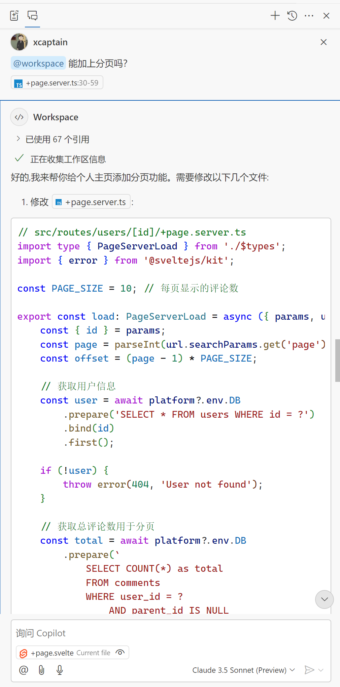
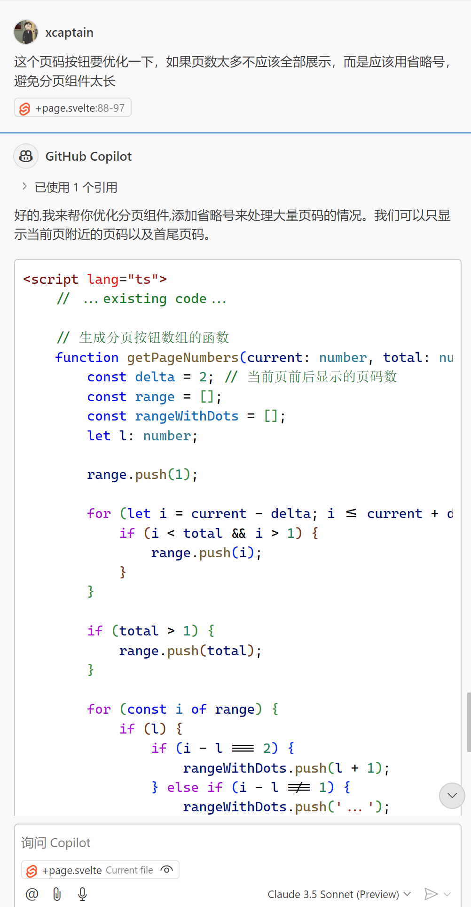

年前学习了一下如何做chrome扩展程序，并且发布了我的第一个程序 MyPod Space 到chrome和edge市场，走完了一个完整的开发、发布与宣传的流程。

- [MyPod Space chrome app](https://chromewebstore.google.com/detail/mypod-space/bpjkhpggekhbjofkapefhjidgkbomkel)
- [MyPod Space edge app](https://microsoftedge.microsoft.com/addons/detail/mypod-space/hidhdmfkcncniamhjjhenbngmdbbolmp)
- [v2ex anouncement post](https://www.v2ex.com/t/1108976)

这个MyPod Space 在 V2 上宣发完后，评论不多，应该是感兴趣的人不多，可能是这个点子就没什么亮点吧，暂时搁置一下，以后有时间再慢慢优化。学会了做浏览器插件，又在家过了个年，现在已经开始工作了。我在想还能写什么插件程序？还真让我想到了一个新点子，就是类似 medium 的内联评论系统。

现在做博客做网站的，如果想要添加评论的功能最简单的办法就是接入 disqus 之类的第三方评论系统，这种一般都是在网页正文下生成一个评论框，用户登录评论区后就可以发表评论。这种做法比较麻烦，因为要求站长接入第三方评论系统，要改一点网页代码。很多人是不愿意接入的，比如我这个博客就没有评论系统。事实上大部分的个人博客都没人评论的，一是站长懒得加，二是个人懒得去登录评论。

我现在要做的评论系统是一个浏览器插件，只要安装了这个插件的用户，就可以像在 medium 文章页上一样，选中一行文本，添加评论。微信公众号也有划词评论的功能，我也常用，比文末评论用的还多，因为这种交互方式比较友好，像是在网页上做批注，又好像是在网页上发弹幕，国内自媒体平台发评论之类的都有审核机制，因为评论发出去大家都能看到，必须要禁止一些不良内容发出来，但是通过插件来发评论的话，不会污染网页本身，你不想看到里面的评论很简单，卸载这个插件就行。趁着年前学习了chrome插件开发，现在还记得很多api的用法，抓紧时间把这个点子实现一下！

## 产品设计

目前只是一个初步的想法，我个人觉得这个点子很棒，但是市场前景怎样，有哪些竞品，该选择哪些核心功能开发都是问题，我可以拍脑门自己想到啥就做啥，但是最近 deepseek 的AI爆火了，所以我还是跟 AI 交流一下，先让它给我点建议吧，以下是我跟 deepseek AI 的一些对话：

> 我做了一个浏览器扩展程序，通过这个扩展程序，用户可以对当前网页进行选词高亮并且发表评论，你觉得这个点子如何？市场上有类似的流行的应用吗？

```md
你的浏览器扩展程序点子很有潜力，尤其是在内容互动和协作方面。以下是对这个点子的分析和市场上类似应用的概述：

### 点子分析

#### 优点：
1. **增强网页互动**：允许用户对网页内容进行高亮和评论，提升互动性。
2. **协作工具**：适合团队协作，如研究、编辑或学习小组，方便共享见解。
3. **个性化体验**：用户可以根据兴趣标记和评论内容，提升个性化体验。
4. **数据积累**：通过用户的高亮和评论，积累有价值的数据，用于改进产品或提供个性化推荐。

#### 挑战：
1. **竞争**：市场上已有类似工具，需找到差异化优势。
2. **用户隐私**：处理用户数据时需确保隐私和安全。
3. **扩展性**：需确保扩展程序兼容多种浏览器和网页类型。
4. **用户习惯**：改变用户习惯需要时间和有效的市场推广。

### 市场上类似应用

1. **Hypothesis**：
   - **功能**：允许用户在网页上高亮文本并添加注释，支持公开或私密分享。
   - **用户**：广泛应用于学术研究、教育等领域。

2. **Diigo**：
   - **功能**：提供网页高亮、注释、书签和标签功能，支持团队协作。
   - **用户**：适合个人知识管理和团队研究。

3. **Weava**：
   - **功能**：支持网页高亮、注释和内容分类，提供云端存储和团队协作。
   - **用户**：适合学生、研究人员和专业人士。

4. **Liner**：
   - **功能**：专注于网页高亮和注释，支持内容保存和分享。
   - **用户**：适合个人知识管理和内容整理。

### 如何差异化

1. **独特功能**：
   - **AI辅助**：利用AI提供智能高亮建议或自动生成注释。
   - **社交互动**：增加社交功能，如点赞、评论回复等，增强互动性。
   - **跨平台同步**：支持多设备同步，方便用户随时随地访问高亮和注释。

2. **垂直市场**：
   - **教育**：针对学生和教师，提供学习辅助功能。
   - **企业**：针对企业用户，提供团队协作和项目管理工具。

3. **用户体验**：
   - **简洁易用**：确保界面简洁，操作流畅。
   - **个性化**：提供丰富的自定义选项，满足不同用户需求。

### 总结

你的浏览器扩展程序点子有潜力，尤其是在增强网页互动和协作方面。虽然市场上有类似工具，但通过提供独特功能、专注垂直市场和优化用户体验，你可以找到差异化优势。建议进一步研究目标用户需求，进行市场验证，并持续迭代产品。
```

再问：

> 你觉得我这个扩展程序要加上网页涂鸦的功能吗？就是说如果是触屏设备，可以使用手写笔圈出内容，然后在网页上手写评论

```md
为你的浏览器扩展程序添加网页涂鸦功能是一个不错的想法，尤其是在触屏设备上使用手写笔进行圈选和手写评论。以下是对这个功能的分析和建议：

### 优点

1. **增强用户体验**：
   - **自然交互**：手写笔和触屏设备的结合提供了更自然的交互方式，特别适合需要快速标注的场景。
   - **灵活性**：用户可以通过涂鸦、圈选和手写评论更自由地表达想法，适合视觉化思考和创意表达。

2. **差异化优势**：
   - **独特功能**：目前市场上大多数类似工具主要依赖文本高亮和注释，涂鸦功能可以成为你的扩展程序的独特卖点。
   - **垂直市场**：这一功能在教育、设计和创意领域尤其有用，吸引特定用户群体。

3. **提升协作效率**：
   - **视觉反馈**：涂鸦和手写评论可以提供更直观的视觉反馈，适合团队协作和远程会议。
   - **即时沟通**：在网页上直接进行手写评论可以加快沟通速度，减少误解。

### 挑战

1. **技术实现**：
   - **兼容性**：确保涂鸦功能在不同浏览器和设备上都能稳定运行，特别是在触屏设备上的性能优化。
   - **精度和响应速度**：手写笔的精度和响应速度是关键，需要确保用户体验流畅。

2. **用户习惯**：
   - **学习曲线**：部分用户可能不习惯使用手写笔进行标注和评论，需要提供简单易用的教程和引导。
   - **输入方式**：需要支持多种输入方式（手写笔、鼠标、触摸屏），以满足不同用户的需求。

3. **数据存储和处理**：
   - **存储空间**：涂鸦数据可能比文本注释占用更多存储空间，需要考虑数据存储和同步的效率。
   - **数据处理**：手写评论可能需要额外的处理（如手写识别），以方便搜索和整理。

### 建议

1. **逐步迭代**：
   - **MVP版本**：先推出基本的涂鸦功能，收集用户反馈后再逐步优化和扩展。
   - **用户测试**：在小范围内进行用户测试，了解用户对涂鸦功能的需求和使用习惯。

2. **多平台支持**：
   - **跨设备兼容**：确保涂鸦功能在桌面、平板和手机等不同设备上都能良好运行。
   - **输入方式多样**：支持手写笔、鼠标和触摸屏等多种输入方式，提升用户体验。

3. **智能辅助**：
   - **手写识别**：提供手写识别功能，将手写评论转换为文本，方便搜索和整理。
   - **智能标注**：利用AI技术提供智能标注建议，如自动圈选重要内容或生成注释。

4. **社交互动**：
   - **共享涂鸦**：允许用户共享涂鸦和手写评论，增强协作和互动。
   - **评论互动**：支持对手写评论的点赞、回复等社交互动功能。

### 总结

添加网页涂鸦功能可以显著增强你的浏览器扩展程序的用户体验和差异化优势，特别是在触屏设备上使用手写笔进行圈选和手写评论。尽管存在一些技术实现和用户习惯上的挑战，但通过逐步迭代、多平台支持和智能辅助功能，你可以有效克服这些挑战，打造一个独特且实用的工具。建议先推出MVP版本，收集用户反馈后再进行优化和扩展。
```

看起来涂鸦功能也挺有市场的，但是不知道有没有类似的流行的应用了，所以再问：

> 市场上已经有类似功能的产品吗？

```md
是的，市场上已经有一些产品提供了类似的功能，特别是在网页标注、涂鸦和手写评论方面。以下是一些具有类似功能的产品：

### 1. **Microsoft Edge 的 Web Capture 和 Ink 功能**
   - **功能**：Microsoft Edge 浏览器内置了网页截图和涂鸦功能，用户可以在网页上进行手写标注和评论。
   - **特点**：集成在浏览器中，使用方便，支持手写笔和触摸屏设备。

### 2. **Kami**
   - **功能**：Kami 是一个PDF和文档标注工具，支持文本高亮、注释、涂鸦和手写评论。
   - **特点**：广泛应用于教育领域，支持协作和云端存储。

### 3. **OneNote Web Clipper**
   - **功能**：OneNote 的网页剪裁工具允许用户截取网页内容并保存到 OneNote 中，支持手写注释和涂鸦。
   - **特点**：与 OneNote 深度集成，适合个人知识管理和团队协作。

### 4. **Evernote Web Clipper**
   - **功能**：Evernote 的网页剪裁工具允许用户保存网页内容并添加文本注释和高亮，部分支持手写注释。
   - **特点**：强大的笔记管理和搜索功能，适合个人和团队使用。

### 5. **Notability**
   - **功能**：Notability 是一款笔记应用，支持手写笔记、涂鸦和标注，可以导入网页内容进行注释。
   - **特点**：专注于手写体验，适合教育和个人使用。

### 6. **LiquidText**
   - **功能**：LiquidText 是一款文档阅读和标注工具，支持手写注释、涂鸦和高亮，特别适合处理长文档和复杂内容。
   - **特点**：强大的视觉化标注功能，适合研究和学术用途。

### 7. **Xodo**
   - **功能**：Xodo 是一款PDF阅读和标注工具，支持手写注释、涂鸦和高亮，可以在网页上直接使用。
   - **特点**：跨平台支持，适合个人和团队协作。

### 如何差异化

尽管市场上已有类似功能的产品，但你可以通过以下方式实现差异化：

1. **专注浏览器扩展**：
   - **无缝集成**：作为浏览器扩展，提供更无缝的网页标注和涂鸦体验，无需切换到其他应用。
   - **实时协作**：支持实时协作功能，允许多用户同时在同一网页上进行标注和评论。

2. **AI辅助功能**：
   - **智能标注**：利用AI技术提供智能标注建议，如自动圈选重要内容或生成注释。
   - **手写识别**：提供手写识别功能，将手写评论转换为文本，方便搜索和整理。

3. **社交互动**：
   - **共享涂鸦**：允许用户共享涂鸦和手写评论，增强协作和互动。
   - **评论互动**：支持对手写评论的点赞、回复等社交互动功能。

4. **跨平台支持**：
   - **多设备兼容**：确保涂鸦功能在桌面、平板和手机等不同设备上都能良好运行。
   - **输入方式多样**：支持手写笔、鼠标和触摸屏等多种输入方式，提升用户体验。

### 总结

虽然市场上已有一些产品提供了类似的功能，但通过专注浏览器扩展、引入AI辅助功能、增强社交互动和跨平台支持，你可以实现差异化并吸引特定用户群体。建议先推出MVP版本，收集用户反馈后再进行优化和扩展。
```

看起来做网页涂鸦和手写评论的产品也很多，那么再问问 AI 有没必要把这些功能集成到我这个扩展里面去

> 你觉得我现在这个浏览器扩展是应该专注于做网页文本高亮和评论，还是应该加上手写涂鸦功能

```md
是否专注于网页文本高亮和评论，还是扩展到手写涂鸦功能，取决于你的目标用户、市场需求以及你的资源和开发能力。以下是一些分析和建议，帮助你做出决策：

---

### **1. 专注于网页文本高亮和评论**
#### **优点：**
- **开发成本较低**：文本高亮和评论功能相对简单，开发和维护成本较低，适合独立开发者或小团队。
- **用户需求明确**：文本高亮和评论是许多用户（如学生、研究人员、内容创作者）的核心需求，市场验证较为成熟。
- **快速迭代**：可以快速推出MVP（最小可行产品），收集用户反馈并持续优化。
- **专注核心体验**：专注于文本高亮和评论，可以打磨出更流畅、更稳定的用户体验，建立口碑。

#### **适合场景：**
- 如果你的目标用户主要是需要快速标注和分享文本内容的人群（如学术研究者、学生、编辑等），专注于文本高亮和评论可能更合适。
- 如果你希望快速进入市场，验证想法并积累用户，专注于核心功能是一个更稳妥的选择。

#### **潜在挑战：**
- 市场竞争激烈，已有类似工具（如Hypothesis、Diigo等），需要找到差异化优势。
- 功能相对单一，可能难以吸引对视觉化标注有需求的用户。

---

### **2. 加上手写涂鸦功能**
#### **优点：**
- **差异化优势**：手写涂鸦功能在浏览器扩展中较为少见，可以成为你的产品的独特卖点。
- **吸引特定用户**：手写涂鸦功能对教育、设计、创意领域的用户（如教师、设计师、产品经理）非常有吸引力。
- **提升用户体验**：手写涂鸦提供了更自然的交互方式，特别适合触屏设备和手写笔用户，增强用户的参与感和创造力。
- **扩展使用场景**：涂鸦功能可以扩展到更多场景，如在线教学、团队头脑风暴、网页设计反馈等。

#### **适合场景：**
- 如果你的目标用户包括需要视觉化标注和创意表达的人群（如设计师、教师、产品团队），手写涂鸦功能将非常有价值。
- 如果你希望打造一个更具创新性和差异化的产品，涂鸦功能可以帮助你脱颖而出。

#### **潜在挑战：**
- **开发复杂度高**：手写涂鸦功能需要处理更多技术细节（如笔触精度、性能优化、跨设备兼容性等），开发成本较高。
- **用户群体可能较小**：手写涂鸦功能的用户群体可能比文本高亮和评论的用户群体更小众，需要精准定位和推广。
- **硬件依赖**：手写涂鸦功能在触屏设备和手写笔上的体验最佳，但并非所有用户都拥有这些设备。

---

### **3. 折中方案：分阶段开发**
如果你难以决定，可以考虑分阶段开发：
1. **第一阶段：专注于文本高亮和评论**
   - 推出核心功能，快速进入市场，积累用户和反馈。
   - 通过用户调研，了解对手写涂鸦功能的需求和优先级。

2. **第二阶段：逐步引入手写涂鸦功能**
   - 在第一阶段成功后，根据用户需求和反馈，开发手写涂鸦功能。
   - 可以先支持简单的涂鸦功能，后续再优化性能并添加高级特性（如手写识别、AI辅助标注等）。

这种分阶段开发的策略可以降低风险，同时让你更灵活地应对市场变化。

---

### **4. 关键决策因素**
在做出决策时，可以考虑以下因素：
- **目标用户**：你的核心用户是谁？他们更需要文本高亮还是手写涂鸦？
- **市场竞争**：文本高亮工具较多，但手写涂鸦工具较少，是否愿意进入一个相对空白的市场？
- **开发资源**：你是否有足够的资源和技术能力开发手写涂鸦功能？
- **长期愿景**：你希望这个扩展程序成为一个轻量级工具，还是一个功能丰富的协作平台？

---

### **5. 建议**
- **如果你资源有限或希望快速验证市场**，建议先专注于文本高亮和评论功能，打造一个稳定、易用的核心产品，积累用户后再考虑扩展。
- **如果你有足够的开发资源且目标用户需要视觉化标注**，可以尝试加入手写涂鸦功能，打造差异化产品。
- **如果不确定**，可以采用分阶段开发的策略，先推出核心功能，再根据用户反馈逐步扩展。

无论选择哪条路径，关键是明确目标用户的需求，持续优化用户体验，并通过差异化功能建立竞争优势。
```

根据 AI 的建议，我还是专注于做网页高亮和评论好了，如果有人用，再丰富特性。但是仅仅一个评论也有很多产品决策可以选，比如是否要用富文本编辑器，是否要支持插入图片语音等等，要如何决策还是再问问 AI 吧

> 好的，那我的这个扩展程序就专注于网页高亮和评论。目前我设计的评论内容是纯文本，你觉得有必要使用富文本编辑器或者 markdown 编辑器来发布评论吗？另外你觉得是否有必要让用户在评论区发布图片、语音和视频？

```md
专注于网页高亮和评论是一个很好的方向！关于评论内容的形式，是否使用富文本编辑器、Markdown 编辑器，以及是否支持图片、语音和视频，取决于你的目标用户和使用场景。以下是一些分析和建议：

---

### **1. 纯文本 vs. 富文本 vs. Markdown 编辑器**

#### **纯文本评论**
- **优点**：
  - **简单易用**：用户无需学习任何格式语法，直接输入文字即可。
  - **开发成本低**：实现和维护简单，适合快速迭代。
  - **轻量化**：评论加载速度快，适合对性能要求高的场景。
- **缺点**：
  - **表达能力有限**：用户无法通过加粗、列表、链接等方式增强表达效果。
  - **视觉单调**：评论内容可能显得枯燥，缺乏层次感。

#### **富文本编辑器**
- **优点**：
  - **丰富表达**：用户可以使用加粗、斜体、列表、链接、颜色等格式，增强评论的可读性和表现力。
  - **用户友好**：通过工具栏提供直观的操作，适合非技术用户。
- **缺点**：
  - **开发复杂度较高**：需要集成富文本编辑器（如TinyMCE、Quill等），并处理兼容性和性能问题。
  - **可能过度设计**：如果用户不需要复杂格式，富文本编辑器可能显得冗余。

#### **Markdown 编辑器**
- **优点**：
  - **轻量且强大**：支持简单的格式语法（如加粗、列表、链接等），适合技术用户或喜欢简洁输入方式的用户。
  - **开发成本适中**：Markdown 解析器较为成熟，实现相对简单。
- **缺点**：
  - **学习曲线**：非技术用户可能需要学习 Markdown 语法。
  - **功能有限**：相比富文本编辑器，Markdown 的格式选项较少。

#### **建议**：
- **如果你的目标用户是普通用户**（如学生、研究人员、内容创作者），建议使用**富文本编辑器**，因为它更直观且功能丰富。
- **如果你的目标用户是技术用户**（如开发者、设计师），可以考虑使用**Markdown 编辑器**，因为它更轻量且符合技术用户的习惯。
- **如果希望保持简单**，可以先从**纯文本评论**开始，后续根据用户反馈决定是否升级到富文本或 Markdown。

---

### **2. 是否支持图片、语音和视频评论**

#### **支持图片**
- **优点**：
  - **增强表达**：图片可以帮助用户更直观地说明问题，特别是在教学、设计反馈等场景。
  - **提升互动**：用户可以通过截图、图表等方式分享信息。
- **缺点**：
  - **开发复杂度**：需要处理图片上传、存储、压缩和显示等问题。
  - **性能影响**：大量图片可能影响页面加载速度。

#### **支持语音**
- **优点**：
  - **便捷性**：用户可以通过语音快速输入评论，适合移动设备用户或需要快速反馈的场景。
  - **个性化**：语音评论可以传递情感和语气，增强互动性。
- **缺点**：
  - **开发复杂度**：需要集成语音录制、上传和播放功能。
  - **用户习惯**：并非所有用户都习惯使用语音评论。

#### **支持视频**
- **优点**：
  - **丰富表达**：视频可以更全面地展示内容，适合教学、演示等场景。
  - **互动性强**：用户可以通过视频分享动态内容。
- **缺点**：
  - **开发复杂度高**：需要处理视频上传、压缩、存储和播放等问题。
  - **性能影响**：视频文件较大，可能影响加载速度和存储成本。

#### **建议**：
- **图片支持**：建议优先考虑支持图片评论，因为图片在大多数场景下都非常有用，且开发成本相对较低。
- **语音支持**：如果你的目标用户中有大量移动设备用户，或者你的产品定位是快速反馈和协作，可以考虑支持语音评论。
- **视频支持**：视频评论的开发成本和性能开销较高，建议在明确用户需求后再考虑是否支持。

---

### **3. 分阶段实现的策略**
如果你不确定是否需要这些功能，可以采用分阶段实现的策略：
1. **第一阶段：纯文本评论**
   - 推出核心功能，快速验证市场。
2. **第二阶段：富文本或 Markdown 评论**
   - 根据用户反馈，决定是否升级评论编辑器。
3. **第三阶段：支持图片评论**
   - 如果用户需要更丰富的表达方式，可以添加图片支持。
4. **第四阶段：支持语音和视频评论**
   - 如果用户对多媒体评论有强烈需求，再逐步扩展功能。

---

### **4. 总结**
- **评论编辑器**：建议从纯文本开始，后续根据用户需求升级到富文本或 Markdown。
- **多媒体评论**：优先支持图片评论，语音和视频评论可以根据用户需求逐步添加。
- **分阶段开发**：先推出核心功能，再根据用户反馈逐步扩展，降低开发风险。

通过这种方式，你可以在保持产品简洁的同时，逐步满足用户的需求，打造一个功能丰富且用户体验良好的浏览器扩展程序！
```

AI 是建议我从纯文本开始，跟我自己的思路也是相符合的，但是我觉得如果能发语言也是个很酷的功能，我比较常用的一些社交软件的评论区比如B站、抖音、推特等，都不支持发语音，通过我这个插件，对同一个网页感兴趣的人可以语音在侧边栏交流，也挺有意思的，未来可以当作一个增值服务提供。

## 产品命名

那么我这个产品的核心功能就是高亮和评论，以后可能会添加语音评论的功能，那么如何给产品取名字呢？作为一个想象力一般，英语一般的人，还是让 AI 给点思路吧。
问了一下 AI 给这个产品起什么名字好，AI 推荐了几个，比如说 Annotate+, Inscribe, Markflow，强烈推荐的是 Markflow，因为mark有标注的意思，而flow表示工作流。

因此我决定采用AI 给我的markflow的名字，去 godaddy 花20RMB注册了 markflow.ink 这个域名，就可以开始做网站写插件了。

## 产品icon

这也是一个令我比较头疼的事情，MyPod Space 这个插件的icon是我从网上随便找的png图片，虽然也能用，但是原封不动地抄袭总觉得不太好，但是我自己又确实不懂icon设计。现在网上有很多文生图的产品，这些产品可以用来生成海报，搞笑图片等等，用来生成网站icon还是不太行，最好的icon肯定是简单的svg，就像小米、宝马，奔驰这些icon，都是简简单单几笔就完事。

因此我这次设计icon的思路是去网上找一个免费的svg icon，然后拿来改一改当作自己的。我来 [https://iconoir.com/](https://iconoir.com/) 找了 `multi-bubble` 作为我的基础icon，这是2个泡泡放在一起，看起来就是2个人在评论交流，挺符合我这个产品功能的。接下来我让 AI 帮我改改这个svg，我是这么对 AI 说的：


比较一下二者：

前：

<?xml version="1.0" encoding="UTF-8"?>
<svg width="24px" height="24px" stroke-width="1.5" viewBox="0 0 24 24" fill="none"
    xmlns="http://www.w3.org/2000/svg" color="#000000">
    <path
        d="M7.5 22C10.5376 22 13 19.5376 13 16.5C13 13.4624 10.5376 11 7.5 11C4.46243 11 2 13.4624 2 16.5C2 17.5018 2.26783 18.441 2.7358 19.25L2.275 21.725L4.75 21.2642C5.55898 21.7322 6.49821 22 7.5 22Z"
        stroke="#000000" stroke-width="1.5" stroke-linecap="round" stroke-linejoin="round"></path>
    <path
        d="M15.2824 17.8978C16.2587 17.7405 17.1758 17.4065 18 16.9297L21.6 17.6L20.9297 14C21.6104 12.8233 22 11.4571 22 10C22 5.58172 18.4183 2 14 2C9.97262 2 6.64032 4.97598 6.08221 8.84884"
        stroke="#000000" stroke-width="1.5" stroke-linecap="round" stroke-linejoin="round"></path>
</svg>

后：

<?xml version="1.0" encoding="UTF-8"?>
<svg width="24px" height="24px" stroke-width="1.5" viewBox="0 0 24 24" fill="none"
    xmlns="http://www.w3.org/2000/svg">
    <!-- 注释气泡 -->
    <path
        d="M7.5 22C10.5376 22 13 19.5376 13 16.5C13 13.4624 10.5376 11 7.5 11C4.46243 11 2 13.4624 2 16.5C2 17.5018 2.26783 18.441 2.7358 19.25L2.275 21.725L4.75 21.2642C5.55898 21.7322 6.49821 22 7.5 22Z"
        stroke="#22C55E" stroke-width="1.5" stroke-linecap="round" stroke-linejoin="round"></path>
    <!-- 带高亮文本的气泡 -->
    <path
        d="M15.2824 17.8978C16.2587 17.7405 17.1758 17.4065 18 16.9297L21.6 17.6L20.9297 14C21.6104 12.8233 22 11.4571 22 10C22 5.58172 18.4183 2 14 2C9.97262 2 6.64032 4.97598 6.08221 8.84884"
        stroke="#22C55E" stroke-width="1.5" stroke-linecap="round" stroke-linejoin="round"></path>
    <!-- 添加高亮文本的示意线条 -->
    <path
        d="M12 6H16M12 9H18"
        stroke="#22C55E" stroke-width="1.5" stroke-linecap="round"></path>
</svg>

就以我普通的审美来说已经挺好的了，接下来把这个svg导出为4张不同尺寸的 png 图片当扩展的icon，凑合用吧。

将 svg 导出为 png 的方式很多，因为这种事平时干得少，所以也记录一下这次我是怎么做的。我是用 ImageMagick 命令行工具来转的。

```shell
winget install "ImageMagick.ImageMagick"

magick -background none -size 16x16 markflow-icon.svg 16.png
magick -background none -size 32x32 markflow-icon.svg 32.png
magick -background none -size 48x48 markflow-icon.svg 48.png
magick -background none -size 96x96 markflow-icon.svg 96.png
magick -background none -size 128x128 markflow-icon.svg 128.png
```

## 产品开发

流程都差不多，先做一个官网，做一个简单的首页，再集成用户登录，然后在扩展里面通过 `host_permissions` 发请求给官网的api交互，添加 `cookies` 权限去本地判断用户是否已经登录，拿用户信息等等。

现在AI编码已经很发达了，所以我现在基本都是让AI帮我写代码，web开发是比较无聊的事情，如果自己一行一行写后端，写前端，耗时多，把自己弄得很累，效率低，质量还不一定比得上AI，
让AI帮忙生成代码不是什么丢人的事，不一定表示自己编程水平很低。现在各种编程代理很多，什么 cursor, windsurf, devin, v0等等，但是我只买了 github copilot 10美金的会员，之前也没想到去玩那些更高级的直接生成可以运行的项目的工具。好在过年这几天(2月5号)微软更新了 github copilot，加入了agent mode，现在它的大局观已经更好了，能够结合整个项目来进行代码生成，这功能差不多落后了cursor 半年，但是还好已经追上来了，让我能便宜体验到。

以前我使用 AI 写代码，是自己先写个开头结尾，然后告诉AI我在做什么事情，让 AI 帮我补全内容，这么做主要是因为那会儿的 github copilot 就是没那么聪明，只能顺着我的思路去实现。
现在升级后变为了一个智能体，区别就是我可以只输入中文，告诉他我想做什么，他就会给我生成代码，并且解释为什么这么做。以前我得自己写很多代码，AI才能正确补齐我的代码，现在我一行代码不写，
让 AI 从头生成，效果还更好。AI 编程这块进步真是太快了，程序员真是要有危机感。

### 文本高亮

因为我做的是一个网页文本标注和评论的插件，所以遇到的第一个问题就是如何高亮网页文本。我以前没做过网页文本选择与高亮的应用，所以没有什么经验可以参考，问了AI，AI给我的算法是先找到当前所选中文本的父选择器，然后在父选择器下维护2个偏移量定位高亮的范围，最后一个字符串表示选中的文本。因此最终AI给我的表示高亮文本的数据结构如下：

```ts
interface SelectionInfo {
    selectedText: string;
    startOffset: number;
    endOffset: number;
    ancestorSelector: string;
}
```

这里父选择器是一个 css selector，也可以用 xpath selector，但是 AI 推荐前者，因为这种方式对web更加友好。

在浏览器上用鼠标选中几行文本，该怎么查找父选择器呢？

最简单的做法当然是一路往上找 parent，最后找到 body 为止，这种方法不够稳定，因为一旦网页有微小调整，比如说加了一段话，就无法找到这个选择器了。所以更好的办法是找到最短的选择器路径，能唯一标识父元素。整体思路还是往上遍历，但是每往上走一层都会判断当前选择器是否唯一，就像如下代码这样：

```ts
if (document.querySelectorAll(path).length === 1) {
    return path;
}
```

其中还有一些小技巧，比如说优先使用id，这是最精准的，再考虑特殊类名和标签名。网页的形式乱七八糟，内容也可能经常修改，所以今天保存的选择器，明天在这个网页上就查不到了也是正常，medium上就有一堆以前发布的评论，现在再看找不到对应位置了的，很正常，不要太强求。

然后AI还实现了一个定位跟selector 的2个偏移量的算法。以如下 html 为例：

```html
<div>
    <p>第一段</p>
    <p>包含测试文本的段落</p>
    <p>第三段</p>
</div>
```

如果我选中的文本是 `测试` 2字，那么父选择器是 `p:nth-of-type(2)` , 2个偏移量则分别是2， 4

这个场景很简单，因为选中的区域没有跨元素。如果跨元素，比如说我选中的内容是 `段落 第三段` 那么很显然父选择器是 `div`，但是偏移量就比较复杂了。段落前面的文本有：
`第一段 包含测试文本的`，长度为11，因此 startOffset 为11，endOffset 是加上选中文本的长度，就是17

高亮的时候会先 `document.querySelector(selector)` 定位到选择器，然后在选择器下找出所有的文本节点，判断 startOffset 位于哪个文本节点，然后通过 Html 的 Range 来高亮这个文本节点的范围，然后往下高亮下一个文本节点，直到最后的 endOffset

这种定位的方式比较繁琐，虽然AI不怕繁琐，但是我测试了一下，对于普通文本的定位和高亮效果很好，但是对于更复杂的内容块，比如说 `<code></code>` 标签，你看起来是用鼠标选择了3行代码，但是计算 offset 的时候要不要考虑空格？换行符呢？如果空格和换行符都算长度，有可能影响普通文本的定位。所以要写额外写一些判断代码，让AI修改了几次都不尽如人意，很烦人。

不过后来我问AI有没有开源库实现了网页文本选择与高亮，AI 给我推荐了几个库，如 `mark.js`, `rangy` 等，这2个库都比较有名，用的人也很多，就是太久没更新了，我在 npm 上搜了一下，发现一个叫 `advanced-mark.js` 的库，没啥依赖，更新也活跃，所以就打算使用这个库来做高亮，而不是自己做。

这个库的原理是根据选中的文本来匹配，还是上面那个例子，如果我选中的文本是 `段落 第三段`，它就会在 div 下先找到 `段落` 二字进行高亮，然后继续找到 `第三段` 二字进行高亮。很自然如果网页内容修改了，比如说第三段改为了 `<p>第3段</p>` 是不是就无法高亮了呢？这个库提供了多种匹配算法，有 `exact` 模式，意思是有一点不符合都不高亮，但是还有一个模式叫 `complementary`，意思是会尽最大可能去匹配高亮。对于我来说肯定是更喜欢这种模式的，我可不想作者在这段内容中改了一个字，我以前划线的内容就找不到了。目前经我测试效果还是不错的。

### 评论设计

先是要建表，然后写接口，然后写前端页面，添加后端交互。整体很繁琐，如果一个人写的话会写得很烦，但是让AI写的话就更有乐趣，比如说你让AI给生成一个 comments 表，要哪些字段等等，然后可以问AI默认值怎么设置好，是否要加索引等等，最后让AI补齐接口，AI做这些增删改查的事情真是非常拿手。我这个评论系统还是比较复杂的，我参考了 medium, youtube, 抖音的评论系统做的，2层嵌套，还有点赞、删除功能。

就以下面这条sql为例：

```typescript
const allComments = await platform?.env.DB
    .prepare(`
    WITH RECURSIVE comment_tree AS (
        -- 基础查询：获取顶级评论
        SELECT 
            c.*,
            u.name as user_name,
            u.image as user_image,
            NULL as reply_to_user,
            0 as level
        FROM comments c
        LEFT JOIN users u ON c.user_id = u.id
        WHERE c.url = ? AND c.parent_id IS NULL
        
        UNION ALL
        
        -- 递归查询：获取所有回复
        SELECT 
            c.*,
            u.name as user_name,
            u.image as user_image,
            parent_u.name as reply_to_user,
            ct.level + 1
        FROM comments c
        LEFT JOIN users u ON c.user_id = u.id
        LEFT JOIN comments parent ON c.parent_id = parent.id
        LEFT JOIN users parent_u ON parent.user_id = parent_u.id
        JOIN comment_tree ct ON c.parent_id = ct.id
        WHERE c.url = ?
    )
    SELECT 
        ct.*,
        datetime(ct.created_at) || 'Z' as created_at,
        datetime(ct.updated_at) || 'Z' as updated_at,
        (SELECT COUNT(*) FROM comment_likes WHERE comment_id = ct.id) as likes_count,
        CASE WHEN ? IS NULL THEN 0
            ELSE EXISTS (
                SELECT 1 FROM comment_likes 
                WHERE comment_id = ct.id AND user_id = ?
            )
        END as has_liked
    FROM comment_tree ct
    ORDER BY 
        CASE WHEN ct.parent_id IS NULL THEN ct.id ELSE ct.grand_parent_id END DESC,
        ct.level ASC,
        ct.id ASC
    `)
    .bind(currentUrl, currentUrl, userId, userId)
    .all();
```

这条sql让我自己从头写，没2小时写不出来，我也不会想到写这么复杂的sql，而如果是分多个sql去查询的话，代码量又太大了，数据拼来拼去容易出错，而AI十几秒就给了我这段代码，拿进去一测基本可用，这就是升级后的 github copilot，它已经索引了我项目下的所有文件，知道我的表是怎么命名的，也知道我要做的东西是什么，不像以前的版本必须明确告诉他我要写什么函数，才可能写出来。

### 用户主页

插件的评论页面做完后，在官网需要有个地方能看到自己的评论列表，不然不知道自己在哪些网页上发表了评论。一开始我并没有想好怎么做这个页面，因为方案有很多，我也没想好怎么设计界面UI，所以我抱着试试看的心态问了一下AI该怎么做：


结果直接把代码给我生成了，一粘贴进去直接就能用，还真是类似 medium 的UI风格，简直给我震惊了。当然还不够完美，因为这个时间线下面没有分页，我也不知道该怎么做分页，到底是一页一页往下点击，还是瀑布流分页，所以我又试着问一下 AI 怎么做分页：



又是十几秒就生成了结果，粘贴进去直接又能用，报错都没有，我只是弱弱地问一句，你直接把代码给我干嘛。。。

当然默认的分页不完美，因为页码是连续的，如果有几十页就会导致分页组件很长，所以我又问一下 AI 能不能优化一下页码



又是毫不犹豫就把答案告诉我了，粘贴到代码里就能用。我真是服了，太快了。最终这个用户时间线长这样：


我真是被AI的效率震惊了，有这工具，什么产品开发不出来，未来还要程序员干什么，随便来个人指挥AI干活，然后验证一下AI的成果就行。我只是想问问AI该如何做个人主页，10分钟不到就给我实现了可用的产品，没有AI自己写的话，从设计功能，到构思页面布局，到写前后端代码，至少一天过去了，后期想做改动，又是时间，危机感爆棚啊，真是想不到有什么程序是AI写不了的。

## MVP 效果展示

在 AI 的帮助下，大概3天我就把这个产品的基本原型做完了，截图如下：


这个插件主界面是一个 sidepanel，安装后，用户在网页上选中文本，会在附近弹出一个 tooltip，上面有2个按钮，一个是高亮，另一个是评论，我在设计后端存储的数据结构的时候，其实是把高亮和评论都当做一个东西的，高亮是内容为空的评论。用户点击评论按钮，会在sidepanel上面加载一个 textarea 方便用户输入，提交后将评论保存到服务器上，然后更新前端评论列表。评论列表我采用的是youtube或者抖音评论区这种2层嵌套的形式，而不是像reddit那样可以无限嵌套下去。

到这里我想开发工作可以告一段落了，先把这个扩展程序打包提交到 chrome 应用市场上吧，等审核一般还得3、4天。下周审核过了再找一些朋友测试体验下。
