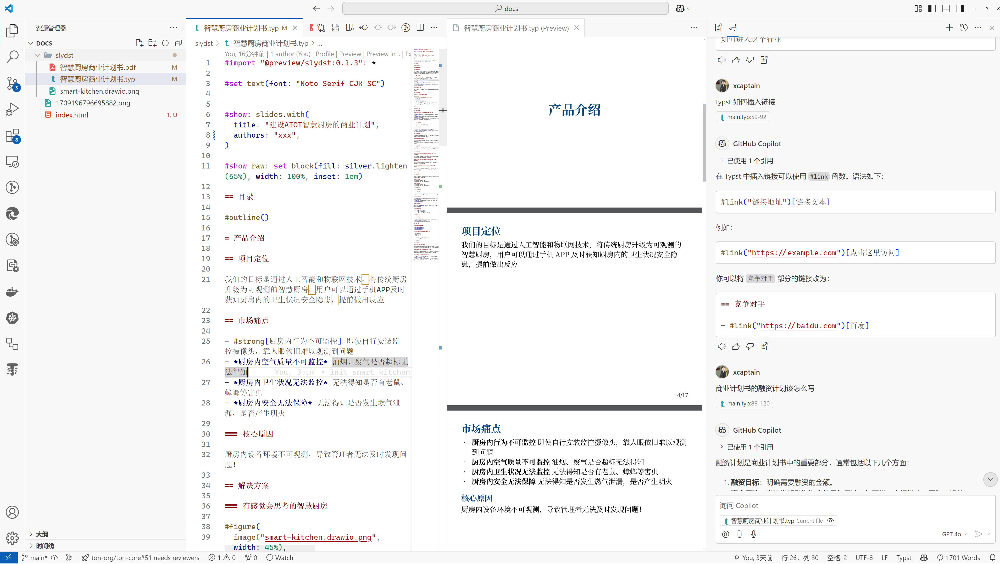
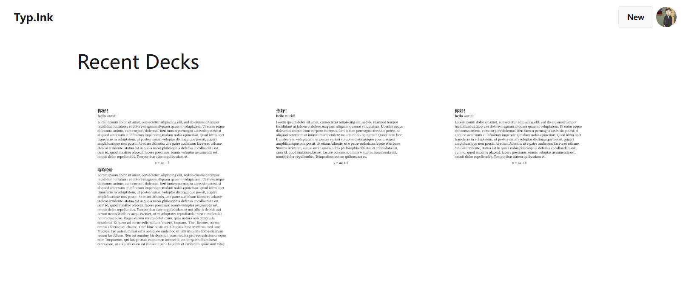
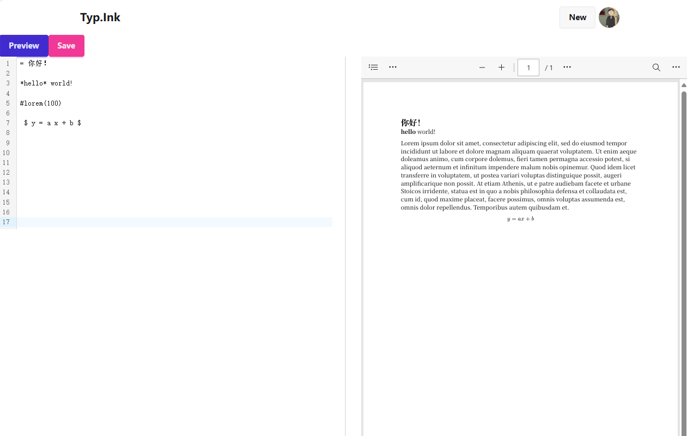
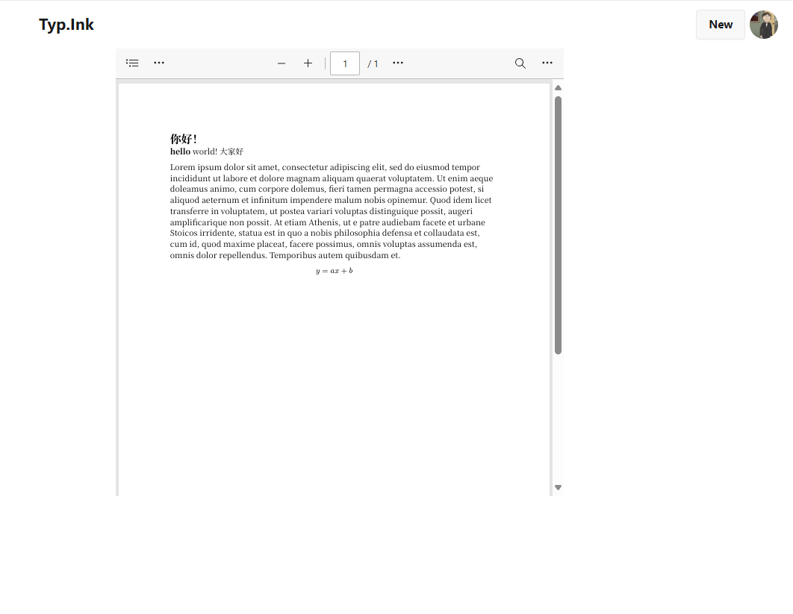

## 背景

不知道大家写演示文稿喜欢用什么软件，ppt, wps, 腾讯文档，飞书，还是其它？在上篇博客[^1]中我提到了前几天在写一份简单的演示文档给别人看，因为不常写这种东西所以又开始纠结用什么软件写，我电脑上没装 office，也没有继续订阅 office 365了，所以 office 在我这里被否定掉了。wps更不可能，从来没用过，至于腾讯文档，在微信群里统计信息的时候用过几次，但是基本没有正经拿来写过文档。飞书的话在工作中常用，但是我不想反复切换个人和工作账号，然后给别人发一个飞书链接查看。以前我还用过 `slides.com` 因为看 Youtube 上的技术分享，很多人都喜欢用 `slides.com` 来写文档，然后直接放链接给别人看和下载。以前我还用 vscode + latex 插件写pdf，前几年简历就是拿 latex 编译的，不过因为这几年出了个排版领域的新秀 `typst`，所以我的简历目前已经是用 `typst` 写的了。

[^1]: 见 [2025/01.1 周报](/posts/journal/week4) 最后一段

综上，目前我要写演示文稿有3种可选方案：

1. `slides.com`
2. vscode + latex
3. vscode + typst

最终我的决定是用 vscode + typst 来写，因为技术够新，我也想看看这几个月 typst 有什么新增功能。用vscode整体写作体验还是不错的，copilot 补齐很精准，因为是纯文本编辑，Tinymist typst 插件的实时预览功能也很棒，ppt很快就写完了，我的工作流如下图：

从网上找了一个好看的ppt模板叫 `slydst`，安装，然后就开始边预览边编辑，遇到不懂的地方还可以直接问 copilot，我个人是觉得这个工作流很棒，能不能把他推荐给别人呢？难，安装 vscode 有门槛，安装 typst 插件有门槛，安装 github copilot 插件也有门槛，最后让大家学习一堆用法也有门槛，最后还不如回归简单的 office powerpoint 方便。那么有没有办法降低这些门槛呢？

## 将 vscode + typst 搬到浏览器上

我对于浏览器内的编辑器一直很有兴趣，8月份的时候基于 monaco 编辑器做了一个 [tmdx editor](https://tmdx.xyz) 主要的想法是让用户能输入 markdown，然后编辑器处理图片、视频、AI补全，不过最后没什么人用所以就放弃了。

现在我又有了在线编辑的需求，所以又重拾了做浏览器内编辑器的想法，这次我不再玩 markdown 这种小儿科烂大街的东西，直接来 typst -> pdf

首先遇到一个技术难点就是如何编译 typst 代码

### 服务端编译

这个是我最早想到的办法，就是买个vps，做一个服务器，接受请求，然后命令行执行 `typst compile xxx.typ` 得到 `xxx.pdf` 之后通过 http 返回给客户端。

这种方式很简单粗暴，实际效果也并不好，因为 vps 默认的操作系统内可能缺失很多语言的字体。比如我的这台测试的服务器就缺少中文字体，导致在上面执行 `typst compile` 找不到中文字体，所以没法渲染中文。后来我手动下载了 `Noto Serif CJK SC` 字体，大概100MB，传到服务器上，设置好 `TYPST_FONT_PATHS` 环境变量后，才能正确渲染pdf

就一个中文字体就这么大了，到时候有不同国家的人来使用的话，这台编译的服务器得把相关字体装全了才行，太没可操作性了

### 浏览器内编译

这是我偏好的方式，因为我在使用 vscode + typst 插件的时候就是在本地渲染编译的，如果本地预览的时候OK，那么导出的pdf文件肯定也是ok的。tinymist typst 插件的工作原理我不清楚，也许是在 vscode 内开启了一个 language server进程用于跟 vscode 交互，但是后来我看到这个作者还开源了 [https://github.com/Myriad-Dreamin/typst.ts](https://github.com/Myriad-Dreamin/typst.ts) 看介绍说这个库能使用 wasm 编译和渲染 typst 于是就下下来学习下。

### 演示站点

本地使用 typst.ts 来渲染 typst 文件，我已经跑通了，并且做了个网站，见：[https://typ.ink](https://typ.ink)

核心技术就是上面说的，通过 浏览器加载 typst.ts 提供的 wasm 文件，来编译和渲染编辑器内的 typst 源代码，这里要注意目前字体使用的是本地操作系统的字体，所以需要授权当前网站访问操作系统本地字体的权限，如果拒绝了的话就会导致读不到本地的字体文件，会导致渲染错误。未来把动态从网络加载字体的功能实现后，应该体验会好很多。

目前实现了最基本的功能，如：

1. 用 CodeMirror 编辑器编辑 typst 源码
2. 预览 pdf
3. 保存源码和pdf文件到服务器
3. 查看列表和详情

我的decks列表页：

编辑页：

详情页：

目前界面看起来很简陋，因为加上技术调研的时间，也才花了2天时间搭建，还没来得及优化各种细节。

## 用户反馈

今天上午我给2个朋友发了上面这个网站，希望得到一些反馈，但是结果都不太好，很打击人，主要有如下意见：

1. 伪需求，大部分人习惯用专门的ppt软件去制作ppt，不会用网站来写
2. typst 语法复杂，普通人很难看懂学会
3. 功能太简陋
4. 文档和编辑器领域是红海市场，要做出彩很难

说的很有道理，我自己是比较喜欢尝试新东西，但是我不能拿我自己的兴趣和需求当作是普遍的兴趣和需求，这两个朋友跟我经历相似，人家都不感兴趣，更别说其他人了。不过好在没花什么时间和精力在这上面，也没什么损失，未来有时间慢慢打磨优化就好了。

## 未来计划

虽然说这个产品可能没什么市场需求市场前景，但是拿来当练手项目，娱乐自己也挺好的，目前我计划了一些需求点，未来有时间可以慢慢做：

- [x] CodeMirror 编辑器内加上 AI inline completions
- [ ] 给 CodeMirror 编辑器加上 typst 的语法高亮
- [ ] 支持图片上传功能
- [ ] 给文档加上权限控制，避免用户意外泄露隐私
- [ ] 持续优化界面和交互体验
- [ ] 内置一些好看的 ppt 模板
- [ ] 内置一些网络字体，检测是否字体缺失

## 产品更新记录

### AI 辅助功能

2025/01/10 下午更新

typst 语法虽然复杂，但是AI肯定是懂这个的，因此如果AI能自动补齐 typst 源代码，对于用户来说上手就简单了。网上搜了一下 CodeMirror 
的 AI 补齐插件，没有很丰富，但是看到一个项目：[https://github.com/yuri2peter/codemirror-ai-enhancer](https://github.com/yuri2peter/codemirror-ai-enhancer) 看了他的demo[^2]，挺符合我的需求的，正好作者开源了代码，文档写的也不错，就下下来学习了一下，目前我已经把这个功能集成到 typ.ink 网站上面了，操作体验不像 vscode 那样好，因为要手动按快捷键触发补齐，但是也不错了，至少可以减少我的 AI 接口的调用次数，降低成本。

[^2]: [CodeMirror AI Enhancer](https://codemirror-ai-enhancer.vercel.app/)

用法：

1. 自动补齐，按下 <kbd>Ctrl</kbd> + <kbd>J</kbd> 会触发AI补齐光标后的内容，如果觉得合适按下 <kbd>Tab</kbd> 就能接受
2. 内容改写，选中要修改的文字，按下 <kbd>Ctrl</kbd> + <kbd>K</kbd> 会弹窗一个对话框提示要进行怎样的修改，输入完按回车发送，然后自行判断是否要按 <kbd>Tab</kbd> 接受还是按 <kbd>Esc</kbd> 拒绝
