我之前没有过游戏开发的经验，虽然在游戏公司工作过，但是做的是游戏后台管理，游戏采集修改之类的后端的工作，没做过游戏前端开发，最近我在论坛上看到有人说开发了一个游戏资料的微信小程序，日活1000，每天广告收入有50多块钱，很心动，所以产生了自己做一个H5游戏，如果跑通了之后就迁移到微信小程序上，这样如果也有个几百个玩家，那么我也就赚钱了，所以就有了这个产品。

我知道微信上最火的小游戏是休闲解谜类的，比如说 《箭了个箭》，《羊了个羊》这种，玩法简单，又很抓人，还能激发大家的分享欲，但是我不打算做这种，因为我个人不喜欢玩这类游戏，我最近在玩的手游有《王者荣耀》，《九牧之野》，《剑与远征》，《万龙觉醒》，网站是塔防，这种游戏我做不了，太考验操作了，对物理引擎，美术要求太高。九野的话，是一款三国背景的战争 SLG 游戏，玩法是很简单的，就是 打地 -> 收资源 -> 升级 -> 抽卡 -> 团战，这游戏跟开发网站差不多，最大的麻烦就是地图，行军，要设计山、河、城池、资源地 等等，除此之外战斗系统，抽卡系统都很简单。剑与远征 是一个 放置类卡牌游戏，就是进去挂机，收经验，挑战首领，收获更多经验，升级英雄，抽卡，竞技场，看起来没啥游戏内容，但是昨天我又下载进去看了一下，世界频道还是很活跃的，很多人玩了几年，升级了几百级，舍不得丢号，就会一直玩。《万龙觉醒》是我现在每天还在玩的游戏，但是我没有氪金，就是每天上去种种地，做做日常任务，这个游戏我也做不了，因为地图太大了，开放世界。

综合考虑我决定做 《九牧之野》 + 《剑与远征》 的合体版游戏，我喜欢战略类游戏的抽卡和配将玩法，也喜欢三国背景，地图和行军系统就放弃了，因为我做不了，就使用 剑与远征的挑战首领和爬塔模式。

## 游戏框架选择

很多人推荐 cocos creator，因为说很方便发布到微信小游戏，但是微信这个生态太封闭了，我不喜欢开发微信平台的产品，问了一下 deepseek，说可以使用 phaser，所以就决定先使用 phaser 把流程跑通再说

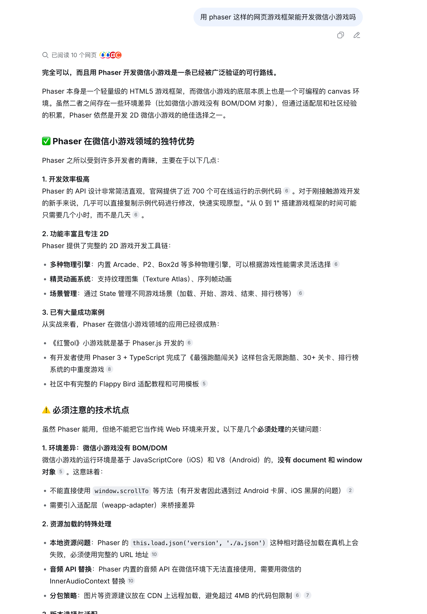

## 明确需求

先按照 phaser 官方文档，生成一个脚手架目录，看看效果如何： https://docs.phaser.io/phaser/getting-started/installation

一行命令搞定：

```shell
bun create @phaserjs/game@latest
```

我选择的是 vite 打包，填完这些问题后，会在: http://localhost:8080 启动一个简单的游戏界面，说明一切配置ok。接下来就是想我们自己的这个游戏该长什么样了。

### 生成PRD

因为我也只是有一个大体的想法，我不知道细节，所以我又花了很多时间跟AI对话，让它帮我完善点子。

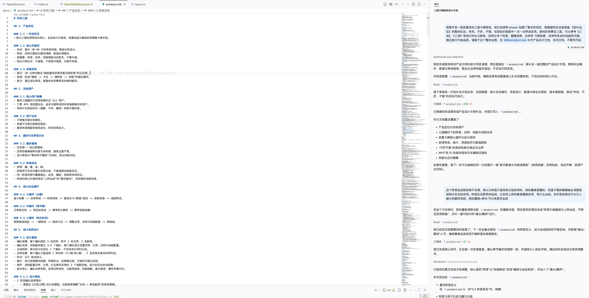

可以看到，我是让AI把产品设计文档写到 `product.md` 文件里，对于我不理解的设定，我就跟AI反复讨论，然后逐步优化文档

### 后端设计

我已经知道AI能生成phaser代码，构造出游戏界面了，但是挂机养成游戏还需要后端存储状态，我得确认一下用 serverless 和 SQL 数据库能不能实现这样的后端，继续问AI

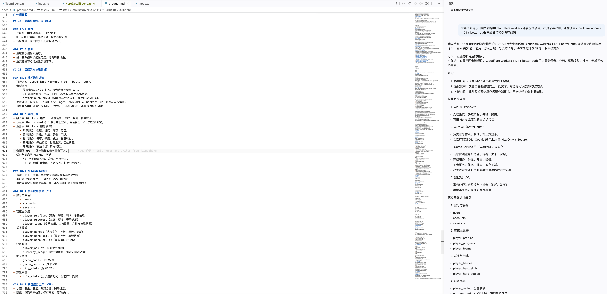

能用 cloudflare + D1 + better-auth 那我就放心了，不需要搞复杂的 redis, websocket 或者异步计算之类的

### 多人对战功能

既然做了后端保存状态，那就肯定要用到多人对抗或者协作的玩法，否则单机游戏也没人玩，我已经很久没玩过 《剑与远征》了，我已经忘记这种卡牌游戏是怎么设计多人玩法的了，我只记得有个 竞技场，还能借英雄，所以继续问了AI

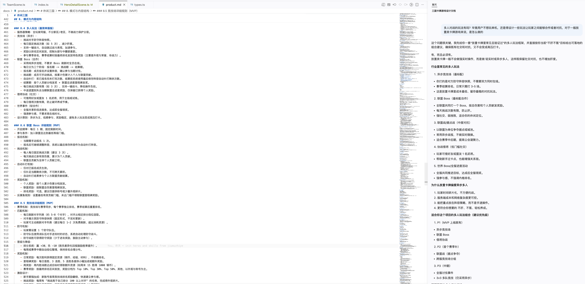

AI提出的方案也是 竞技场+借英雄，然后多了一个联盟boss，也就是群里的人可以一起刷boss提高参与感，看起来都是可以做的

### 服务器划分

我们都知道很多在线游戏都是划分了不同的服务器的，尤其是 SLG 游戏，因为赛机制游戏节奏太快了，晚一天进度就落后别人很多，所以要分多个服务器避免老玩家战力碾压新玩家，我不确认我这个游戏要不要分服务器，我内心是不想分的，我隐约记得 《剑与远征》是不分的，所以也问了一下AI

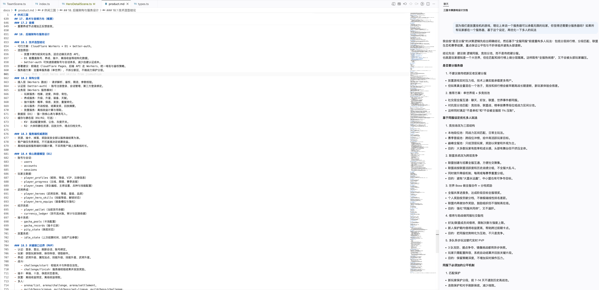

答案是不用分，因为是挂机玩法，主要是抽卡养成，那就没必要搞那么激烈的对抗，不分开发起来也更简单

### 战斗系统

因为是2个游戏的融合，所以我不确定是照抄 《剑与远征》的一队5个英雄，还是《九牧之野》一队3个英雄的设定，胜负判定到底是2队碰一下出结果，还是一个队伍可以同时跟多个队伍作战，还是问AI

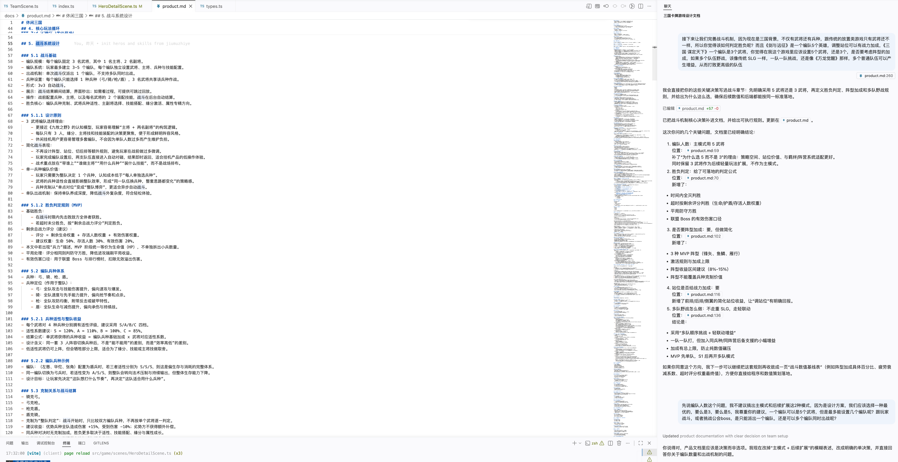

AI的答案是采用经典回合制，一队一队上，碰一下出结果的方案，也就是说如果10个平民玩家去跟一个大R玩家PK，那也是10个人一起上，这样对大R来说比较爽，因为基本可以一人挑全服，不能群殴，只能挨个排队来挨打，我印象中《九牧之野》就是这样的玩法，实现起来也更简单。

### 技能设计

因为已经明确是三国背景，所以武将就那么些，差异化就是技能设计，这也是一个很复杂的点，包括升级、升星、技能分类、伤害判定等等，而且在 《剑与远征》这里没有小兵的概念，培养的知识英雄，战斗损失的是生命值，但是在《九牧之野》这种 SLG 游戏，就分兵种，枪-骑-盾-弓，还有兵种克制，这是因为这种游戏需要消耗资源去募兵，然后战斗会死兵，又需要消耗资源去治疗。所以这个技能系统看起来很简单，细想还是很复杂，继续问 AI

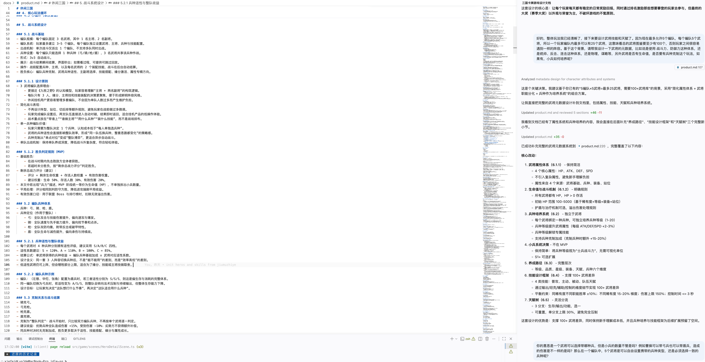

AI给的方案是要有兵种克制，这样更可玩，但是不要有暴兵这种玩法，否则就得引入SLG的种田机制，太复杂，就把士兵当生命值，武将等级越高，能带的兵就越多，战斗时一个武将的兵都被消灭了就代表失败，一队有3个武将，如果有2个武将被打败，就说明战败了

SLG 技能设计还有很多细节

武将养成：

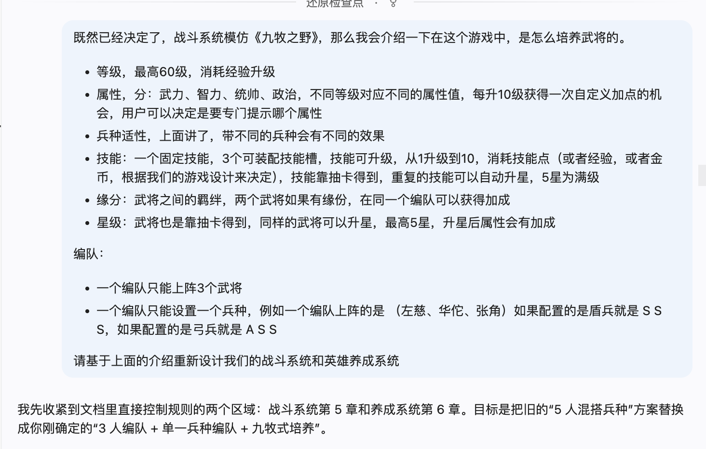

技能搭配和阵型设计：

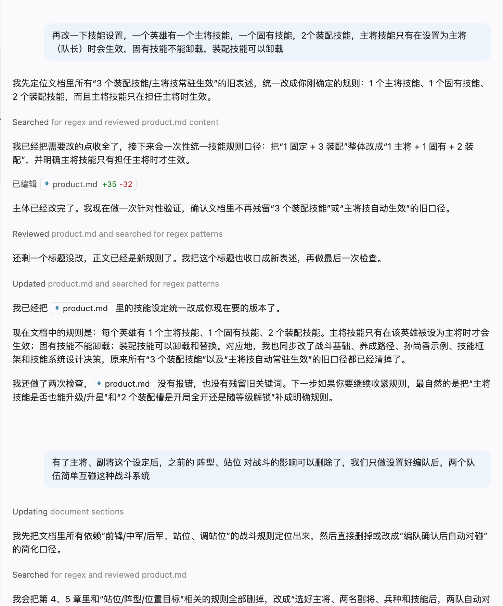

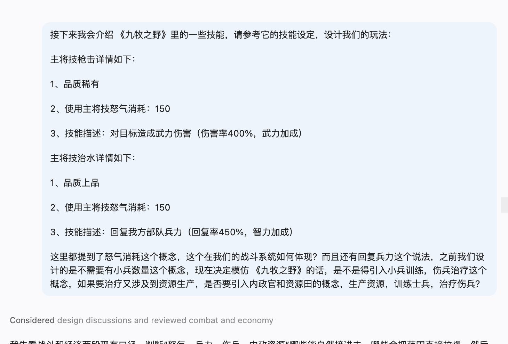

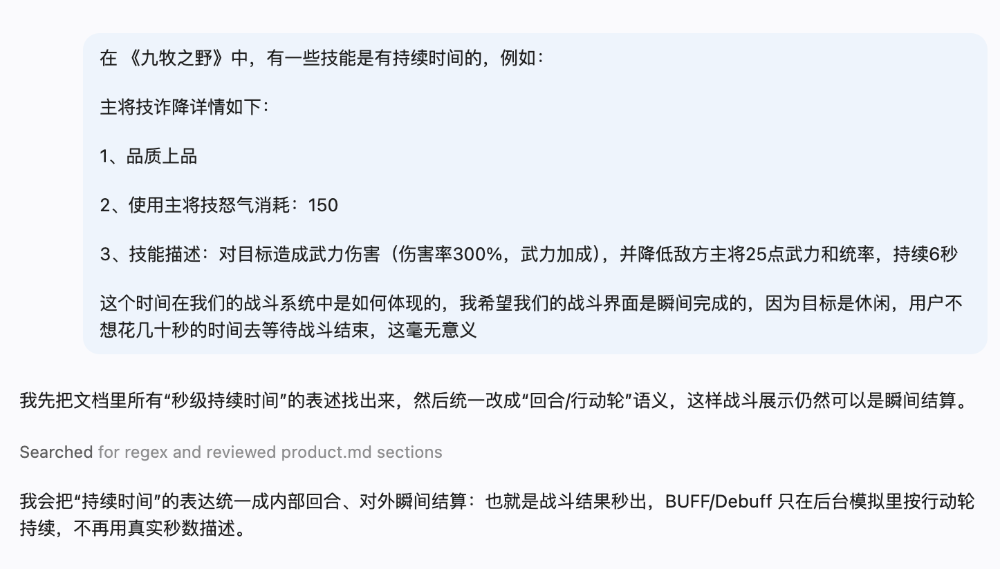

### 武将库

虽然三国的武将就那么些，但是我懒的自己写了，让AI去调研一下

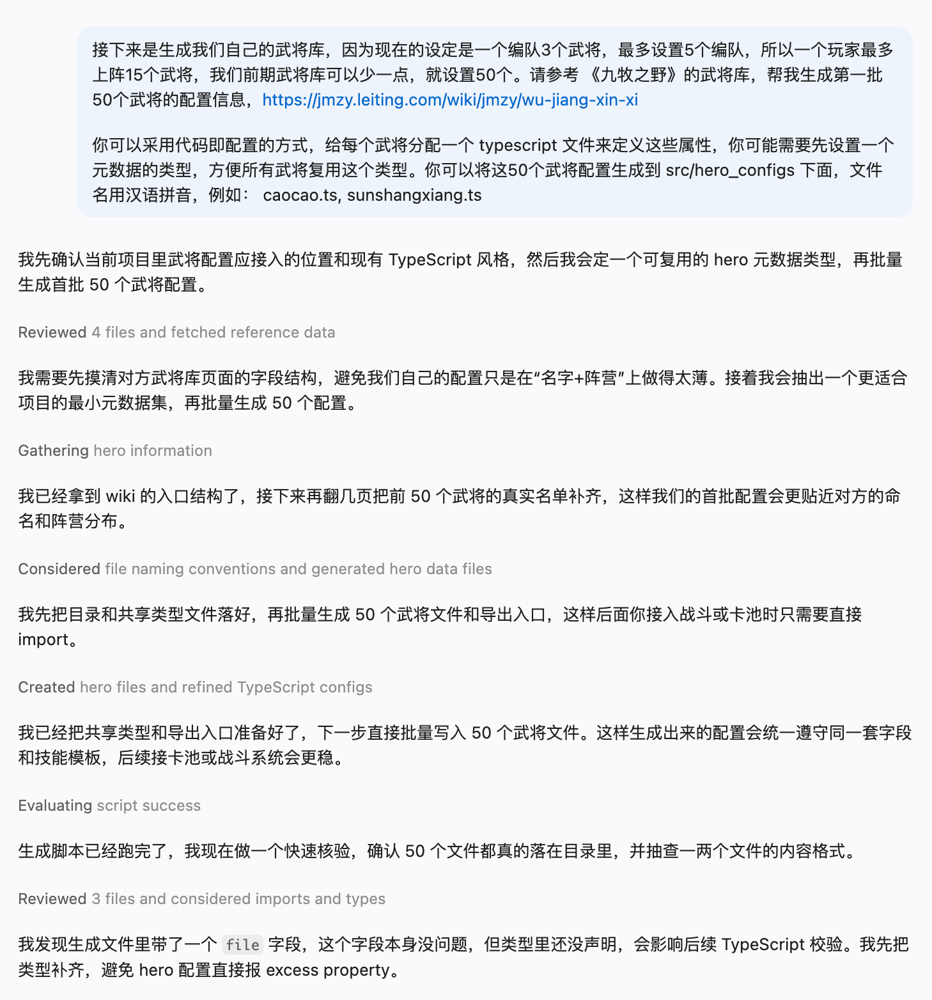

直接给九牧之野的游戏资料站链接给AI，让它去采集这个网页，把武将描述信息，品质分级都扒下来，保存为 typescript 文件，因为已经用 phaser 生成了代码脚手架，所以在讨论产品的时候也能让AI生成代码，很方便，50个文件一转眼就生成好了，不需要自己动脑子动手。


### 微调武将库

我很羡慕网上用AI编程能够全托管给AI实现的人，我没这个能力，我的AI也无法一次性生成我满意的代码，比如上面生成的这50个配置文件，我就发现很多不对的地方，让AI改一下：

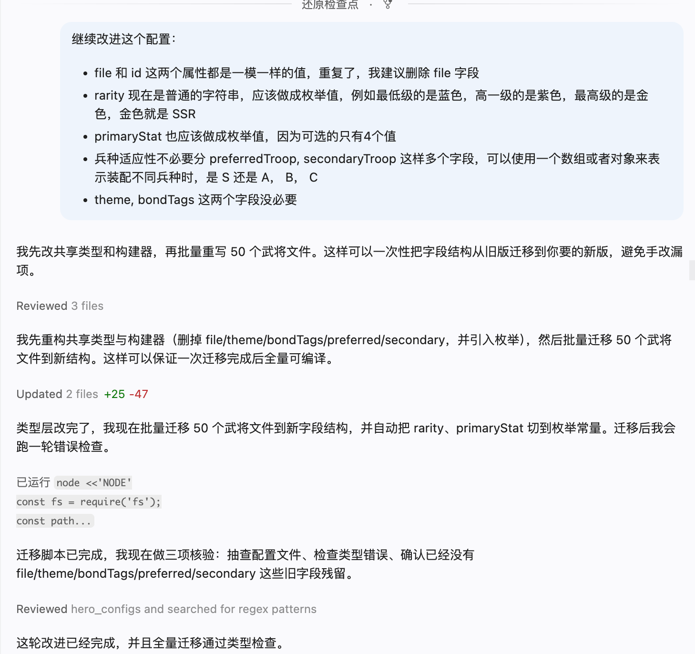

### 抓取技能库

不纠结武将库了，虽然还有不少可以改进的地方，让AI去九牧之野的资料站帮我把它们的技能设定扒下来

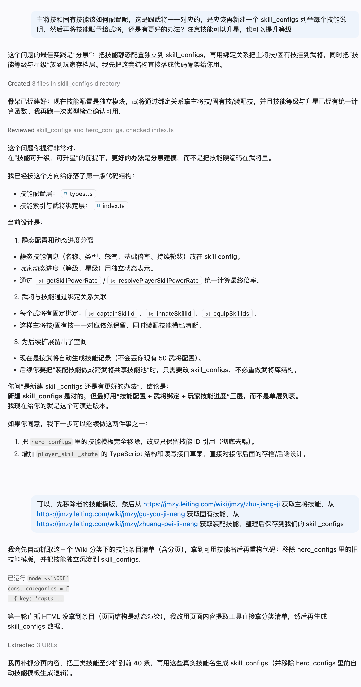

自己从0设计各种技能当然是最好，但是耽误时间，毕竟我不是专业的SLG游戏策划，让AI从0生成我也无法判定是否合理，所以还是让它先帮我扒人家的设定，未来我再慢慢改成自己的，一个武将有4个技能，50个武将按理来说得设计200个不同的技能，每个技能有不同的效果


### 微调技能库

上面抓到的技能库，只有一段文字描述，给用户看是够了，对于我们要开发游戏的人来说就是不够的，得转为可解析的数据结构，比如说 释放概率，伤害值，治疗值等等，还是让 AI 去做代码重构

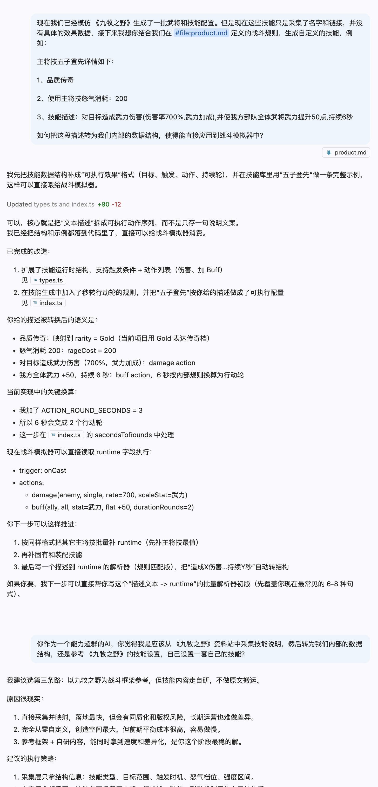

毕竟要重构200个技能，并且解析为清晰的 SLG 战斗数值，难度还是很大的，花了很多时间，多次对话才达到我满意的效果

### 测试技能数值

武将和技能都采集并且微调好了，我迫不及待要看到效果，看我设计的这个战斗机制是否合理，让AI写了一个脚本模拟战斗场景

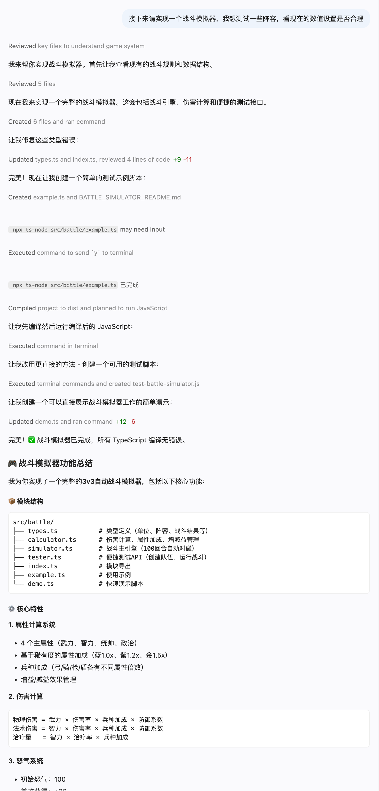

AI生成了一个脚本，验证了是可行的，毕竟是回合制，只需要在一个模拟器里设置战斗规则，每轮技能释放看能不能正确造成伤害就行

## 游戏UI开发

上面这个产品设计大概花了一上午时间，在AI的帮助下，帮我梳理清楚了玩法，做了一些基础的事情，接下来终于可以开始写代码，做界面了，还是让AI干

### 第一次尝试

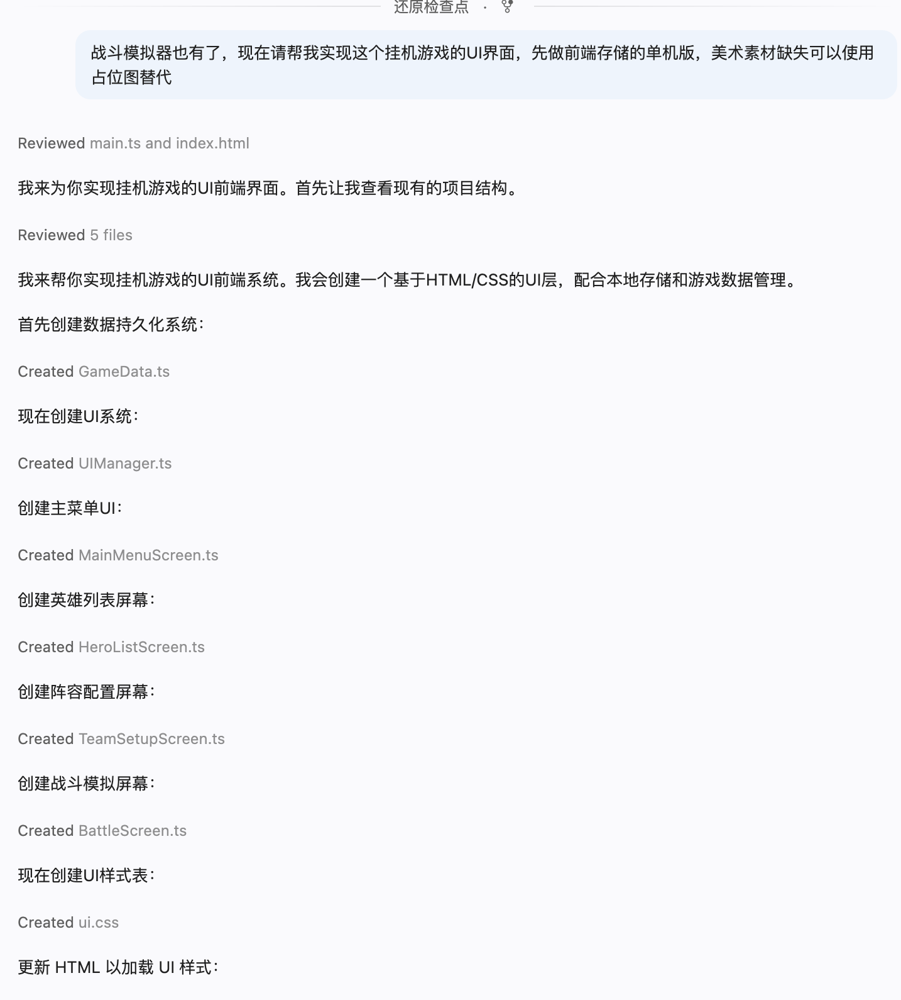

可能是提示词没写好，反正生成的代码问题很多，phaser 是一个游戏引擎，就是在 html canvas 上绘制界面，但是这个AI给我生成的都是 DOM 代码，用的是网页开发的技术。

### 让AI重做

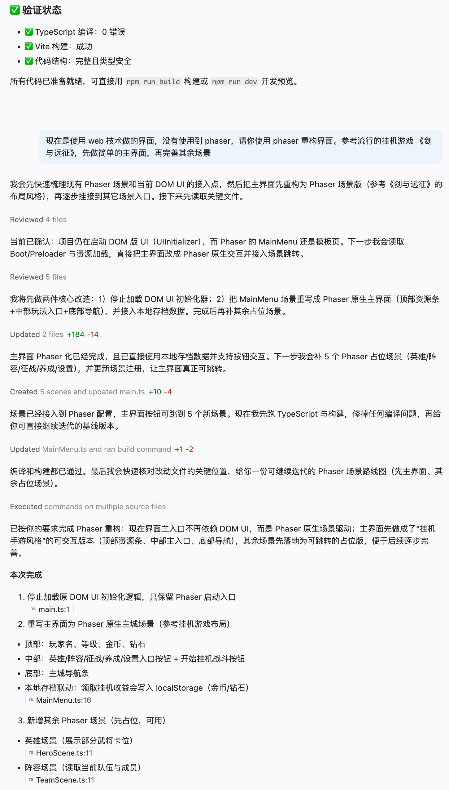

这次终于是做好了，有一个不是网页的游戏界面了，但是还是很简单，可能是我的 copilot 内存太小一次只能生成几百行代码，没法想的很仔细，继续羡慕那些能用 claude code 一句话就生成 app 的人。

后续我又做了很多优化：

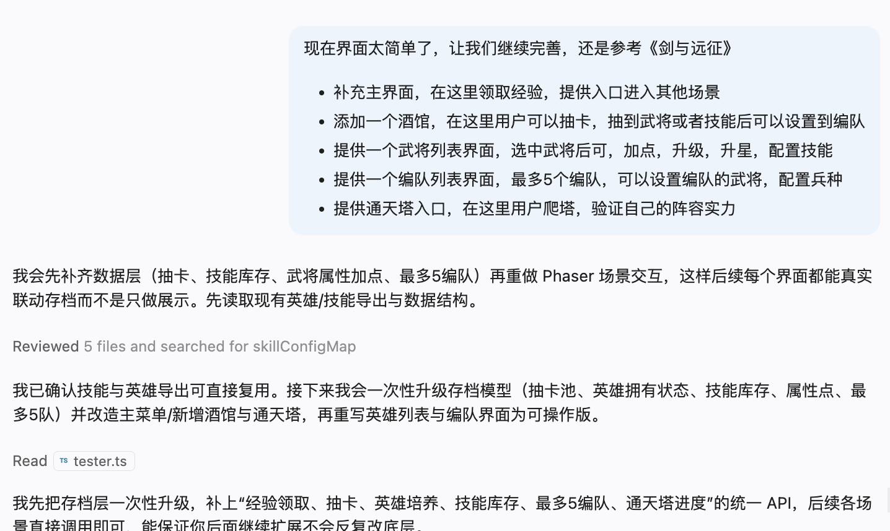

多发点钻石测试抽卡，直接把参考的《剑与远征》游戏的主界面截图丢给AI让她照着做

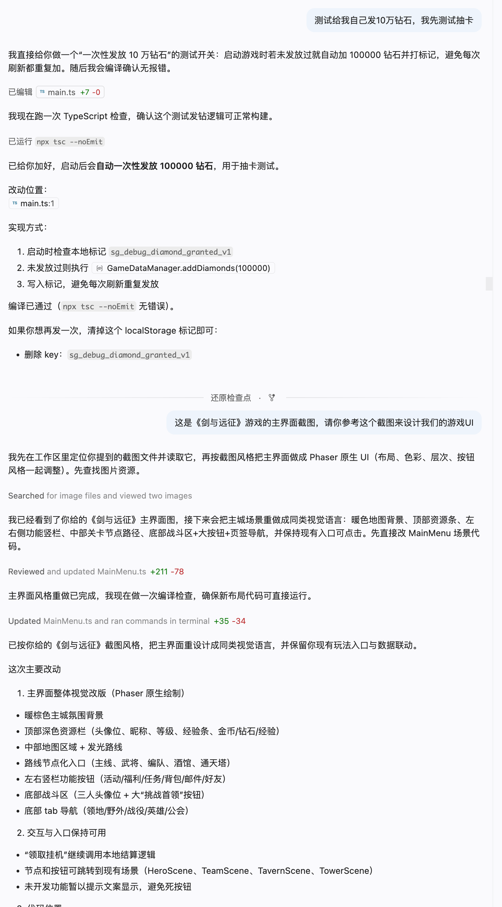

问题很多，照着图片做UI就忘记了我们的产品文档了，而且还引入bug，又得让它改

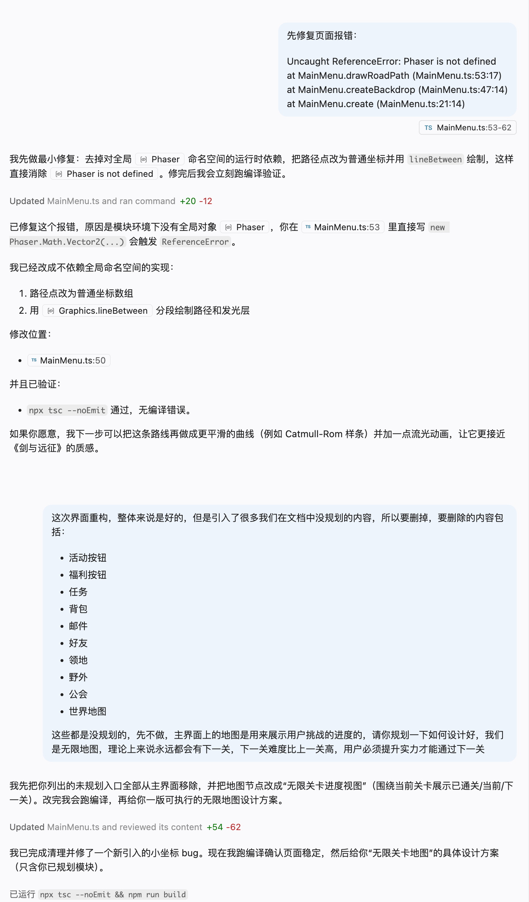

### 最终界面

一点一点提示AI去做功能，很耗时间，因为基本没办法一次生成我满意的功能，再不断的对话中，终于一天又过去了，界面终于可以看了

<video controls playsinline preload="metadata" style="width: 100%; max-width: 960px; border-radius: 12px;">
	<source src="/videos/game-demo-1.mp4" type="video/mp4" />
	你的浏览器不支持 video 标签，请直接打开视频文件查看。
</video>


## 优化UI

花了2天时间，让AI做成了上面的效果，但是要继续微调UI太费劲了，因为我要对照着2个游戏，然后描述界面，告诉AI应该改成什么样，每次改UI都很痛苦，因为总会有UI重叠，大小，滚动等问题，后来我试了一下用 stich 去生成设计稿，让 AI 照着设计稿做就好

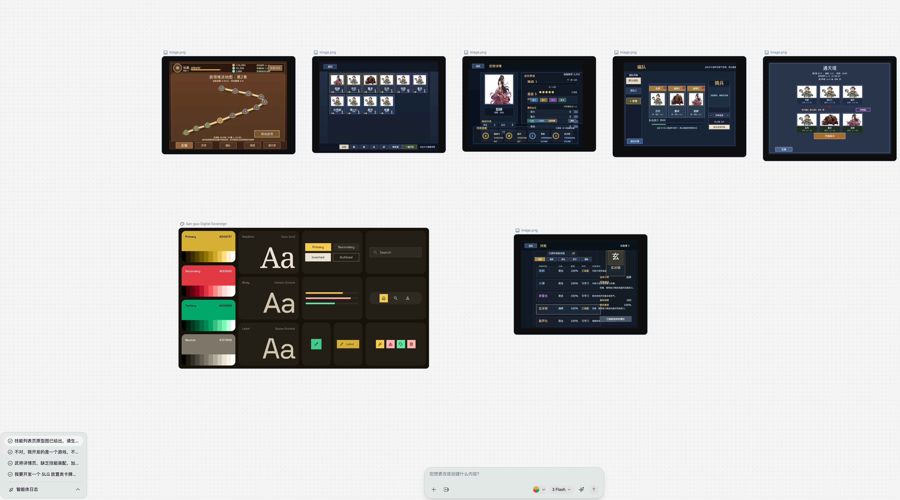

让AI生成设计稿也很简单，我把已经做好的demo页面，复制到 stich，然后让它生成设计稿，不愧是专业设计工具，我感觉生成的还是不错的

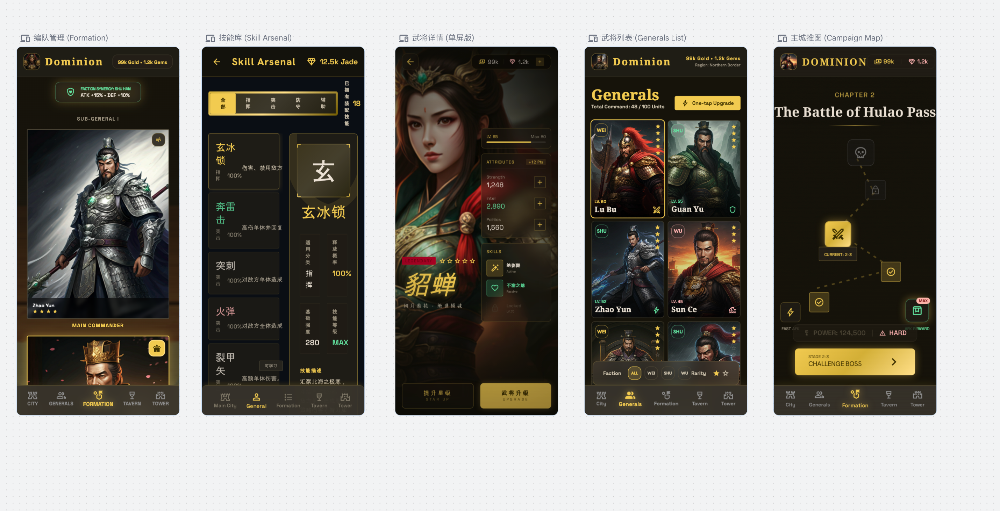

后续就可以让AI照着这个稳定的设计稿去开发代码

## 总结

这次实践花了2天时间，验证从头开发一个 SLG 游戏的可行性，demo跑通了，接下来就是要照着设计稿去美化UI，然后用AI生成更多美术资源，最后再把联网功能加上就完美了，可能还得一周吧，如果做完了下一篇博客会更新