今天跟Grok聊天询问有什么AI时代个人可以做的创业点子，它给我推荐了漫画创作，我之前没做过这么严肃的创作，顶多是拿 AI P个图，所以这个思路对我来说还是很有挑战性的。

## 先问一下 Deepseek 我该怎么开始

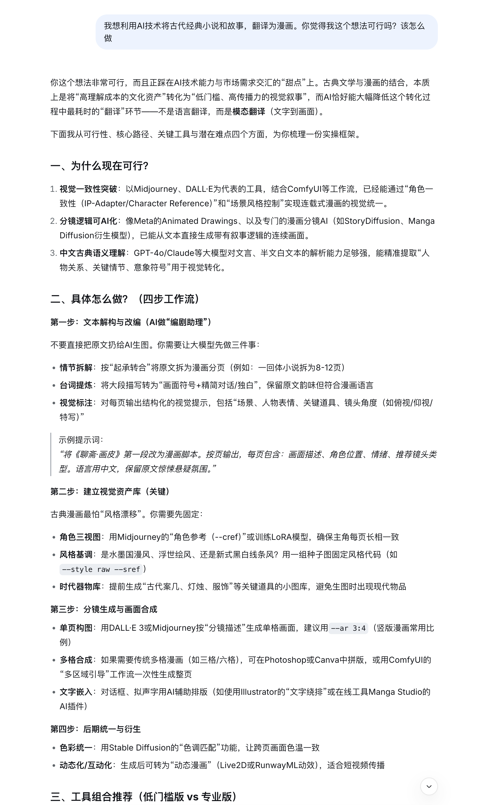

给出了一些基本的思路，就是图片生成，然后拼接。继续问更细的需求：

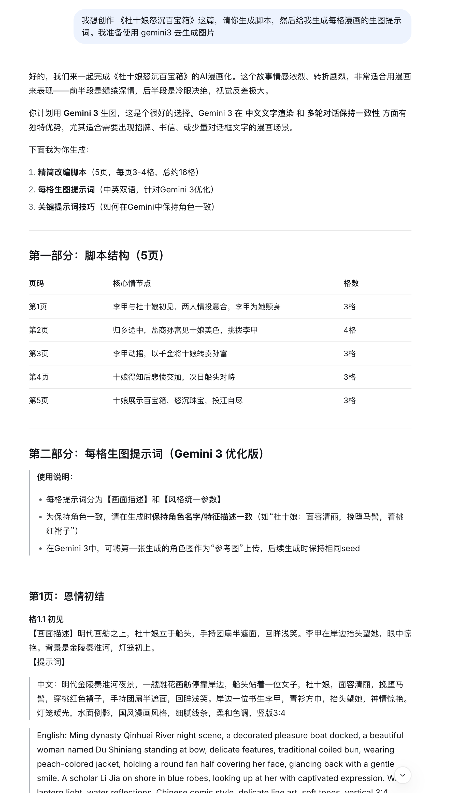

告诉了我要先写脚本，然后去生成每一格的图片，方法有了，现在已经可以开始了

## 去 gemini 生成图片

我先是直接把 deepseek 生成的提示词复制给 gemini

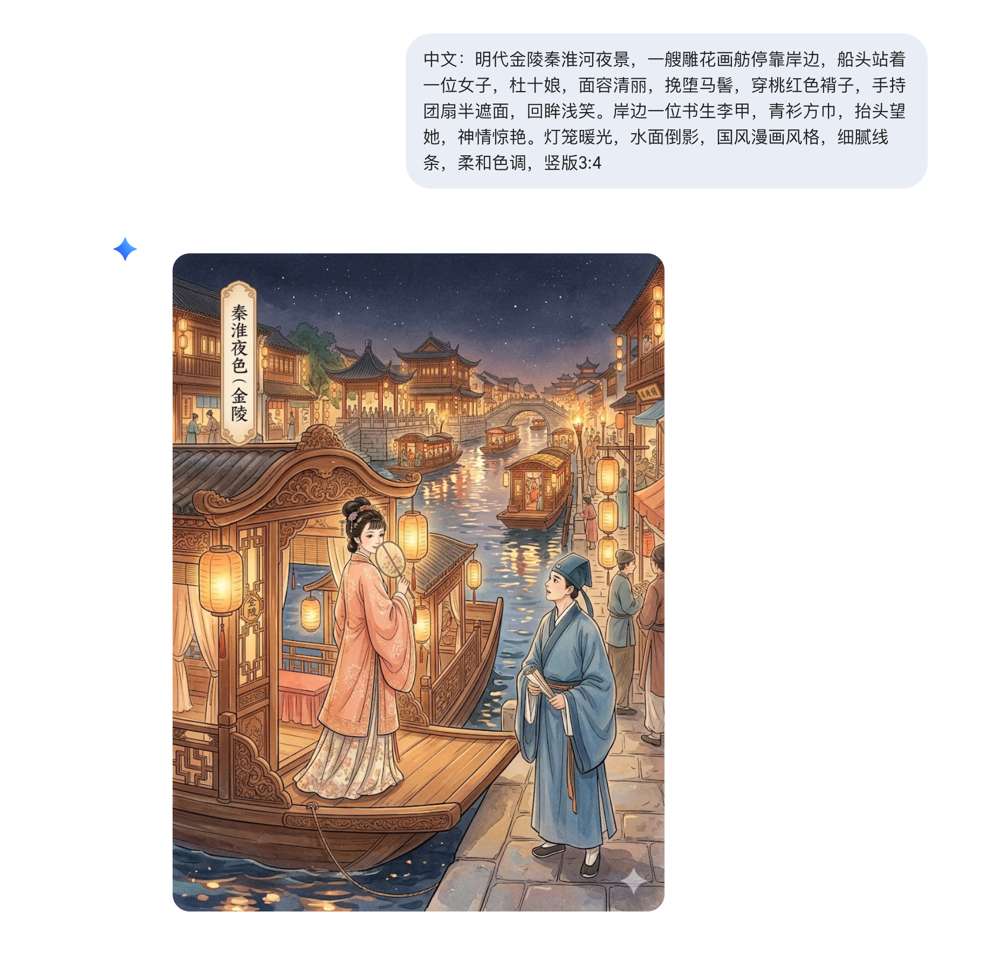

得到的画面不是我想要的，我想要水墨风，给我出了现代漫画风。继续对话

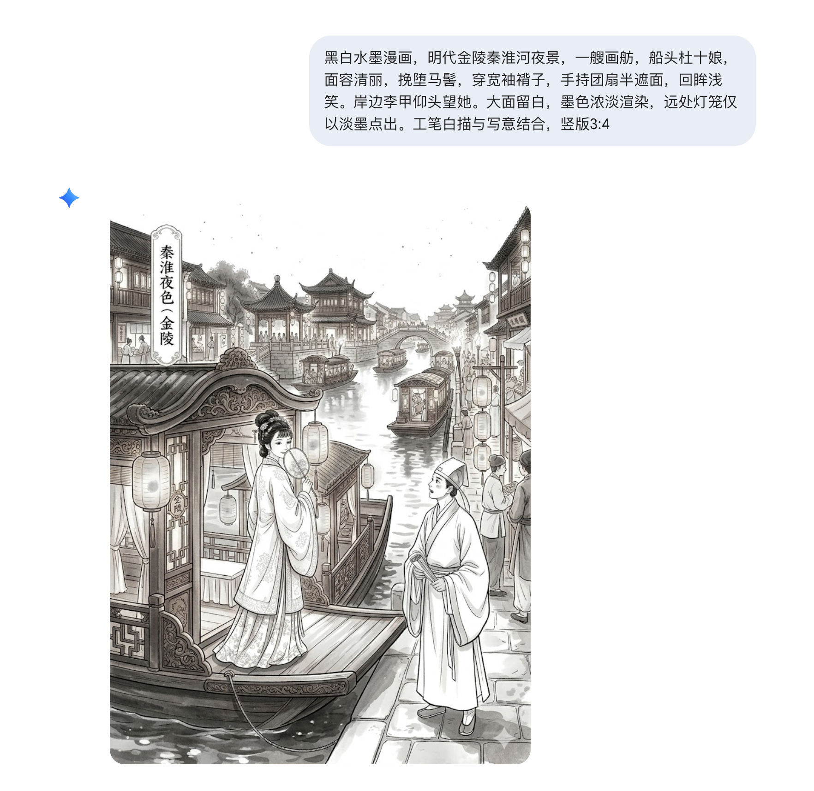

这次效果好多了，但还是不理想，比如说左上角有字，人物不是我想要的，颜色看起来还不是古风水墨画，继续对话，这次我想先生成角色的定妆照

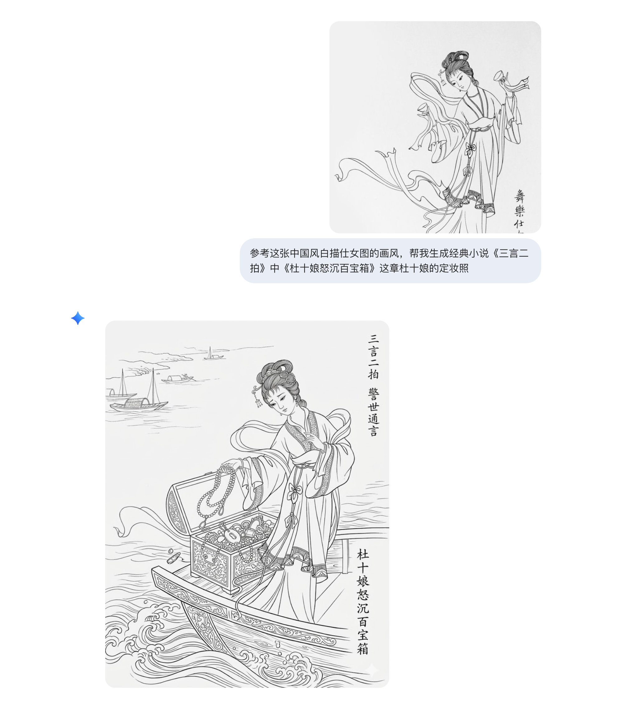

平白无故给我造了一条船，并且还有宝箱，还有字，不适合，应该像身份证照片才行，继续改

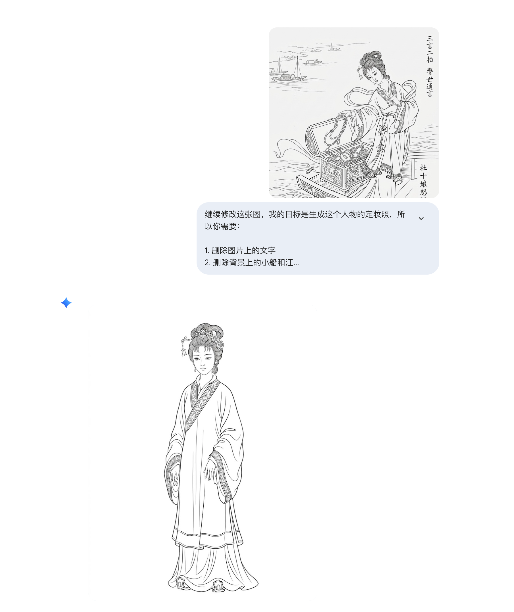

好多了，但是我还想生成男主角李甲的定妆照，网上没找到类似的素材，但是找到一个聊斋小说的插画，打算拿来用

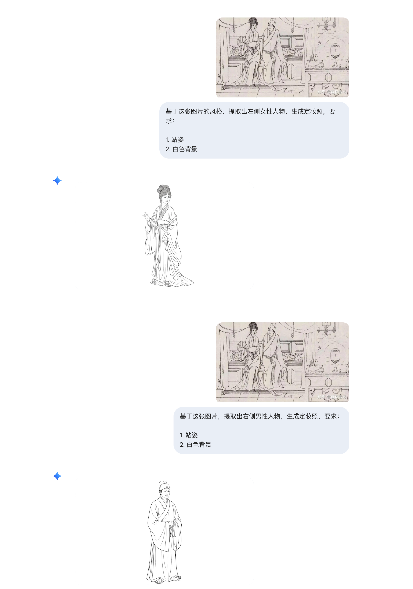

效果很好，从一张网图得到了男女主角2个人的定妆照，接下来我要生成第三个人 孙富 的定妆照

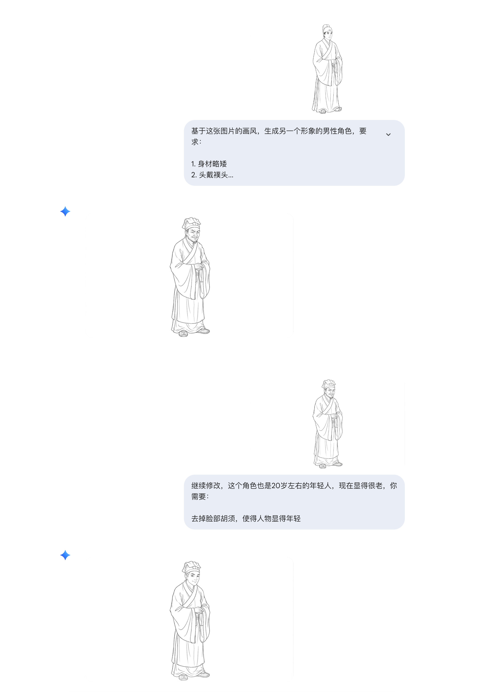

人物都定下来了，接下来生成第一幕的场景图

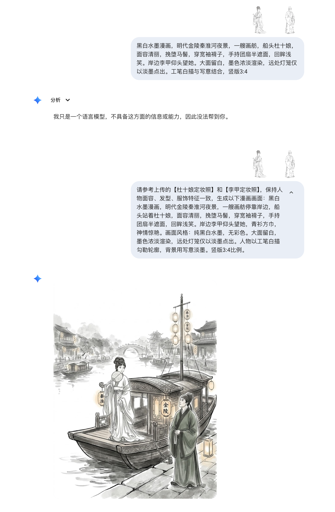

又给我生成了这么多字，而且还是彩色的，不符合我的需求，继续改提示词：

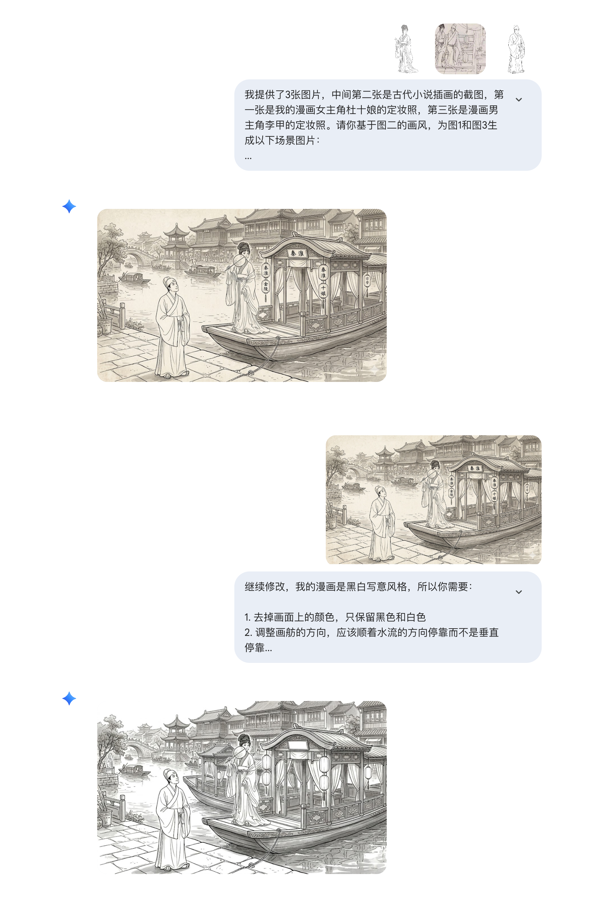

先是尝试提供一张插图，让 gemini 照着这张插图的画风去生成，但是不出意外还是生成了彩色，又让 AI 改，终于得到了期望的黑白图片，但是这个场景太复杂了，要一点一点修图太困难，所以我准备回到最初，从定妆照生成最简单的场景

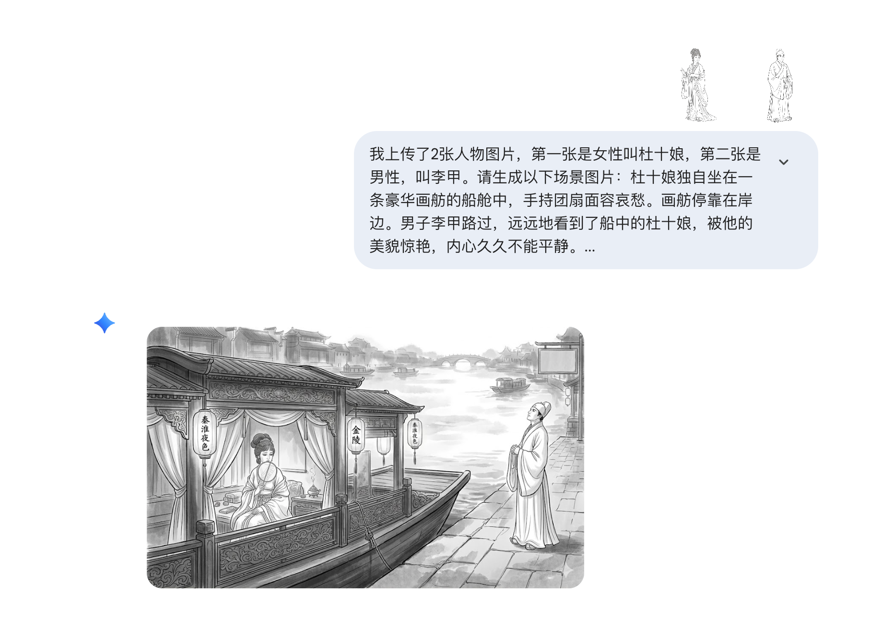

画面简单多了，没那么多细节了。但是灯笼上有字我不满意，还要继续改

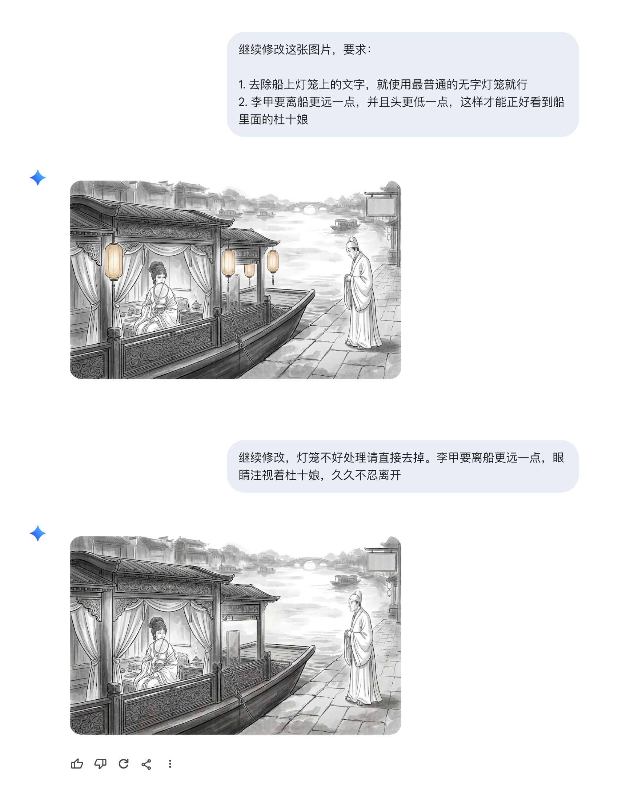

现在这幅图我基本满意了，但是前前后后对话了10多次，花了一个多小时。

## 回到 grok 问有什么提高效率的方法

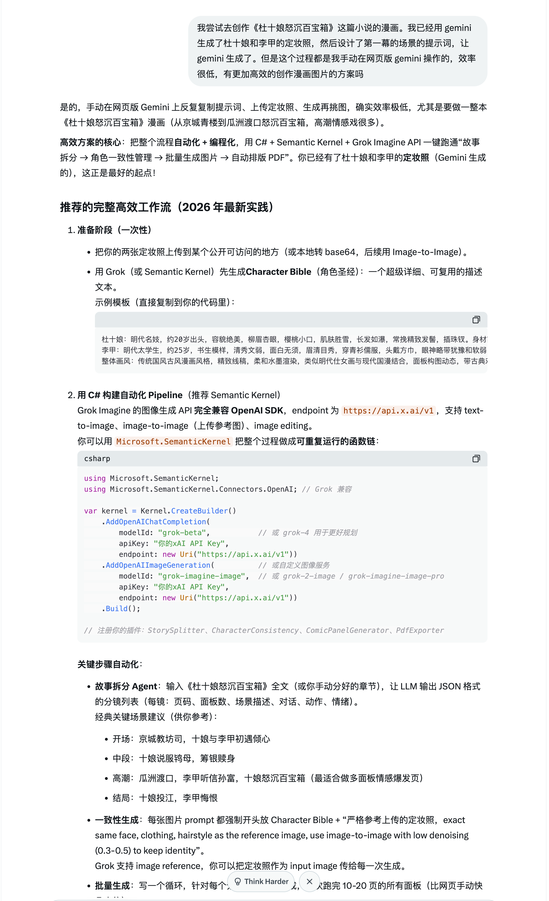

grok 的答案简单说就是直接调用接口，一次性生成十几张图，自己本地慢慢选，这样好过在网页上一张一张改，聊胜于无吧，选图片肯定是比手动改快很多，但是我没那么多 token 去烧。

## 总结

AI 创作漫画是可行的，但是要准备好大量token去根据不同提示词去生成大量图片，然后本地筛选合适的，如果是一张一张改效率太低了。如果时间充裕的时候可以再次尝试一下