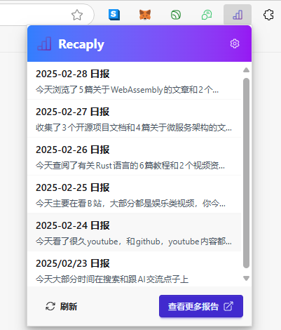
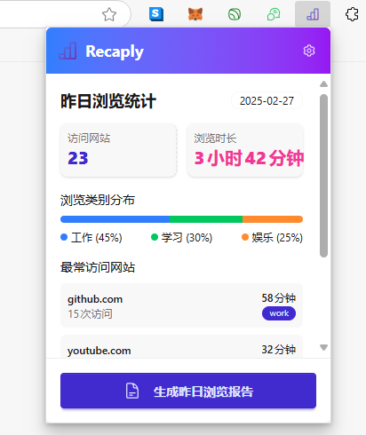
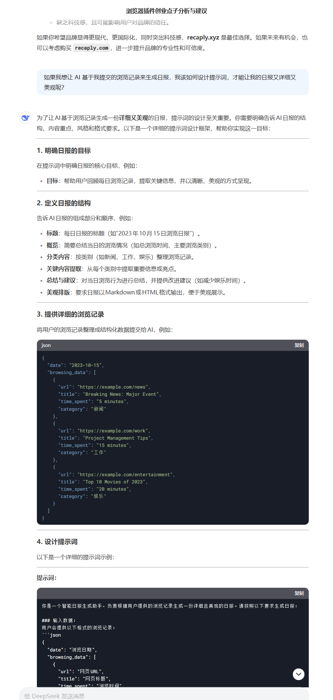

这周在 v2ex 宣发完了 markflow，收集了一些用户反馈和意见，接下来就是慢慢优化，所以手上也没有很着急做的事情，昨晚饭后散步突然脑海中闪过一个点子，就是能不能再做一个浏览器扩展，用来分析用户的浏览记录，然后生成一篇markdown格式的博客，就像记日记一样，但是好处是不用自己动手花时间写。

问了一下 deepseek 和 gemini 都说这个点子很好，然后说市面上还没有类似的产品。给推荐了几个读取浏览记录的插件，都是简单的对浏览时长做统计分析的，不能生成日报。这样看来还真是被我找到了一个没被人关注过的领域，那么说干就干开始做吧。

## 产品命名

想名字依旧是一个很耗时间，很让人头疼的过程，不过还好我现在已经习惯让AI帮我做，我问了deepseek我想做一个基于用户浏览历史做日报的插件，用什么名字来命名这个产品好，deepseek给我推荐了以下几个：

1. dailypulse
2. recaply
3. browseai

我比较了一下发现还是 recaply 比较好听，回顾的意思，跟我这个日报也比较接近。

接下来就是去 godaddy 注册域名，依旧选择注册便宜的域名，挑了几个不好做决定，也是让 deepseek 帮我选，我给了如下选项

1. recaply.xyz
2. recaply.cc
3. recaply.info

不出所料deepseek给我推荐了 recaply.xyz 说 .xyz 域名比较有科技感，也比较新，那么就没啥好纠结的了，花15块钱注册了这个域名，然后转移到 cloudflare 上，前期工作做完，接下来就可以开始写代码了。

## logo 设计

本来设计产品logo也是个比较耗时的过程，但是我对自己要求比较低，我只想快速完成 MVP 的开发，所以在设计logo这块我还是基于开源的svg logo让AI帮我修改。

先去 iconoir.com 上面看一些比较满意的logo，我选择了 `report` 这个，因为我的产品就是生成日报，用这个logo挺直观的。

虽然是开源的logo但也不能直接照抄，我让 github copilot 基于这个logo改了一下，加上一些 AI 的元素，就得到了下面这个图

<svg width="24px" height="24px" stroke-width="1.5" viewBox="0 0 24 24" fill="none" xmlns="http://www.w3.org/2000/svg">
    <defs>
        <linearGradient id="aiGradient" x1="0%" y1="0%" x2="100%" y2="100%">
            <stop offset="0%" stop-color="#4285F4" />
            <stop offset="100%" stop-color="#7B1FA2" />
        </linearGradient>
    </defs>
    <path
        d="M9 21H15M9 21V16M9 21H3.6C3.26863 21 3 20.7314 3 20.4V16.6C3 16.2686 3.26863 16 3.6 16H9M15 21V9M15 21H20.4C20.7314 21 21 20.7314 21 20.4V3.6C21 3.26863 20.7314 3 20.4 3H15.6C15.2686 3 15 3.26863 15 3.6V9M15 9H9.6C9.26863 9 9 9.26863 9 9.6V16"
        stroke="url(#aiGradient)" stroke-width="1.5"></path>
</svg>

有了个蓝紫色的渐变色，比默认的黑色线条好多了，看起来不错，暂时就用这个吧。

## 产品开发

传统的开发流程应该是先在草稿纸上画线稿，然后去 figma 上画设计稿，然后再切成前端页面，再开发后端。但是作为一个个人项目，没时间也没这么多精力按这个步骤去做，所以我还是使用 AI 辅助的方式，代码优先，边做边改。

### 第一版插件主界面

我首先想到的是做一个popup弹窗，里面放用户生成了的日报列表，然后可以点击底部按钮跳转到官网去查看更多，我的提示词是这样的：

```markdown
使用 tailwindcss + daisyui 帮我设计一下这个插件的 popup 的 UI，我希望popup内包含：

一个url列表，用来展示AI帮用户生成的日报列表
底部一个查看更多按钮，打开网页跳转到用户的主页
```

很快 AI 给我生成了UI代码，效果图如下：



看起来效果不错，但是有个问题，这个界面没有生成日报的按钮，如果按这个流程来的话，只能是在后台默默地去调用接口生成日报，然后用户只需要打开扩展看日报就行，交互流程虽然很简单，但是对用户隐私权侵犯可能太严重了，不声不响就在后台上传用户浏览记录。虽然这些互联网大厂都在不遗余力的监控用户行为，但是我作为一个第三方，还是尊重一下用户隐私好了，该加一个按钮触发提交浏览历史的操作，让用户看到服务器要哪些数据，然后主动提交，绝对不在后台自动提交。

### 第二版插件主界面

上面说到尊重用户隐私，所以我想主界面应该是一个表单，列出了用户昨天的浏览记录，然后询问是否要提交到服务器去生成浏览日报。

我是这么对 github copilot 下命令的：

```markdown
帮我重新设计一下这个 popup 的首页，我希望列表页里展示的是用户昨天的浏览历史统计，然后底部一个按钮询问用户是否生成浏览日报
```

很快就生成了代码，测试后效果图如下：



效果不错，按这个UI去组织浏览记录的数据就好了。接下来得思考下如何保存浏览记录的详情，因为 `chrome.history` 这个api只能拿到标题和url，如果我要生成详细日报肯定还需要分析用户看到的网页内容，比如说在什么值得买点了很多个网页，说明这段时间对电子产品或者购物很感兴趣，应该要把这些详情也记录下来，而不仅仅是写一句你访问了5个什么值得买的页面，说明你这段时间想买东西。只是分析个标题的话根本不叫 AI日报，过一个月再回来看，也许什么都回忆不起来，还是得再日报里加上网页总结图文，这样几年后回来再看到这份日报就会恍然大悟，啊，原来那几天我对xx产品这么关注这么想买啊，现在都跌成啥样了，还好没买。

### 思考如何生成日报

网上一堆人发视频说AI对他们帮助多大，用AI生成的周报被老板表扬啥的，我没用 AI 写过日报周报，在我印象中，deepseek 生成的内容都比较短，在我这个场景中如果用户一天看了100个网页，生成的日报怎么也得5000字以上吧，不如就太简单了，所以得想一下怎么才能让 AI 生成美观好看又详细的日报。

还是先启发一下 AI，给我明确一下思路：



一下就帮我把服务器接口和提示词模板都生成了，看起来不错，但是似乎少了 content 字段，再问一下AI是不是应该把网站内容也给提交过去，AI 也很赞同，并且更新了一下接口字段，加上了 content，这个 content 是网站的主要内容。

```json
{
  "date": "2023-10-15",
  "browsing_data": [
    {
      "url": "https://example.com/news",
      "title": "Breaking News: Major Event",
      "time_spent": "5 minutes",
      "category": "新闻",
      "content": "今日发生了一起重大事件，涉及全球经济波动。专家表示，这一事件可能会对金融市场产生长期影响……"
    },
    {
      "url": "https://example.com/work",
      "title": "Project Management Tips",
      "time_spent": "15 minutes",
      "category": "工作",
      "content": "本文分享了5个提升项目管理效率的技巧：1. 明确目标；2. 合理分配资源；3. 定期沟通……"
    },
    {
      "url": "https://example.com/entertainment",
      "title": "Top 10 Movies of 2023",
      "time_spent": "20 minutes",
      "category": "娱乐",
      "content": "2023年最受欢迎的10部电影包括《电影A》、《电影B》和《电影C》。这些电影在票房和口碑上均表现出色……"
    }
  ]
}
```

### 设计抓取的内容

根据上面AI给我设计的接口字段，我需要在前端组装好 `browseing_data` 提交给服务器，这里面 `url`, `title`, `time_spent` 应该都能通过 `chrome.history` 这个 api 获取到，`category` 应该是我们自己对已知的网站域名做一些分类，`content` 就要自己提取了。

之前做 MypodSpace 和 Markflow 我都需要读取当前网页内容，当时是通过 `@mozilla/readability` 这个库来读的，这个库能智能识别和提取主体内容，但是效果比较粗糙，对于一些未知的网站用这个库来提取内容可以，但是对于一些主流网站，最好是手写一些抓取的代码，这样提取的内容比较准确，脏数据更少。

我现在使用的是 `dom-to-semantic-markdown` 这个库来提取dom主要内容，想换换新东西试试，如果想要达成最好的效果肯定是要手写解析器的。

### 设计日报提示词

接口格式已经定义好了，这个接口提交的内容很大，因为加入提交100个网页，每个网页的content是1000个字符的话，输入token数量都接近100k了，超过目前deepseek支持的64k最大上下文长度。在这里我准备用 google gemini，因为这个AI支持的上下文窗口很大，能支持100万token，很多人拿他来翻译pdf文件，我拿来处理一点网页内容，生成日报应该不成问题吧，理解归纳对于AI来说是很简单的事情，在这里我考虑的主要是上下文窗口大、速度快、价格便宜，google这个服务目前可以免费用，可能是共享接口，稳定性不如付费好，如果哪天用户上去了，再升级为付费版本也来得及。

要实现一个提示词，让AI来总结这100个网页的内容，然后生成日报，还是比较难的，我是让 AI 来生成这个提示词的，自己想不到这么长，这么详细的提示词，正应了那句话，让AI跟AI交流，比人跟AI交流更快。

```markdown

你是一个专业的浏览日报生成助手，负责将用户的浏览记录转换为精美的日报。请严格按照以下要求生成报告：

### 输入数据格式：
用户会提供浏览记录，包含日期、总浏览时间、使用语言和详细浏览数据。

### 日报生成要求：

#### 1. **内容分类与整理**
- 首先分析所有浏览内容
- 如果页面类别是"other"或缺失，请根据URL、标题和内容自行分类，可能的类别包括：
  - 技术（编程、开发、IT等）
  - 新闻（时事、媒体等）
  - 娱乐（视频、游戏、音乐等）
  - 社交媒体（社交平台、论坛等）
  - 工作（办公、协作工具等）
  - 学习（教育、培训、文档等）
  - 购物（电商、产品等）
  - 其他（无法明确分类的内容）
- 将所有浏览内容按照实际分类组织，不要保留"other"类别

#### 2. **语言适配**
- 根据 \`language\` 字段选择日报语言（如 zh-CN 用中文，en-US 用英文）
- 确保所有内容、标题和描述都使用对应语言

#### 3. **日报标题与日期**
- 中文格式: "# 📅 YYYY年MM月DD日浏览日报"
- 英文格式: "# 📅 Daily Browsing Report for YYYY-MM-DD"

#### 4. **浏览概览**
- 创建一个简短的概览部分，总结关键统计信息：
  - 总浏览时间
  - 访问的网站数量
  - 主要浏览的内容类别（按重新分类后的结果）
  - 为增强视觉效果，使用表情符号如 🕒 (时间)、📊 (统计)

#### 5. **分类内容展示**
- 根据你的分类结果，为每个类别创建二级标题
  - 中文: "## 📰 新闻" / "## 💻 技术" / "## 🎮 娱乐" 等
  - 英文: "## 📰 News" / "## 💻 Technology" / "## 🎮 Entertainment" 等
- 在每个类别下，列出相关页面：
  - 页面标题（可链接到原网址）
  - 浏览时间
  - 根据内容生成的1-2句摘要，概括用户在此页面可能获取的主要信息
  - 使用列表格式，并辅以表情符号增强可读性

#### 6. **今日亮点**
- 从各类别中挑选1-3个最重要或浏览时间最长的页面作为亮点
- 中文: "## ✨ 今日亮点"
- 英文: "## ✨ Today's Highlights"

#### 7. **总结与建议**
- 对浏览行为进行总结，并提供建议
- 中文: "## 📝 总结与建议"
- 英文: "## 📝 Summary & Suggestions"
- 分析用户的浏览模式，提出合理的建议，如时间分配、关注点等
- 使用友好的语气，辅以表情符号

#### 8. **Markdown格式排版**
- 使用标准Markdown语法，确保适当缩进和空行
- 善用加粗、斜体、链接等格式元素
- 合理使用表情符号增强视觉效果

### 重要说明：
1. 直接输出纯Markdown格式的日报内容
2. 不要添加任何代码块标记（如 \`\`\`markdown 或 \`\`\`）
3. 不要在输出中包含系统提示或解释
4. 报告内容要基于提供的浏览数据，不要编造不存在的内容
5. 确保生成的内容专业、有序且美观
6. 内容分类是日报生成的关键，请仔细分析内容后再进行合理分类

请直接开始生成日报内容，无需添加任何前缀或后缀说明。
```

### 测试提示词

这涉及到写一点单测，不如每次都去插件上点一下看生成效果太慢了。

```ts
import { test, expect, describe } from 'bun:test';
import { generateReport } from '../src/lib/report';

async function getTestHistory() {
    const file1 = Bun.file('./examples/how-i-build-recaply-blog.md');
    const text1 = await file1.text();

    const file2 = Bun.file('./examples/bun-reading-file.md');
    const text2 = await file2.text();

    const file3 = Bun.file('./examples/dom-to-markdown.md');
    const text3 = await file3.text();

    const file4 = Bun.file('./examples/bilibili-李白-大鹏赋.md');
    const text4 = await file4.text();

    const file5 = Bun.file('./examples/v2ex-t-1022439.md');
    const text5 = await file5.text();

    return {
        date: '2025-03-02',
        language: 'zh-CN', // zh-CN, en-US
        total_time: '3h 10m',
        browsing_data: [
            {
                url: 'https://feiye.me/posts/how-i-build-recaply/',
                title: '我是如何开发 recaply 的',
                category: 'work',
                time_spent: '4m',
                content: text1.slice(0, 1000),
            },
            {
                url: 'https://bun.sh/guides/read-file/string',
                title: 'Read a file as a string with Bun',
                category: 'learning',
                time_spent: '1m',
                content: text2.slice(0, 1000),
            },
            {
                url: 'https://github.com/romansky/dom-to-semantic-markdown',
                title: 'romansky/dom-to-semantic-markdown: DOM to Semantic-Markdown for use with LLMs',
                category: 'work',
                time_spent: '2m',
                content: text3.slice(0, 1000),
            },
            {
                url: 'https://www.bilibili.com/video/BV1sVPieyE8x/?spm_id_from=333.788.player.switch&vd_source=b006e936c76c138f12ddafe94e135085',
                title: '李白《大鹏赋》译文（二）鲲鹏神化',
                category: 'enterainment',
                time_spent: '26m',
                content: text4.slice(0, 1000),
            },
            {
                url: 'https://www.v2ex.com/t/1022439',
                title: "基于 LangChain 的开源 GPT 向量 + 知识数据库，帮助个人或企业实现自己的专属 AI 问答助手 - V2EX",
                category: 'enterainment',
                time_spent: '15m',
                content: text5.slice(0, 1000),
            }
        ]
    };
}

describe('Report', () => {
    test('should return a report', async () => {
        const history = await getTestHistory();

        const response = await generateReport(history, import.meta.env.GOOGLE_AI_STUDIO_API_TOKEN ?? '');
        expect(response.length).toBeGreaterThan(100);
    });
});
```

我主要看以下几点：

1. 能否按传入的语言，生成不同语言的日报
2. 自己看一眼日报内容，看看格式对不对

AI 是个黑盒子，不知道一点点提示词的改动对于输出会有什么影响，所以做好测试还是很重要的。


### 网页停留时间统计

我要统计用户在每个url上停留的时间，并且在日报上标注这个时间。这个时间获取起来还比较麻烦，我是改了好多次，最初问了好几个AI，都是让我监控tab的时间，做减法得到停留时间，然后累加起来，大致如下：

```ts
let activeTab = {
  tabId: number;
  startTime: number; // 开始计时的时间
  url: string;
}
chrome.tabs.onActivated.addListener(async (activeInfo) => {
  // tab 切换，记录之前那个tab的停留时间
});

chrome.tabs.onUpdated.addListener(async (activeInfo) => {
  // 页面刷新，或者打开新的标签页，开始给当前tab重新计时，或者给新tab计时
});
```

要监听很多事件，然后还要从这些事件中提取出更细的场景，比如说打开一个新网页，可以是在当前tab打开，也可以是新的tab打开，也可以是打开后不切换到新的tab，还有删除标签也是，可以删除当前活跃标签，也可以删除一个后台标签，反正要把各种可能的场景都考虑到，很容易出错。

这个问题头疼了我好几天，因为总是觉得时间统计不准确，后来我上网一搜，看到了一个开源的时间统计插件 [web activity time tracker](https://github.com/Stigmatoz/web-activity-time-tracker) 看了一下代码，跟我的需求很接近，所以我想抄一下他统计活跃时间的代码。主要是看 `background.ts`，逻辑不复杂，他大概是这样实现的：

1. 设置一个1s执行的定时器，执行的时候去查询当前活跃tab，看是不是跟代码保存的活跃tab一致，如果是，说明用户还停留在这个tab上，那么就要增加1s停留时间
2. 维持这个活跃tab也很简单，只有切换tab会改 tabId，所以只要在 `tabs.onActivated` 里面及时更新活跃tabId就行

这种一秒一秒定时累加停留时间的方法简单粗暴，但很有用，不需要关心用户的浏览行为是怎样，只要检测到当前tab打开，就给它加1s，虽然说每秒钟都要调用 `await chrome.tabs.query({ active: true, currentWindow: true });` 会产生一点性能开销，但是是可以接受的。

还有2个问题要注意，就是当用户切换到别的软件的时候，应该停止计时，如果开了多个浏览器窗口，也要注意区分哪个是活跃的浏览器窗口，只更新活跃的浏览器的活跃tab的时间。
