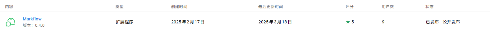

上个月做了一个叫 markflow 的评论插件，做完后更新了几版，一直没啥用户，本来是打算放弃不管了，又在电鸭论坛收到一些正面的评论，说这个点子不错，让我做成一个网页的js库，这样有站长能主动集成，于是趁着清明假期花时间做了一下。

## markflow 插件的数据总结

先来总结一下 markflow 的安装人数吧

chrome webstore:




edge webstore:


可以看出基本没人安装，都是小于10个人，应该都是我的朋友们以及官方的测试人员在用。所以在没有更多人安装的情况下，我应该不会继续更新新功能了。

## 如何移植浏览器插件

浏览器插件是用 js 写的，如果想要做一个网页js库，移植起来应该没啥困难才对，甚至网页版应该更简单才对，因为不需要处理那么多通信问题，但是实际情况还是超出了我的想象。

### sidepanel 和 sidebar

sidepanel 是一种chrome 插件形式，它会固定出现在网页右侧，但是又不属于这个网页的dom，所以当sidepanel打开的时候，网页的宽度其实是变窄了的。而 sidebar 是我希望实现的效果，就是在当前网页右侧用 css 自己实现一个侧边栏，模拟 chrome sidepanel 的样式。二者虽然看起来很像，但是还是有本质区别的，我觉得就我这个评论的场景来说，用 sidepanel 体验好过 自己实现的 sidebar

### CORS

还要解决的一个问题就是跨域，我的评论系统的域名是 markflow.ink 我如果希望任何网站都能集成我的js来发评论，那么就有可能从任意的域名发 http 请求来获取评论列表。浏览器默认有安全机制，只有同源才能发送 fetch 请求，但是为了让我的接口变得更通用，我得开放服务端限制，告诉浏览器任何域名发来的请求我都接受。

修改很简单，先要加一个 option 的路由，当发起同源的试探请求的时候要告诉浏览器是ok的。然后修改对应接口的响应头，加上CORS相关的头部就行了。

我因为使用的是 sveltekit 框架，所以可以直接定义一个 cors 中间件，把所有的 response header 都改了，避免一个一个改的麻烦。

### 身份认证

还有一个麻烦的点在于身份认证，我的官网 markflow.ink 是使用 cookie 来做身份验证的，有一个叫 session-token 的cookie，每次发请求的时候带上它，服务端会去 session 表里验证一下有效性，如果通过了就说明已登录。我的 markflow 浏览器插件也是利用这个 cookie 来实现身份验证的，chrome 插件支持读取指定域名下的cookie，不过需要配置相关权限。不过到网页上就稍微麻烦点，因为我们都知道 cookie 是不能跨域的，目前我的登录 cookie 是种在 markflow.ink 这个域名的，如果第三方网站比如说 https://a.example.com 就没法访问到这个 cookie，也就不能带上这个 cookie 去发请求。

网上有各种解决办法，比如说换成 jwt token，通过 http 参数重定向的时候返回保存之类的，我感觉改动都太大了，我目前官网和插件都是用 cookie 来认证身份的，不想为了做个网页集成就再搞一套 jwt 的验证方式。最后问了 AI，别的评论系统比如说 disqus 是怎么做的，AI说是通过 iframe 来实现的，这样我就豁然开朗，那么我也用 iframe 就好了。

实现起来很简单，如下：

```html
<body>
    <!-- https://a.example.com -->
    <div>
        <iframe src="https://markflow.ink/embed/comments" />
    </div>
</body>
```

只要在第三方网页上加上这个 iframe，然后我让它展示在侧边栏，这样点击按钮展开侧边栏的时候，看到的页面以为是当前网页自己的，实际是通过 iframe 加载的 markflow.ink 这个域名的。所以我要做的其实就是专门为这个 iframe 做一个嵌套的网页就行了，这个也简单，目前官网已经有了评论列表，拿来稍微改改就是了。

到最后线上测试的时候我发现了一个问题，之前在本地开发的时候没发现，就是 auth.js 默认给我种的 session-token 这个 cookie 的 `SameSite` 属性是 `Lax`，这导致在 iframe 里面没法拿到 markflow.ink 域名下的这个 cookie，导致没法验证身份。解决办法是什么呢？将这个属性设置为 `none` 就好了，我因为用的 sveltekit + auth.js ，所以只要在 `auth.ts` 里面配置一下 cookie 的行为就行

```js
cookies: {
    sessionToken: {
        options: {
            httpOnly: true,
            sameSite: "none",
            path: "/",
            secure: true,
        }
    }
}
```

这么改再重新登录就改了属性了，iframe 里面就能拿到 session-token 这个 cookie了，安全性我感觉也还好，毕竟设置了 `httpOnly`，我是想不到有什么场景会被黑客偷到自己的 cookie

### 移植 content script

这是整个改造过程改动最大的地方，在 chrome 插件中，如果想要改变当前网页的行为，比如说增加 css，执行js，因为插件和网页是隔离的，得通过一个 content script 来操作。我那个 markflow 的content script 写了 1700 多行，就为了在页面上渲染高亮，渲染评论框，渲染图片上的点。因为 content script 不能使用框架写，当时做的时候着实花了我一番功夫，还好有AI，现在看到要改这大坨代码，我内心还是很抵触的。

不过改下来发现也没那么难，最大的改动在于之前是通过 `chrome.runtime.sendMessage` 给 `background.ts` 发消息，让它去把评论、回复之类的发送到服务端，成功之后 `background.ts` 又发一个消息给当前的 tab，告诉它成功了，请重新渲染一下页面，把最新的高亮再渲染一下。

我现在因为没有了插件，而网页没法获得当前用户的身份，只能让网页发消息给 iframe 告诉它有个评论创建了，而 iframe 内因为就是我的官网，所以直接调用评论接口就行，会自动带上 cookie 去服务端创建新评论。

```js
function sendMessageToIframe(message: any) {
    const markflowIframe: HTMLIFrameElement | null = document.getElementById('markflow-comments-72x3ksb8') as HTMLIFrameElement;
    
    if (markflowIframe && markflowIframe.contentWindow) {
        try {
            markflowIframe.contentWindow.postMessage(message, '*');
        } catch (error) {
            console.error('发送消息到iframe失败:', error);
        }
    } else {
        console.warn('未找到markflow iframe，无法发送消息');
    }
}
```

从网页往 iframe 里发消息大概就像上面写的，如果 iframe 里的网页要接收到这个消息，得定义 `onmessage` 这个事件监听器。从事件监听器里解析出了各种 data 之后，再调用 `fetch` 把json发给服务端就行。

## 待优化点

### 网页入侵

对于插件来说，对网页是一点影响都没有，但是我现在做成了一个js脚本，那么对网页就有不小的影响了。但是我感觉影响还是不大，别的评论插件都是在博客正文底部占用一块长长的空间，用来展示评论列表，展示发布/登录表单，我这个只在网页右下角占用一小块地方用来展示一个按钮，点击按钮才会出现侧边栏。

传统的评论插件还需要用户懂一点编程，因为需要找到博客正文所在的容器是哪个，将评论区占位符正确放到正文下面，这样js才能正确找到定位，然后渲染评论列表。虽然现在个人站长都懂编程，但是找位置还是比较麻烦，我这个插件就不用这么复杂，我不需要定位，因为我默认是在右下角展示。只要查找 `</body>` 然后在上面插入 

```html
<script src="https://markflow.ink/js/markflow-client-latest.js"></script>
```

一般一个项目只会有一个 `</body>` 所以我这个集成起来更简单。

### 减少接口请求

目前我发表评论是通过 iframe 来发的，但是发完又立刻调用了一下评论列表接口，因为要及时更新页面状态，不然发完之后网页的页面没有高亮，打点数字没及时更新用户会很疑惑。这样就等于对于同一个数据有了2次请求：

1. iframe 内请求一次，返回评论列表的网页
2. js 触发请求一次评论列表

得想想看如何在 iframe 里就把最新的评论列表告诉网页，省个请求。

### 自定义 UI

目前我的这个评论区的UI没法自定义，就是右下角展示一个按钮，点开是一个侧边栏，侧边栏里用iframe嵌套了一个网页。我的官网是用 tailwindcss + daisyui 做的，所以默认是支持检测浏览器的主题，自动切换 dark/light theme的，但是如果有人需要让评论区颜色风格跟自己的网站更相似就不好改了，因为iframe就是大家用同一个网页同一套UI，如果我改了这个网页的UI，那么别人也受影响了。

右下角这个按钮的定位目前也是固定的，所以如果在这个位置已经有别的按钮了容易冲突，但是我也没想到好办法解决，配置太多使用门槛也就越高，本就没几个人用，还提高使用门槛简直自讨苦吃。

## 最终效果展示

我在我自己的 astro + tailwindcss 博客集成了这个js，已经有了这个评论的功能了。

先看一张桌面版的截图，文本高亮和图片打点都有


再看一张手机版的截图，能查看高亮，但是目前还没法创建高亮，因为默认选中文本后的行为被浏览器覆盖了，但是可以在图片上创建打点。


点开评论按钮长这样，因为我官网自动进入暗黑模式了，所以评论列表是黑的，但是头部的样式是由当前网页控制的，所以还是白色，点击右上角那个 x 关闭侧边栏回到网页


## 总结

花了几天时间终于改完了，不知道有没有人愿意使用这种新的评论形式，观察一下数据吧，有用户使用就持续优化。
