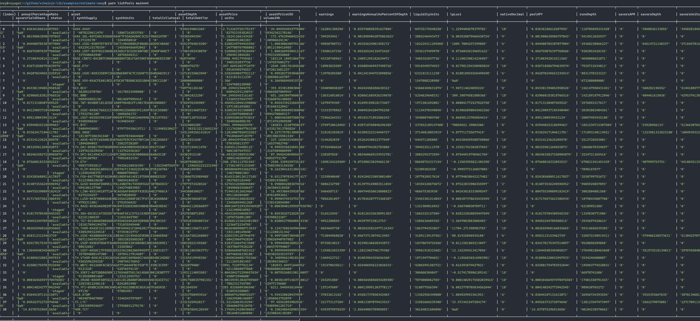
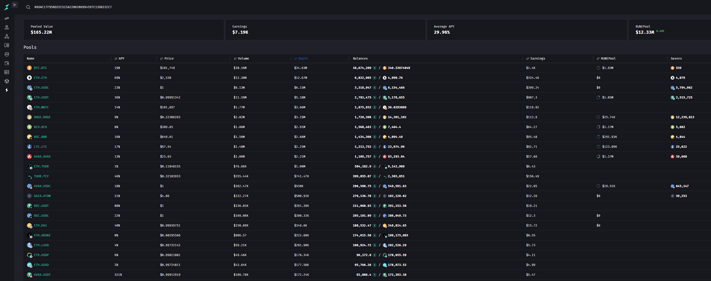
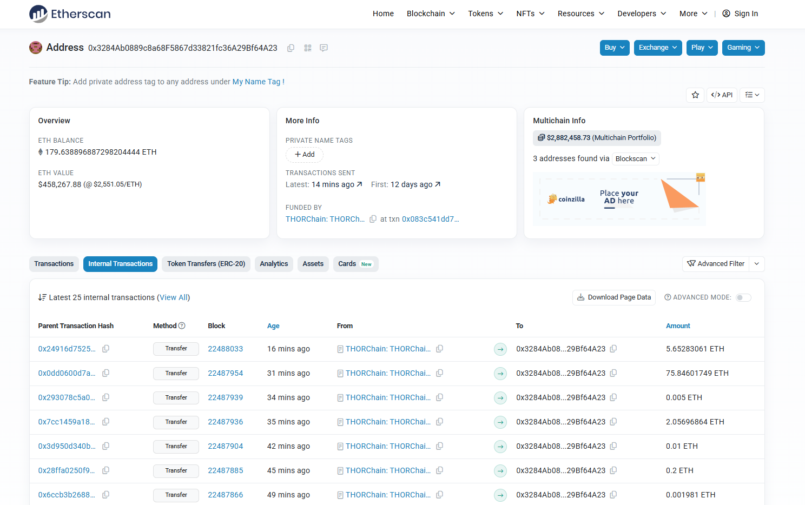

以前都是通过币安或者okx这类中心化的交易所来跨链换币的。比如说去年我测试tontip打赏，需要获得一些TON，但是我只有USDT和ETH，那么就可以去币安卖一些USDT去换TON，最后将账号内的TON币提到TON链上，这样就能在telegram wallet里面看到自己的TON余额了。

还有一种流行的换币的方法是通过 Uniswap，很多币的项目方实力不够不能上架到大的交易所，就会采用先去 Uniswap 创建一个交易池，找一堆朋友去当LP托盘，然后让普通玩家去这个交易池兑换，这种方式一般只限于 ethereum 以及衍生的区块链。

最近了解到一个区块链叫 THORChain，可以不用中心化交易所，直接跨链完成转账，比较好奇内部原理，所以看了一下官方文档，在这篇文章中记录一下。

## THORChain pools

THORChain 目前只支持一些特定的区块链之间兑换，这些可兑换的链就构成了一个池子



上面这个截图是通过 `xchainjs-lib` 这个库提供的一个脚本输出的，当然也可以通过浏览器去访问一些检索的网站查看，如：

[https://runescan.io/pools](https://runescan.io/pools)



这里的资产命名有点奇怪，比如有的是`BTC.BTC`，有的又是`ETH.USDT-0XDAC17F958D2EE523A2206206994597C13D831EC7`

可以理解为 `BTC.BTC` 代表 BTC 区块链上的原生代币 BTC，而`ETH.USDT-0XDAC17F958D2EE523A2206206994597C13D831EC7` 就表示ethereum主网区块链上的USDT代币，合约地址为：`0XDAC17F958D2EE523A2206206994597C13D831EC7`

## Estimate Swap

知道了可交易的资产之后，就可以进行兑换了，不过不是直接转账，先要估计一下

xchainlibs 也给了一个叫 estimateSwap 的脚本来做估计

```shell
yarn estimateSwap mainnet 2552 6 ETH.USDT-0XDAC17F958D2EE523A2206206994597C13D831EC7 ETH.ETH 0x7e727520B29773e7F23a8665649197aAf064CeF1
```

这个命令的意思是，我有 2552个USDT，USDT 代币的小数位是6，我想换成 ETH，请帮我估计一下费用，以及我该怎么创建转账交易

命令返回：

```json
{
  memo: '=:ETH.ETH:0x7e727520B29773e7F23a8665649197aAf064CeF1:97467969',
  expiry: 2025-05-15T10:44:52.000Z,
  toAddress: '0x3284ab0889c8a68f5867d33821fc36a29bf64a23',
  txEstimate: {
    input: '$ 2,552',
    totalFees: { outboundFee: 'Ξ 0.00039341', affiliateFee: 'Ξ 0' },
    slipBasisPoints: '9',
    netOutput: 'Ξ 1.00274175',
    inboundConfirmationSeconds: 24,
    outboundDelaySeconds: 12,
    canSwap: true,
    errors: []
  }
}
```

这个结果的意思是，我如果要给 `0x7e727520B29773e7F23a8665649197aAf064CeF1` 这个地址转 2552USDT等价的 ETH，需要在 ethereum 上给 `0x3284ab0889c8a68f5867d33821fc36a29bf64a23` 这个地址转 2552 USDT，备注为上面那段memo

去 etherscan 上看下这个地址



竟然是12天前才创建的，但是有很多 transfer 交易了。但是还没看到 ERC20 交易，可能是因为没人通过 THORChain 在同一条链上转账吧

猜测一下，如果 THORChain 的后端检测到 `0x3284ab0889c8a68f5867d33821fc36a29bf64a23` 多了一笔交易，并且memo, expiry都对上了，那么就会触发另一个交易自动给收款地址转1ETH，具体是中心化后端还是区块链去检测我们不得而知。这个汇率定价是怎么定的现在也还不知道，但是经过测试这个汇率还是很靠谱的
