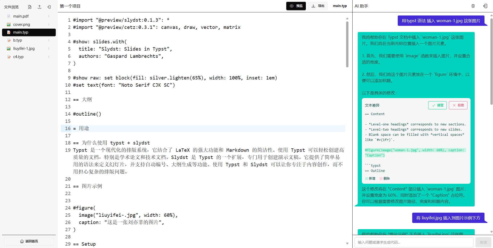

我的在线编辑器 [typ.ink](https://typ.ink) 基本功能已经做完很久了，UI 基本已经确定了，上周想着做点重构改进一下代码质量，因为我那个编辑页面目前代码长度达到了 1700 多行，这么长的文件，找到一个修改点鼠标都要滚很久，不太方便，所以想拆分成组件，这样代码比较简短，维护啊，写测试都更简单。

编辑界面如下：

## 页面 UI 结构分析

### 左侧

在这个页面中，左侧是文件列表，文件列表上面是文件工具栏，目前包括 新建文件、上传文件2个按钮，列表里的每个文件右侧有个菜单栏，可以点击在下拉菜单选择重命名、删除文件。

### 中间

中间是主体部分，展示的是编辑器和预览界面，如果当前打开的是纯文本文件，就展示 CodeMirror 编辑器界面，如果是图片等文件就直接渲染图片。如果是 "main.typ" 文件，顶部工具栏还会展示预览按钮，点击会编译 typ文件到canvas进行预览。

### 右侧

右侧是AI聊天助手，用户在这里发送消息跟AI交互，AI返回消息，解析后渲染到列表上。这个界面我抄的是github copilot的交互流程，如果AI返回了代码我就用一个 Diff 组件把变更展示出来，用户可以选择接受，如果用户选择的是生成图片，那么就展示图片内容。
比较麻烦的是AI返回的内容可能会跟编辑器和文件树互动，比如AI要新建一个文件，我得改文件树，还得改编辑器内容，涉及到各个组件之间传递消息。

## 改进想法

最早我是在一个svelte文件中实现的这个UI，代码行数觉得有点多，所以又花了几天时间拆成了 `FileExplorerPanel`, `EditorPanel`, `ChatPanel` 这3个面板，面板之间如果要互通消息，是先把事件冒泡发给父级 `+page.svelte`，父级再决定触发哪个组件的更新，这就更加麻烦了，我在文件树重命名了一个文件，我想在编辑器立刻看到这个文件，得先把重命名事件发到 `+page.svelte`，再发给 `EditorPanel.svelte`，然后才能展示文件内容，代码复杂度也提高了。

现在这么搞: `FileExplorerPanel` 470 行，`EditorPanel`: 282 行，`ChatPanel`: 570 行，`+page.svelte`: 120 行

总体行数加起来 1400 行左右，看起来没省多少代码，但是确实UI复杂度变高了，原来一个大单体，改一个状态的话所有组件都知道，现在拆分细了，改了内部状态得发消息通知其他组件更新。

这种新的划分方式让我觉得很不方便，我打算再把这些组件合进去，省得到处发消息，文件大无所谓只要内聚性高，改动都限制在一个小范围内挺好，不要为了拆分而拆分。
