typink 是一个在线编辑器，通过输入 typst 代码，可以在本地编译出pdf文件，跟office, wps 这类编辑软件不同的是我直接操作的是typst代码，所以比较容易用AI来辅助编辑。

## 从创建项目开始

用户的每份文稿都是一个项目，一个项目下包含多个文件，如源码，各种图片，以及封面图等等。

这里是创建项目的界面，点击右上角新建按钮，然后在弹窗输入项目名就行，如下图所示：

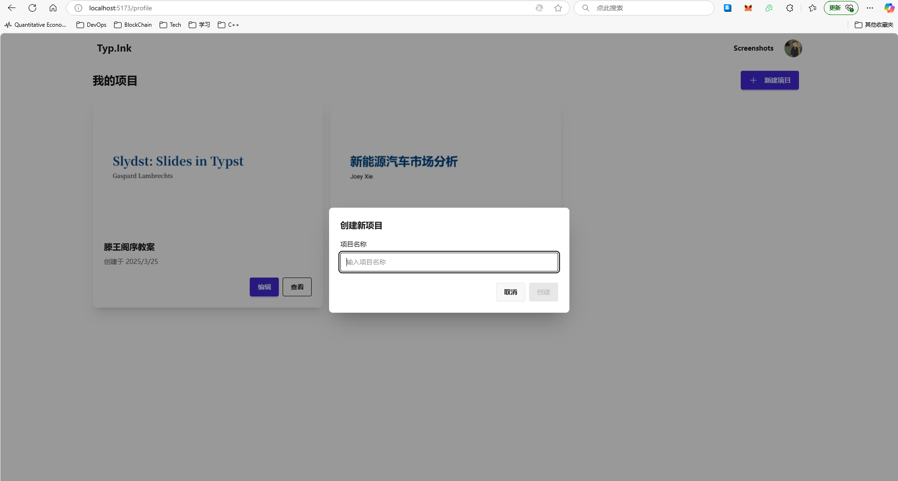

我昨天用AI写了一份新能源汽车市场分析的文稿，今天我打算变身一个高中语文老师，来写一份教案

## 编辑界面介绍

创建完项目会跳转到编辑界面，如下图所示：

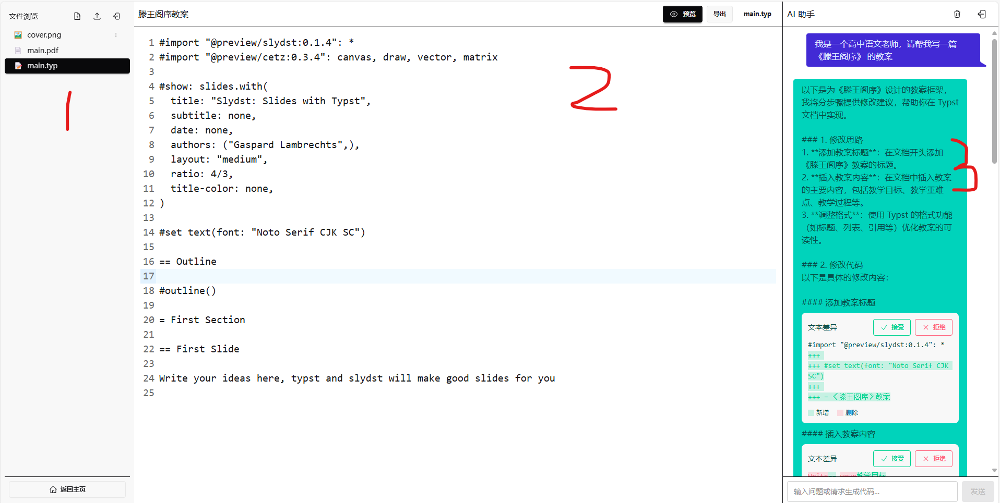

第一部分是文件管理器，顶上有2个按钮，新建文件、上传文件，底下是当前项目文件列表
第二部分是主编辑界面，顶上是工具栏，如预览、导出按钮，底下是编辑器，在这里可以编辑 .typ 文件源码，这个 main.typ 就是我们项目的入口文件，编辑它然后预览无误点击导出就会更新项目里的 main.pdf 文件。
第三部分是AI聊天界面，在这里跟 AI 对话，给它提需求，让它帮你改编辑器里的代码。

每个项目都会包含一些最基础的模板代码，如上图所示，目前这个模板我用到了 slydst 这个库，通过这个库我们可以输出美观的pdf文件。

每个新建的项目都是可以运行的，先点一下预览按钮看看效果：

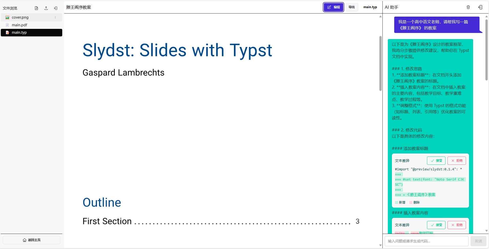

此时编辑器里展示的不再是那堆看起来复杂的代码，而是一个简洁的页面，看起来挺像ppt文件的。

再来点击一下导出按钮看看效果

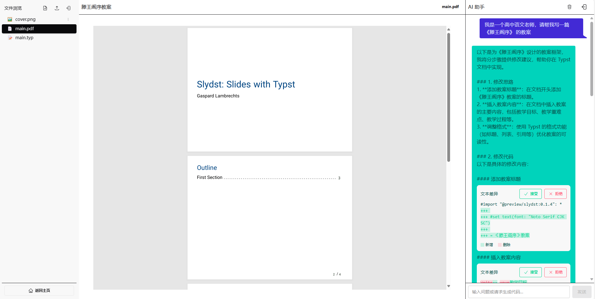

点击导出会跳到这个 `main.pdf` 文件，在这里我们可以看到这是一个 4页的pdf文件，大部分内容都是空的，就一些标题，大纲信息而已，未来我们要做的事就是往里面填充内容，然后再导出

## 使用 AI 来一步一步补充内容

接下来我们要做的事情就是往 `main.typ` 这个文件里填充内容，有个难点，我不懂 `typst` 语法怎么办？我也不太懂 `typst` 的语法，但是不要紧，我们让侧边的 AI 来帮我们写代码。

### 第一个需求 --- 粗略想法

我先提出了第一个粗略需求，让 AI 帮我写个教案，提问和AI响应的前半部分在上面的截图中都展示了，AI 生成了长长的反馈，这里我再截图展示一下靠后的内容：

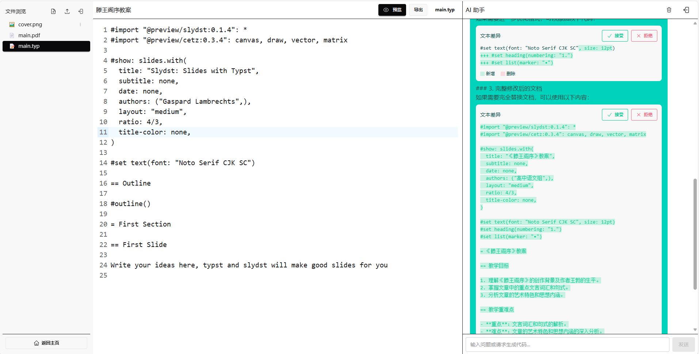

AI 的作用是输入一个问题字符串，然后返回一个长长的回答字符串，我这里在提示词上做了一些标记，这样我就能把AI的响应解析成一块一块的内容。截图中能看到的一块一块的代码块，右上角还有 “接受”，
“拒绝” 2个按钮，这就是 AI 基于当前文档内容以及我们提的需求，返回的代码，通过红绿颜色标明做了哪些修改，如果觉得 OK 可以点接受按钮，会把改动更新到编辑器中。如果担心一键接受会影响到其他代码，也可以手动复制到文本，粘贴到编辑器中。

就我这个需求，AI 给出了2小段修改建议，但是最后AI发现改动比较大，所以又给了一个全量修改的建议。我打算接受 AI 最后的修改建议，全量替换编辑器内容，点击接受按钮

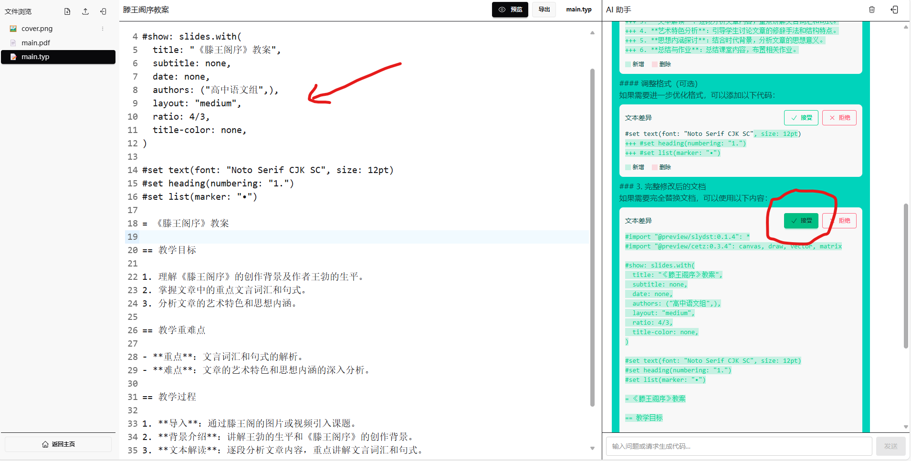

这样默认模板的英文内容都没了，反之是AI生成的教案内容

AI 生成的这段代码能不能用呢？让我们点击一下预览按钮看看

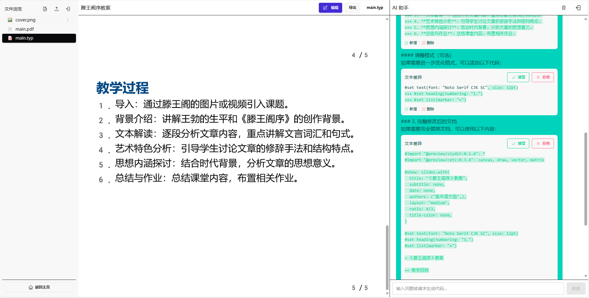

很不错，AI给出的代码很正确，一字未改顺利编译通过，在预览界面我们看到了一个 5页的文档。

### 第二个需求 --- 完善

5页的教案肯定是不够的，但是我不是语文老师，我也不知道这堂课该怎么讲，所以让我们继续给 AI 提需求，让它完善，我的第二个问题如下：

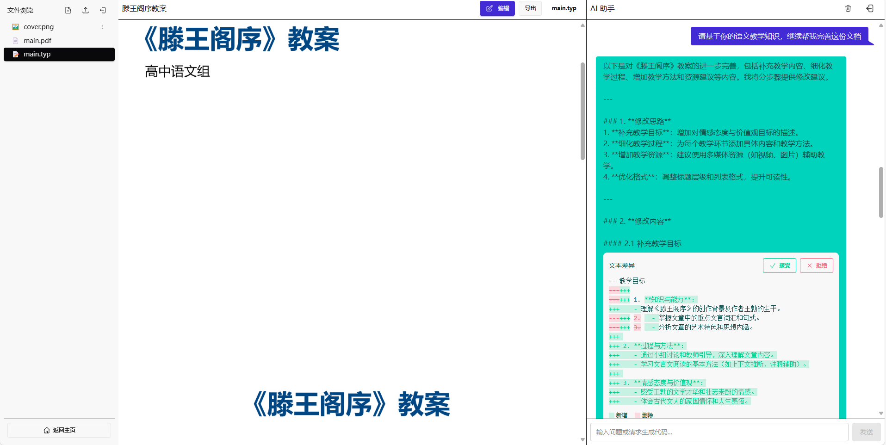

可以看到 AI 给出了修改思路，并且在每段都给出了修改建议，AI 给出的建议太详细了，问它10个字，回复了得有1000个字，让我们滚到底部看看AI最后的回复内容：

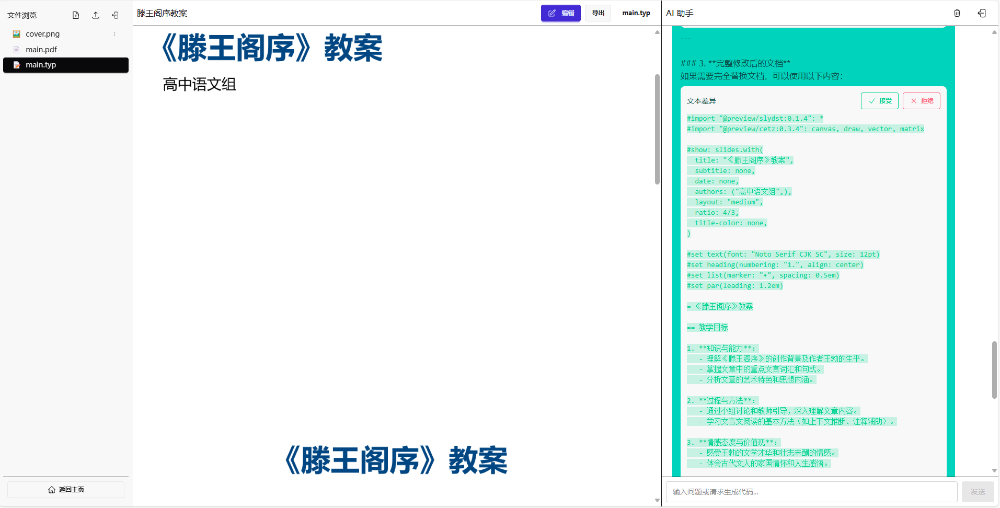

可以看到前面分点给了修改建议，最后 AI 觉得麻烦给出了完整的修改文档，方便我们一键替换。我可以点击接受按钮一键接受，但是我担心改动太大会导致破坏掉我之前的内容，现在又还没做版本控制，所以我点击上面的“编辑”按钮，回到编辑界面，先将之前的内容复制出来，纯文本复制到哪里都很方便，再点击接受。

代码更新后，我们再点击一下预览按钮看看对不对：

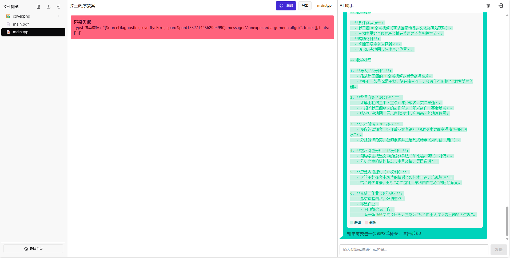

这次很不幸，报了一个错，但是也不要太紧张，AI 生成代码大部分时间都是准确的，偶尔不准确也许是因为知识库没更新而软件又有了不兼容的改动。这个错误讲的是有一个未预料到的参数 align，点击编辑按钮，回到编辑器，按下 `Ctrl + F` 查找 `align` 发现只有在第 15 行一个地方用到了 align

```
#set heading(numbering: "1.", align: center)
```

所以这个错可能是因为 heading 这个函数不支持传入 align 这个参数，很简单把这个参数删掉试试


很幸运，问题解决，可以渲染。

这是我们自己想到的修改办法，让我们试试看把问题交给AI它能不能想出解决办法：

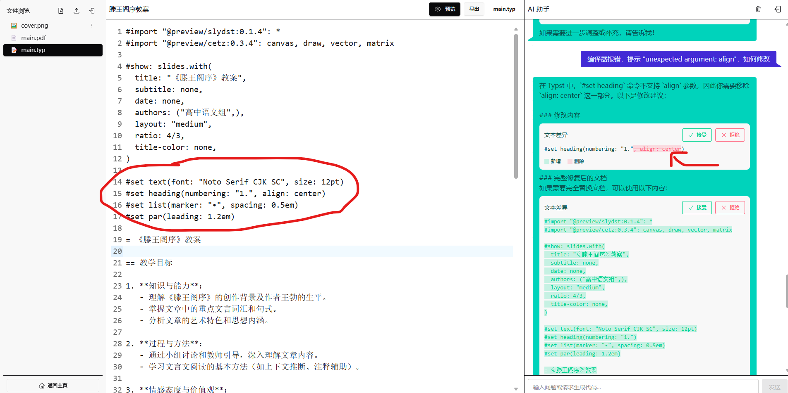

可以看到 AI 也发现了 heading 里面不支持使用 align 参数，并且给出了一行修改意见，红色表示删除，所以AI的意思跟我们判断一样，都是删掉 `alien: center`，不想点击接受一键修改的话，就自己在编辑器里把对应内容删了。

### 第三个需求 --- 插入图片

通过上面2个问题，AI 给生成的教案已经有 8 页了，我不知道对于上课够不够用啊，但是接下来我不加文字内容了，我想让 AI 给配上一些图片，不知道出了啥问题，AI 没给出响应

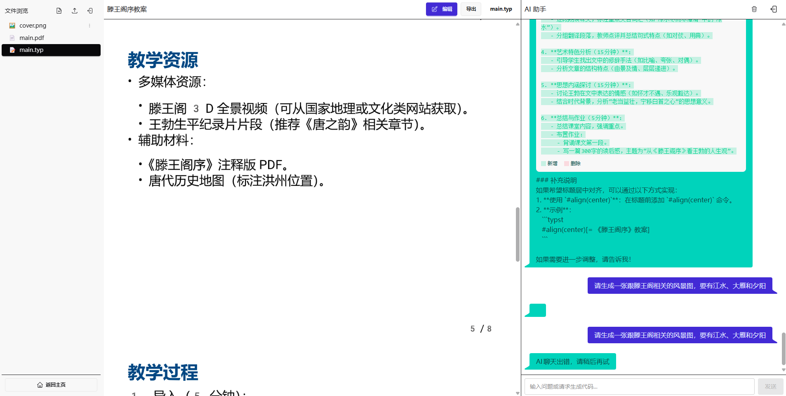

不要紧，让我们点击右上方那个删除按钮，清空一下聊天记录再试试

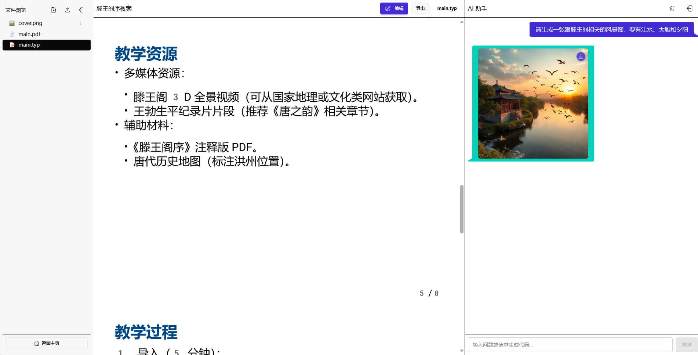

可以看到没有了历史记录影响，此时 AI 成功给返回了一张图片，但是好像跟我的提示词不太相关，目前我用的 AI 是 deepseek，这是一个文本模型，生图我是通过 tools 功能，调用 flux 模型生成的，也许是模型问题，导致生图效果一般，不过不要紧，未来接入更牛的生图模型就行。在这里我还是决定使用这张图片，插入到我的教案中。

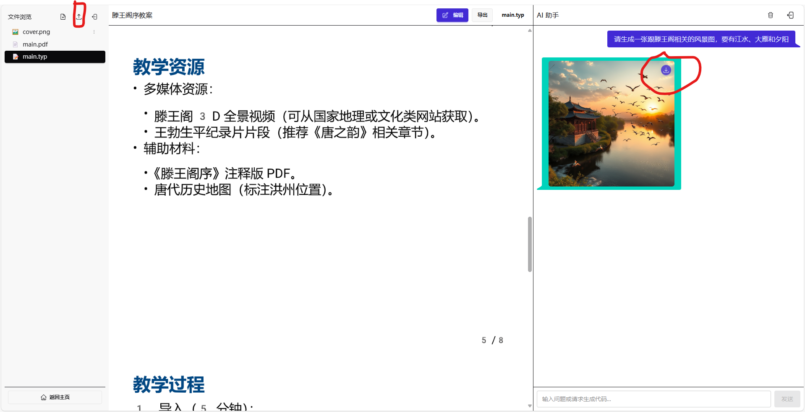

要使用这张图片有2种办法：

1. 右键保存到本地，然后在文件浏览器中点击上传按钮上传到项目中
2. 直接点击图片右上角那个保存按钮一键保存到项目中

为了省事我将采用第二种办法一键保存

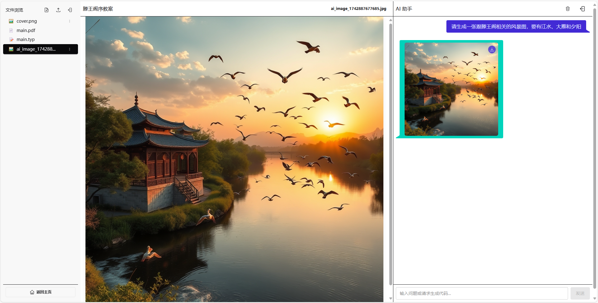

现在在文件浏览器里就可以看到这张图片了，文件名比较长，点击右侧那3个点，在菜单中选择重命名为一个更简短的名字，我在这里使用 `ai-sceen-1.jpg`

接下来我回到编辑器，再提个需求，让 AI 在当前光标处插入图片，我当前光标在第50行，AI能感知到我鼠标在的位置，提供更精准的上下文，结果如下：

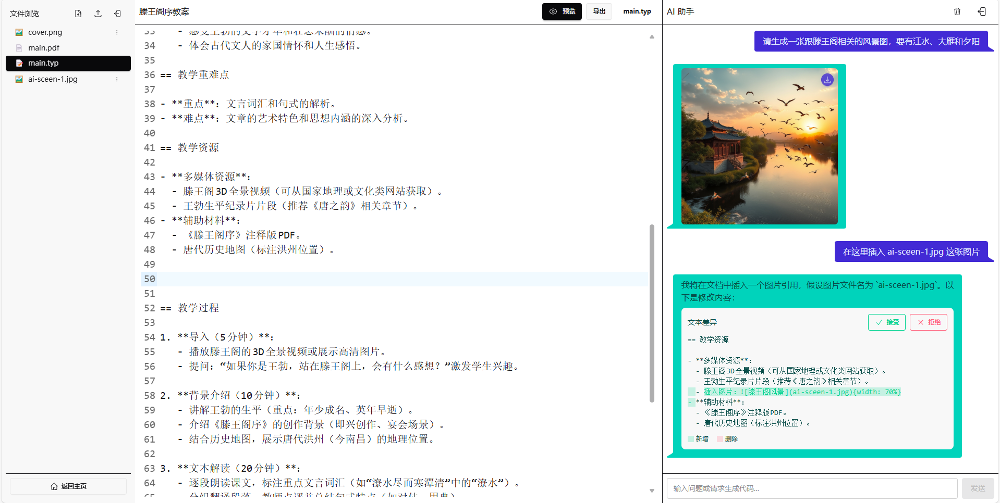

很不幸，这个回复不太对，AI 用的是 markdown 的插入图片的语法，在 typst 中要用 image 函数，也许是我们提示词的问题，让我们继续让AI修改

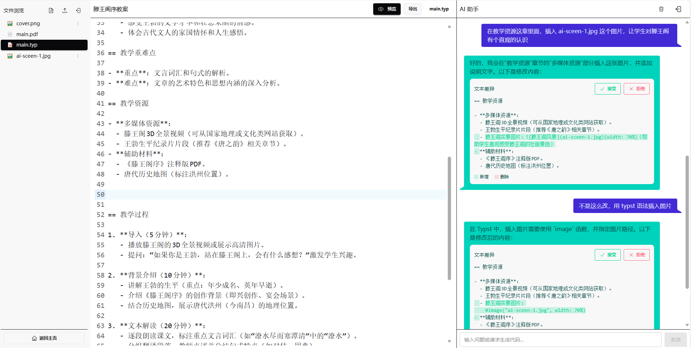

很不幸，也许是提示词没调教好，这个问题问了2遍AI才给我合适的回答，第一遍还是用的 markdown 语法，第二遍我提示它用 typst 语法它才反应过来。AI 给了一行改动，语法是对了，但是我感觉如果这样插入的话页面应该会很丑。让我们先来看下效果：

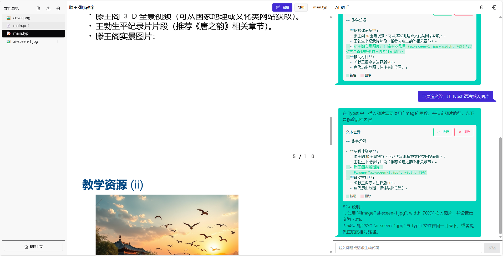

在滕王阁实景图片后面插了一张图，然后就导致分页了，让我们再来尝试修改一下，让 图片和文字在一页展示，避免分页。

我的问题和效果如下：

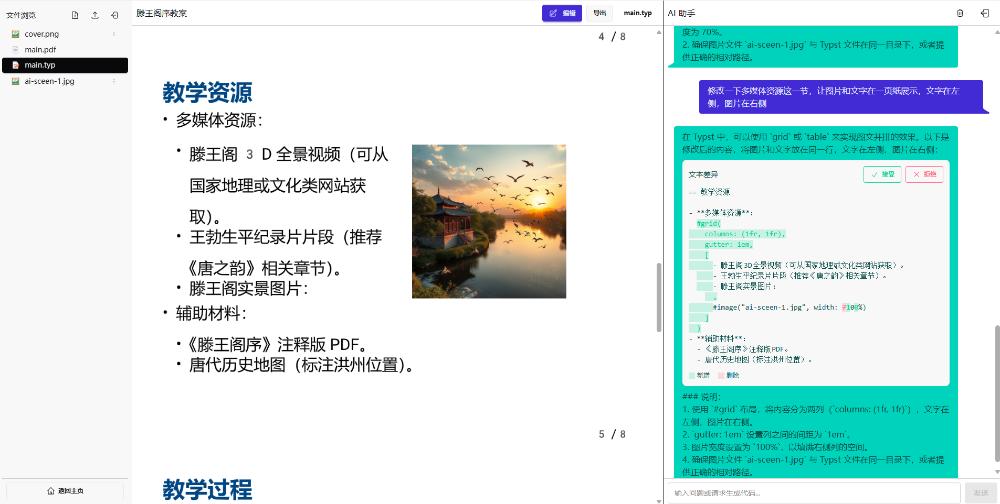

AI 想到了通过grid将当前页分为2列，左边展示列表，右边展示图片，返回大体是可用的，不过AI 将 

```markdown
- 滕王阁实景图片：#image("ai-sceen-1.jpg", width: 7100%)
```

这句话识别到一起了，导致编译器以为这张图跟这个点是一起的，实际上我想将图片作为这页的背景图，不过稍加改动，将图片放到第二列就行，代码如下：

```
  #grid(
    columns: (1fr, 1fr),
    gutter: 1em,
    [
      - 滕王阁3D全景视频（可从国家地理或文化类网站获取）。
      - 王勃生平纪录片片段（推荐《唐之韵》相关章节）。
      - 滕王阁实景图片：
    ],
    image("ai-sceen-1.jpg", width: 70%)
  )
```

这页这个网格，第一列是3个论点列表，第二列是一张图片

## 总结

到这里我想演示就差不多了，我们从0创建了一个项目，然后通过几轮对话让AI帮我们生成了内容大纲，并且指挥 AI 修改内容，生成图片，插入图片等。我想这种方式还是新颖的，因为我看抖音上各种 AI 博主分享的 AI生成ppt的过程都是先去 deepseek 生成大纲，然后拿到markdown格式的大纲，去kimi 或者 wps 或者什么ppt岛的小程序，选择一个模板，然后点击生成，它们的可以生成很花哨的ppt，因为模板库很丰富，但是要改起来也麻烦，修改的时候 AI 就帮不上忙了，得自己下载到本地打开 powerpoint 自己改。

我的这个模式是以对话的形式改，所以每次都可以让 AI 帮忙按你的意思修改，而不是 AI 只帮你生成，修改得靠自己。

最后再让我们看一眼导出的 这个 8页的pdf文件大致长啥样吧：

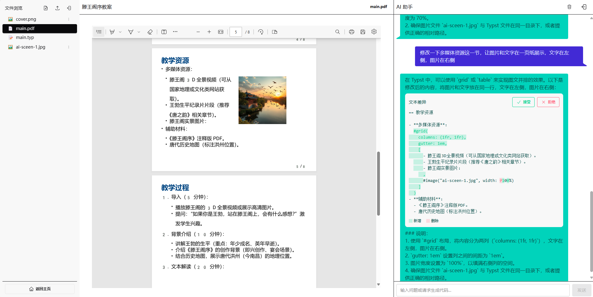

界面看起来很朴素，不如别人的花里胡哨，你会愿意使用这种方式来生成你的演讲稿吗？
