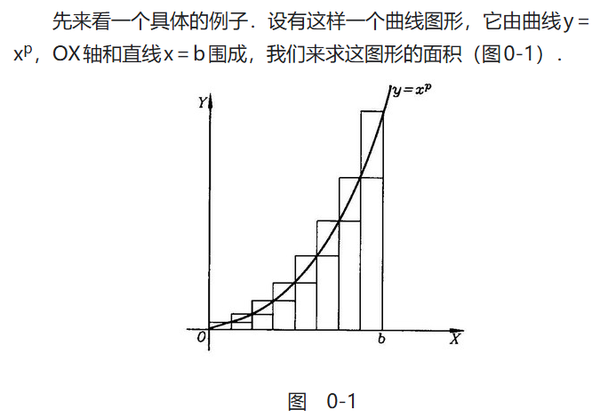
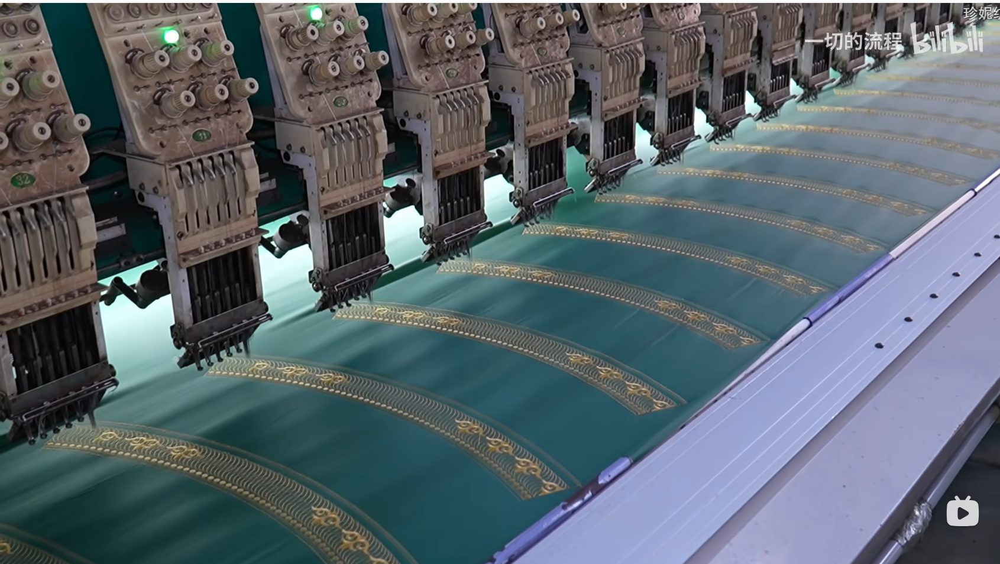

## Web 换脸功能的初步实现

上周产生了做一个 AI 换脸SaaS的点子，所以周末开始实现，现在已经有了一个demo，效果如下图：

技术原理也比较简单，接口用的是 [facefusion](https://github.com/facefusion/facefusion) 这个python程序，包含了很多模型来控制换脸，效果还不错。但是官方只给了一个 gradio 的 webUI 界面，所以我个人还封装了一个 CLI 并且暴露了 HTTP api 对外访问。部署到 Azure Container App 上面，这个服务可以按需收费，如果没人用我的换脸接口就不产生费用，还挺好的。

## 新的 Astro Blog

产生了做一个新的博客站的想法，正好 astro V5 已发布，tailwindcss V4 即将发布，正是再部署一个博客的好时候，搜索一番，选择了 [cactus](https://github.com/chrismwilliams/astro-theme-cactus) 这个模板，整体设计简洁又现代化，挺好的。

我在 windows 上部署的时候，遇到了一个 sharp not found 的问题，这个库是用来处理图片的，astro也许会用它来生成一些小图片适配手机，加快访问速度。但是这个库太老旧了，连 ESM 导入都不支持，官方也不想改，没辙，搜索了一个跳过图片处理的解决办法，见：[Could not find sharp](https://docs.astro.build/en/reference/errors/missing-sharp/)

这个网站计划部署到 `feiye.me` 上面，纯纯记录个人生活，不搞营销推广，这次花了14块钱，明年续费要160，太贵了，到时候再看续不续吧。

## 一个积分问题

昨天咖啡喝多了，导致晚上睡不着觉，所以拿平板看了会儿小说，但越看越无聊，所以找了个数学分析的书看了几页，里面有一道积分问题吸引了我

本来是直接套用积分公式就行，但是现在将自己摆在一个数学初学者的位置，如何求解呢？
作者是从计算面积这个问题开始，一步一步引导我们从累加，到求和公式，到极限，最后引出积分。

第一个问题是如何求和，

$$
\sum_{k=1}^n k^p
$$

如果 `p = 1` 这种简单的都会做，就是等差数列求和，但是当 `p` 变为2, 3, ... 的时候又该怎么做呢？这个没有简单的公式，也不能一下猜出结果然后数学归纳法去证明

从一个恒等式出发

$$
\sum_{k=1}^n k^p - \sum_{k=1}^{n} (k-1)^p = n^p
$$

因为连加号做加减可以提出来，所以变为了

$$
\sum_{k=1}^n (k^p - (k-1)^p) = n^p
$$

里面是2个多项式相减，是有公式可以套的，杨辉三角，就实现了降次，最高次变为了 $ k-1 $

问题就变为了求

$$
\sum_{k=1}^n k^{p-1}
$$

一直往下降次，就可以得到答案，最后的结果形式也是比较长的。

这个问题给我的思考是，要求一个连续函数的积分，首先将它离散化，去算近似的结果，这其实就是计算机做的事，计算机精度有限，只能做离散的计算，数学比计算机强的一点在于数学可以把离散的求和变为连续的积分，计算机却不可以。

我又想到现在 AI 里面计算梯度这么难，各种算法都在优化梯度，什么随机梯度下降，反向传播等等，当年我们学高数，用多元函数偏导数求梯度感觉挺简单的，就是套公式

## 刷到的几条有意思的抖音

### 马斯克成立政府效率部门（DOGE）

有人说中国也要成立类似的部门来削减开支，我评论说太敢说了，体制内人已成为既得利益之，让自己革自己的命实在是太难了，如果体制内不好，为啥大学生削尖脑袋往里面挤？

### 中华田园犬

有个博主发了个视频比对现在的土狗和汉代陶俑狗，发现长得很像，我回了句李斯的话

> 吾欲与若复牵黄犬，出东门逐狡兔

想到这又有点感触，谁不想回到村里，带着孩子拉着狗去追兔子玩呢？李斯回不去，我们也回不去了，哎！

### 付鹏

这位东北证券首席经济学家在一次内部分享的视频，被很多人剪辑，我看到的是这句

> 年轻人掌握资本就不存在资本过剩的问题

为啥经济形势都这样了，还给退休老人提高退休金？他们根本没有消费欲望，年轻人如果手上有钱，很容易就花出去了，因为有挣钱的能力，花就花了，老人拿到钱大概率会一直存着，如何刺激消费？

## 几个有意思的youtube视频

### 零度解说 --- 用 ComfyUI + flux 生图

因为我自己做了换脸，现在又对换衣比较感兴趣，想看看人家是怎么做的，本地运行效果确实不错，但是得想办法做成接口才有可能赚钱，不过这个视频启发了我也可以搞个小红书号，用 AI 去生成内容，因为他视频显示小红书 AI 图，都有人在底下评论说想见面。。。

### 零度解说 --- 白嫖Oracle VPS

说是可以永久免费使用，评论里也有人说白嫖了几年，所以也去试了一下，竟然成功了。操作很简单，要注意：

1. 注册账号不要翻墙，选中国大陆就行
2. 一个邮箱如果失败，就再换另一个邮箱试试
3. 默认创建的VPS有防火墙保护，要先在控制面板子网那里允许目标端口，然后清空本机的 iptables 防火墙才行，很奇怪。

说是最多可以用24G内存，但是我先创建了一个 1核1G 的机器，未来有需求了再创建一下其它的。

Oracle 的云计算技术好像确实不如google和azure，我用 azure 基本不会考虑买VPS，因为太不划算，做网站用静态站点+functions，跑后端用 Container App，基本都是按需收费。

## 几个有意思的 Bilibili 视频

### 中国工厂生产穆斯林帽子过程

[链接](https://www.bilibili.com/video/BV1RTzJY7EPu/?spm_id_from=333.1007.top_right_bar_window_history.content.click&vd_source=b006e936c76c138f12ddafe94e135085)

感触：这种纺织厂，都不需要多少工人在里面干活了，刺绣都是机器干的，只要少量的人力去做裁剪、缝合。据说这还是因为当地要求自动化率不能太高，要消化劳动力，未来全自动了，还需要工人干什么。都说新中国必须要工业立国是因为农业养不活14亿人，可是现在的工厂，能养活这么多城市里的工人吗
