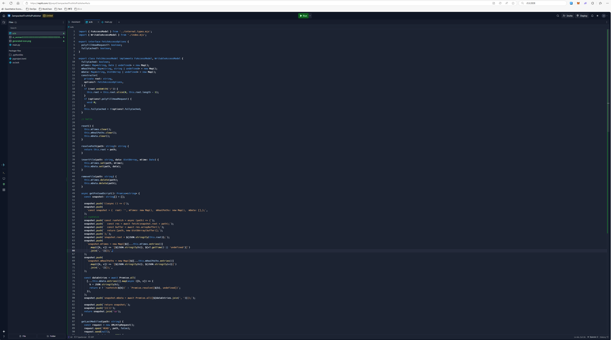

上周花了两天时间弄完了 [typ.ink](https://typ.ink) 编辑器的原型，但是这个原型比较丑，因为编辑器界面我是用 daisyui 的 [Divider layout](daisyui.com/components/divider/) 做的，这个布局是左右结构，正好左边放编辑器，右边展示预览结果，但是呢，很显然只有桌面电脑上展示是正确的，在手机上就不行了，因为没有那么宽的屏幕。因此这周末我又参考了一下别的在线编辑器的UI示例，主要是 [replit](https://replit.com)，觉得他们的这个界面做得简洁直观，所以想模仿一下。编辑界面如下图：



当然，UI组件库还是用 daisyui，不打算换了，虽然这个库缺少很多常用的组件，但是它本身不包含js，我很喜欢这种设计，尽可能用css来渲染界面，只有非不得已再引入js。

## 实现 sidebar

模仿 replit UI 遇到的第一个问题就是如何实现一个可以折叠的sidebar，这个功能在很多UI库里都是内置提供的，但是daisyui没有提供，因为要点击一下按钮就展示 sidebar，再点一下就隐藏需要用到js，不过作者给了一个示例的代码教我们怎么做，也很简单，见：[https://svelte.dev/playground/1117baf37a8a4c8299349d21c68039a2?version=5.17.3](https://svelte.dev/playground/1117baf37a8a4c8299349d21c68039a2?version=5.17.3)

自己用 svelte 5 稍微改改就是：

```svelte
<script>
	let isSidebarExpanded = $state(false);
</script>

<div class="drawer drawer-open">
    <input id="my-drawer" type="checkbox" class="drawer-toggle" />
    <div class="drawer-content">
        <!-- Page content here -->
        Content
    </div>
    <div class="drawer-side">
        <label for="my-drawer" aria-label="close sidebar" class="drawer-overlay"
        ></label>
        <aside
            class={`menu p-4 min-h-full bg-base-200 text-base-content ${isSidebarExpanded ? "w-fit" : ""}`}
        >
            <div class="flex justify-end">
                <button
                    class="btn btn-ghost btn-square"
                    onclick={() => (isSidebarExpanded = !isSidebarExpanded)}
                >
                    {#if isSidebarExpanded}
                        ←
                    {:else}
                        🟰
                    {/if}
                </button>
            </div>
            <ul>
                <li>
                    <a href="/">
                        😀
                        {#if isSidebarExpanded}
                            Sidebar Item 1
                        {/if}
                    </a>
                </li>
                <li>
                    <a href="/">
                        😀
                        {#if isSidebarExpanded}
                            Sidebar Item 2
                        {/if}
                    </a>
                </li>
            </ul>
        </aside>
    </div>
</div>
```


## 实现 contextmenu

基本的 sidebar 做完后，遇到第二个问题，就是 replit 里的sidebar如果按下右键是会弹出一个菜单栏的，用户可以在里面选择新建文件、新建文件夹等选项。很多UI组件库也内置了这个功能，但是同样 daisyui 也没有，我看到github上有人给作者[反馈](https://github.com/saadeghi/daisyui/discussions/3246#discussioncomment-11079389)这个问题，同样作者回复说这个功能的实现要依赖js，所以没有内置，但是他给了一个自己实现的例子，见：[https://svelte.dev/playground/bb1295931880414a9448901e6548775a?version=5.17.3](https://svelte.dev/playground/bb1295931880414a9448901e6548775a?version=5.17.3)

实现思路很明确，就是让一个按钮监听 `contextmenu` 的事件，如果触发了这个事件就展示菜单，因为这个菜单是相对鼠标位置定位的，所以需要一点js来计算菜单的位置，如果点击页面其他地方就隐藏这个菜单。

```svelte
<script>
	let isOpen = $state(false);
	let position = $state([0, 0]);
	function showMenu(event) {
		event.preventDefault();
		position = [event.clientX, event.clientY];
		isOpen = true;
	}
	function hideMenu() {
		isOpen = false;
	}
</script>
<svelte:window onclick={hideMenu} onblur={hideMenu} />

<button class="btn m-20" oncontextmenu={showMenu}>Right-click me </button>

{#if isOpen}
	<ul
		class="menu absolute bg-base-100 shadow-xl rounded-box w-56"
		style="left: {position[0]}px; top: {position[1]}px;"
		>
	  <li><button>Item 1</button></li>
	  <li><button>Item 2</button></li>
	</ul>
{/if}
```

## 实现预览界面

在之前的左右结构的界面中，我是将屏幕右半部分作为预览界面的，现在要考虑到移动端的话，预览一个pdf就应该用弹窗，这样才可能占用整个手机的屏幕，做弹窗比较简单，就是用 Modal 就行。官方文档内置了[这个组件](https://v5.daisyui.com/components/modal/#dialog-modal-closes-when-clicked-outside)

```html
<!-- Open the modal using ID.showModal() method -->
<button class="btn" onclick="my_modal_2.showModal()">open modal</button>
<dialog id="my_modal_2" class="modal">
  <div class="modal-box">
    <h3 class="text-lg font-bold">Hello!</h3>
    <p class="py-4">Press ESC key or click outside to close</p>
  </div>
  <form method="dialog" class="modal-backdrop">
    <button>close</button>
  </form>
</dialog>
```

我因为要在modal里面展示pdf，还要自定义modal的最大宽度和高度，这块官方文档也有教程。

## 实现文件上传按钮

上面做完了 `contextmenu` 后，已经可以展示右键的菜单了，我需要在这个菜单项里加上一个上传图片的功能，因为 typst 编译的时候可以包含指定路径的图片，大家写文档的时候也经常要插入图片进去，一般编辑器内上传都是直接拖拽或者粘贴图片进去，但是这里我试验一下通过右键菜单触发文件选择，然后在选择完文件后立即调用上传接口进行文件上传。

这个功能的实现也要依赖js，一步一步触发，大致代码如下：

```svelte
<script lang="ts">
let fileUploader: HTMLInputElement | undefined = $state();
let uploaderFormButton: HTMLButtonElement | undefined = $state();

async function handleFileChange(event: Event) {
    const input = event.target as HTMLInputElement;
    if (input.files && input.files.length > 0) {
        uploaderFormButton?.click();
    }
}
</script>

{#if isOpen}
    <ul
        class="menu absolute bg-base-100 shadow-xl rounded-box"
        style="left: {position[0]}px; top: {position[1]}px;"
    >
        <li>
            <button onclick={() => fileUploader?.click()}
                >Upload Images</button
            >
        </li>
    </ul>
{/if}
<form
    method="POST"
    action="?/upload"
    enctype="multipart/form-data"
    use:enhance={() => {
        return async ({ update, result }) => {
            if (result.type === "success") {
                files = [
                    ...files,
                    ...(result.data!.files as string[]),
                ];
            }
            await update({ reset: true });
            await applyAction(result);
        };
    }}
>
    <input
        id="file-input"
        type="file"
        accept="image/*"
        name="images"
        multiple
        hidden
        bind:this={fileUploader}
        onchange={handleFileChange}
    />
    <button bind:this={uploaderFormButton} type="submit" hidden
        >Upload</button
    >
</form>
```

上面的 `<ul>` 就是 `contextmenu` 打开后的菜单列表，里面有一个上传按钮

1. 点击上传图片的按钮时，触发 fileinput 的 click 事件，打开操作系统的文件选择器
2. 选中文件后，触发 fileinput 的 onchange 事件，这里进入到 `handleFileChange` 的回调
3. 在 `handleFileChange` 的回调中，如果检测到文件长度大于0，触发 `uploaderFormButton` 的 click 事件
4. 因为 `uploaderFormButton` 按钮是一个 `submit`，所以这个按钮点击会触发对应的 `form` 的提交
5. 因为这个 `form` 使用了 sveltekit 的 progressive enhance，所以结束后不会触发重定向，反而还能自定义回调，避免刷新页面

到这里上传功能基本就做完了，我觉得最重要的还是 progressive enhance 这部分，避免了页面刷新，当然自己实现一个 fetch，然后通过 xhr request 发送也行，但是这样不太符合全栈开发的思想，如果必复用就没必要抽象。

## 实现文件列表

上面说到已经实现了一个 sidebar，在这个 sidebar 里面放的是文件名列表，但是我想模仿 replit 实现点击每个文件的时候，在右侧的编辑器界面会根据不同文件类型进行渲染，比如说我如果点击打开一个pdf文件，右侧就应该 `embed` 一个pdf文件，我如果打开一个图片，右侧就应该用 `` 标签展示这个图片，如果我打开的是可编辑的文件，右侧就应该用我自己封装的 `<CodeMirror>` 组件展示编辑器。

判断当前打开的文件及类型都好说，就用 svelte 的响应式编程就好，左侧显示哪个文件被打开这块要用到 daisyui 的 `menu-active` 组件

```html
<li>
    <a class="menu-active" href="#main.typ">
</li>
```

加上这个类名，就会有选中的效果了。还有一点要注意，我这里是用 url hash 来标识当前打开的文件名的，不是一个内部状态，这样做的好处是方便分享链接

```svelte
import { page } from "$app/state";

let currentFile = $derived.by(() => {
    const urlHash = page.url.hash.slice(1);
    if (files.includes(urlHash)) {
        return urlHash;
    }
    return "main.typ";
});
```

在 svelte 里面可以从 `page` 里面取到hash，然后通过 `rune` 绑定到 `currentFile` 变量上。

## 总结

实现这个编辑器还遇到了一些其它的小问题，比如说如何用 vite 导入静态文件，在前端如何读取文件内容，后端又怎么读，在切换打开的文件的时候，如何保证编辑器的内容不丢失，如何及时保存到服务器上等等，不过本文主要是讨论UI，所以不在这里多说。

总体来说 daisyui 是一个很优秀的UI组件库，目前作者跟进了最新的 `tailwindcss v4` 版本，发布了对应的 `daisyui@beta` 版本，整体有了很大提升。相对来说我对 `shadcn` 就没有那么有好感了，虽然 `shadcn` 内置了很多比较复杂但是又常用的组件，但是用起来，升级起来还是没有 daisyui 方便。

如果有的组件或者布局在 daisyui 官网找不到，还可以去以下网站找：

- [flowbite](https://flowbite.com)
- [preline ui](https://preline.co)
- [flyonui](https://flyonui.com)

如果还是没有就只能靠搜索引擎或者 AI 了，最后再自己写，做界面是比较重复的事情，自己花时间从头写一个组件不划算。
