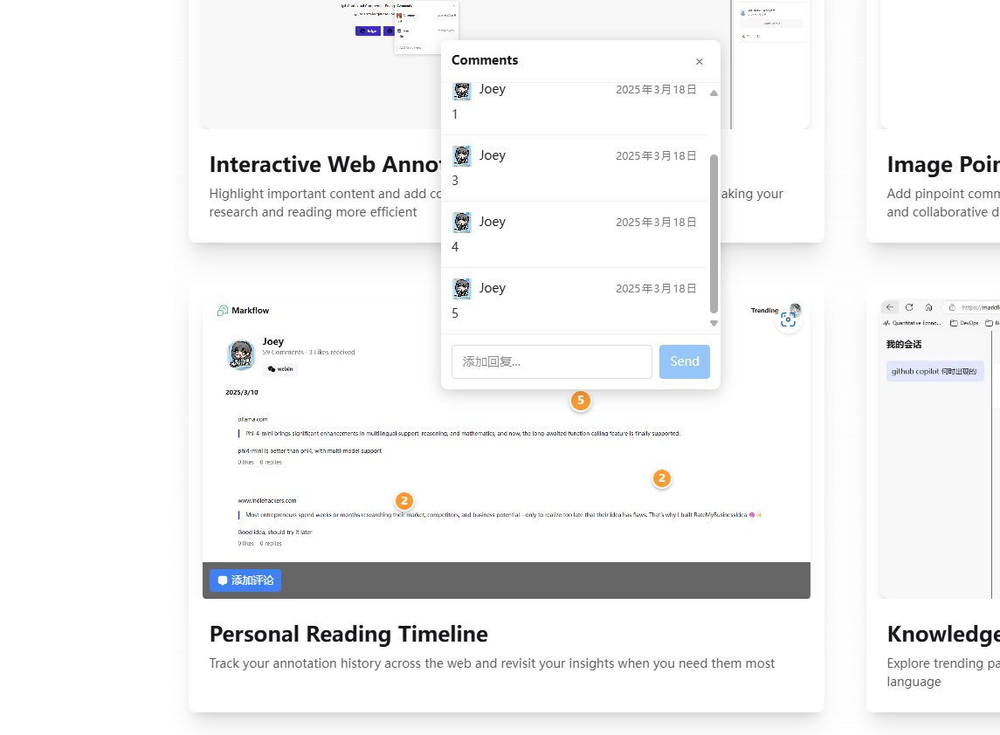
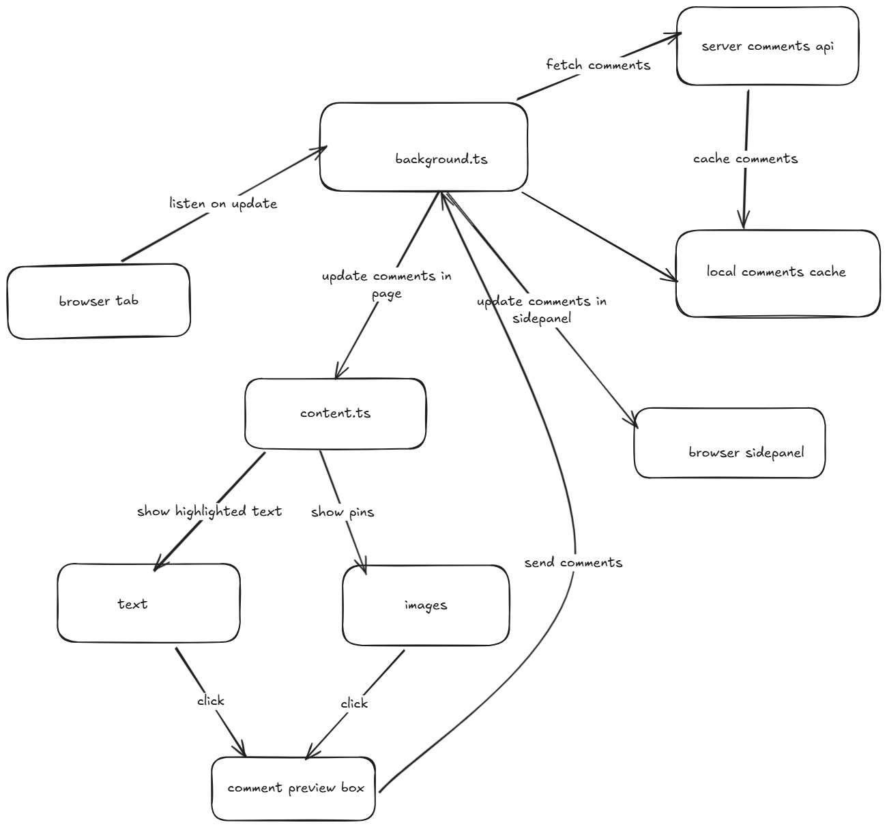

Markflow 已经上线到 chrome webstore 和 edge webstore 一段时间了，用的人还不多，上周我去 producthunt 宣传的时候，突然想到一个新功能，就是对于图片我可以做一个类似 figma
评论设计稿的点评功能，用过 figma 的都知道这是个什么功能，一般产品、设计、开发在评审需求的时候就会经常在设计稿上进行评论，上个月做 markflow 的时候，我就想过 figma 这样的评论，但是因为网页内容会随着屏幕变化，如果对于文本也进行打点可操作性太差了，所以只是模仿 medium 做了一个侧边栏评论，但是现在我想通了，文本评论和图片评论分开做，文本是选中后高亮，然后评论，图片是切换鼠标到评论模式，然后再打点评论，这样互不冲突。

先来看一下效果图：



在这张图上我打了3个点，用黄色圆圈标识，上面的数字代表这个点上的评论数量，点击这个圆圈会展开评论列表，这时候用户可以去下面追加回复。


## 实现过程

整个系统的流程如下：



算是一个稍微有点复杂的小工具了

1. 需要维持 local storage 评论缓存跟 服务端的一致，
2. 需要维持 sidepanel 里面评论列表的状态
3. 需要维持网页上 content script 内部评论的状态

在 content script 里面新增一个评论，要立刻反应到网页UI上（图片打点或者文本高亮），也要立刻反应到 sidepanel 上，更要更新本地缓存和服务端数据库，一个环节都不能错，不然就会导致页面状态不同步的问题。

之前主要交互都在 sidepanel 里面，实现起来还是比较简单，因为用了 svelte 框架，可以采用数据驱动开发，我不用关心添加一条评论后，这个评论列表该怎么渲染，我只要把评论列表的UI绑定到评论数组里面就行，我更改数组内容框架会帮我去更新评论UI，但是在 content script 里面没法使用框架，必须要用原生的 js 和原生的 css 代码写，所以会出现一堆 addEventListener, querySelector, 更新 innerHTML 等操作，写起来还是比较费劲，比较容易出错的。

## 难点一：如何在图片上打点

我原来想的是在 content script 里面找到所有的 img 元素，给它们包一层 overlay 然后给这些overlay加上 click 事件，点击后会计算点的相对位置，在overlay上绘制一个小圆圈。
很快就实现了一版本，在一些网站上工作得挺好的，但是我去知乎上找网页测试的时候，发现经常导致页面崩溃，仔细检查发现是因为知乎给图片加了太多事件，比如说放大镜、或者是点击查看全文这种，我这里给 img 包 overlay 导致一些局部的 DOM 结构发生了变化，导致页面崩溃，很搞笑，你既然用了 react 框架，难道不知道将事件绑定到元素上吗？非要根据相对位置来查找元素。

因此我改了一种实现，将图片的 overlay 全部放到 DOM 底部去，这样网页上图片本身结构没变，对页面的侵入性相对较小。


## 难点二：如何避免影响图片本身的事件

上面说了我通过一个跟图片一样大小的overlay 层来存放打的点，但是我不能一进来就进入打点模式，这样图片原有事件可能就被我干没了，比如说放大镜效果。因此我的方法是在overlay底部加一个工具条，上面有一个“添加评论”的按钮，点击这个按钮才会进入评论模式，此时用户以为在点击图片实际点击的是我那个overlay层。

## 难点三：如何定位评论框的位置

在 overlay 上添加好点后，点击这个点就应该出现那个评论框，用户可以在这个评论框里输入内容，但是这个评论框该如何定位呢？这个点的位置是相对图片的左上角来定位的，评论框该出现在这个点的上下左右哪个位置呢？我是通过 `floating-ui` 这个库来做的，代码就像下面：

```js
computePosition(element, preview, {
    placement: 'top',
    middleware: [flip(), shift()],
}).then(({ x, y }) => {
    preview.style.top = `${y}px`;
    preview.style.left = `${x}px`;
});
```

这里 element 是点，preview 是评论框，基于这个点来定位评论框的位置，从一个overlay内部相对位置，得到了一个DOM上的绝对位置，还是比较容易出错的，还好有库。

## 难点四：如何维护评论框状态

因为没法用框架，所以只能老老实实在每个会更新状态的地方，手动更新 UI，比如说我定义了一个叫 `renderComments` 的方法来渲染评论到评论框上，那么我点击评论按钮的时候要调用，这时候展示一个旧的评论框，让用户能输入内容，当用户按下回车我得再调用一次这个方法，把用户发送的那段文字放到评论框上，避免用户觉得困扰为啥发了没展示，这里还涉及到本地评论临时替换到评论框上，等服务器更新后还得再渲染一遍，不然拿到一个本地造的评论id是没法往下添加回复的。

不用框架维护这些状态真的很费劲，对于 文本高亮、文本评论、图片点评 我都得一个一个操作去测，确保没有漏掉状态更新，目前我的 content.ts 文件有1700多行，就为了实现在页面上展示高亮，进行点评。

## 总结

今天（3月18日）下午，我自测功能没问题已经将新版本提交到 chrome webstore, edge webstore 去审核了，下周应该能审核通过，到时候希望会有人喜欢这个功能，还是挺好玩的。
