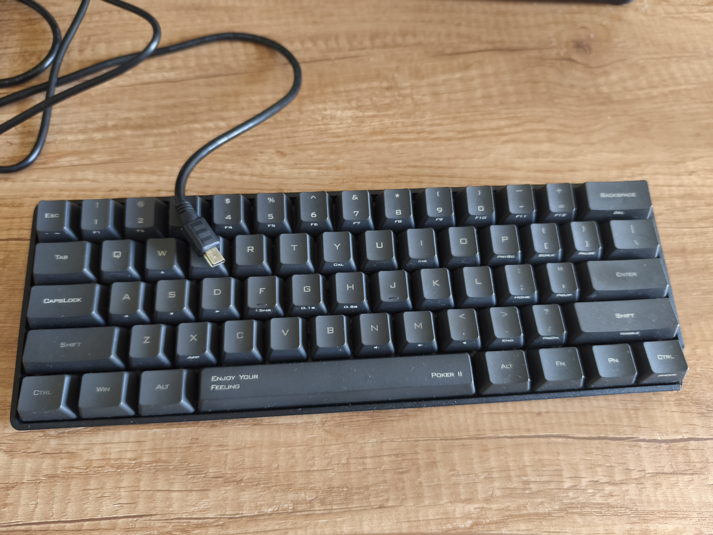
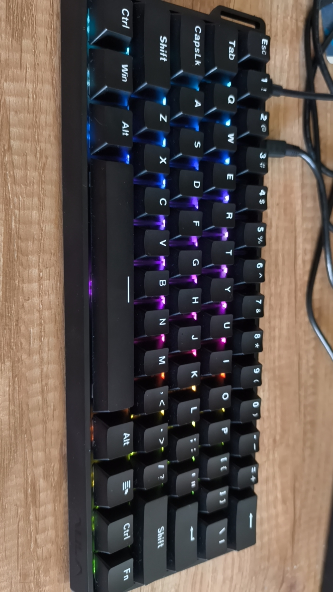
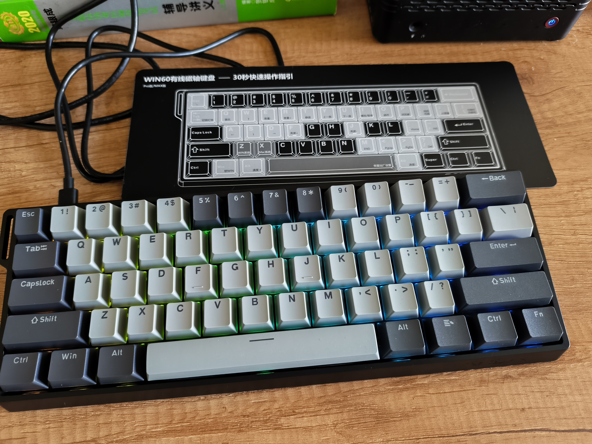
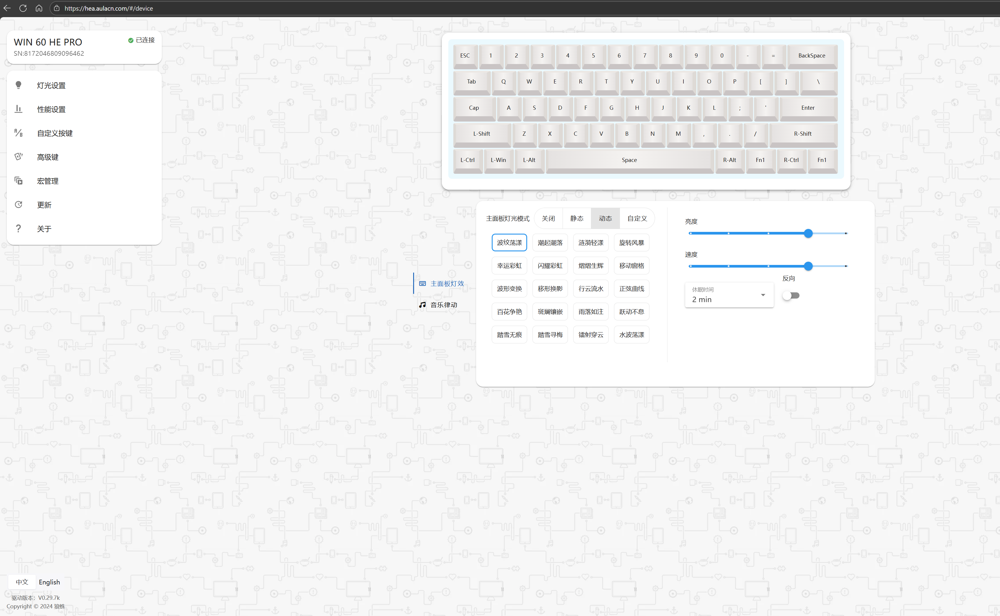

作为程序员，日常打字还是比较多的，之前用的键盘是14年刚工作时花500大洋买的 Poker2 青轴机械键盘，现在也还在用，算算使用年限，到现在都已经11年了，真是历史悠久，不过用了这么久确实渐渐出现了按键失灵的问题。对于日常工作来说影响还是很大的，不经意间就会按出 2个 c或者3个g，要看一眼才会发现按错了，还挺烦人的，尤其是输密码的时候，按错一个字母就过不去。所以观察比对了一段时间，我去京东上入手了一款国产狼蛛WIN60he PRO磁轴键盘。

## 先记录一下老的 Poker2 键盘

这是我第一次接触机械键盘，也是第一次使用61键的键盘。因为当年入坑了61键，导致后续一直对于大键盘无好感。这个 Poker2 键盘陪伴了我11年，现在虽然偶尔有点失灵，但是还是能用的，不得不佩服当年厂家的质量，这个键盘拆过很多次，也摔过很多次，以前也经常放在书包里带去公司上班用，甚至也水洗过很多次，但是它就是能用，真是很神奇，我想好好保养它，看看能不能坚持使用20年。

这个 Poker2 键盘，当年买的时候还没有 USB3.0标准，所以还是USB2的插口，不过还好是兼容的。按键的话，我用不到高级功能，常用的几个组合键也就是

`FN + ASDW` 输入方向键
`FN + N, M` 调节音量

其它基本用不到，导致基本不记得那些用法

## 新的狼蛛 WIN60HE PRO 磁轴键盘

我对键盘和外设不太懂，所以是直接京东搜索买的，最早本来还是想买机械键盘，但是看到网上说新出了一个技术叫磁轴键盘，比机械键盘的使用寿命高，按键反应更迅速，所以就打算换新口味试试。

我是不拘小节的人，所以网上说的什么段落感，声音，灯光，反应度啥的，我都不关心，也不懂，我只是用来打字写代码，打完字完成工作就把键盘电脑丢一边休息去了，那些边边角角的功能我都不在乎，甚至希望没有，这样能保持功能简洁。

### 选购思路

我设定了几个条件：磁轴、61键、便宜、耐用、能满足日常打字需求

首先是磁轴，这点决定了我不需要再去看各种机械轴等等，因为商品那么多，如果不缩小范围，选择余地太多就会陷入啥都想买的境地。

其次是61键，因为我使用了10年61键的Poker2，所以对于80，104键位的键盘我都不考虑，太大了对我来说，单独的功能键、数字小键盘、方向键对我来说毫无用处，大部分时间都不会去按，所以只考虑紧凑的61键。

其次是便宜，14年买那个键盘花了500，算是比较贵的，因为那时候国产质量很差，那会儿都讲究买樱桃原厂轴，而厂家 IKBC 又是一家台湾的口碑比较好的厂，所以贵也有贵的道理。但是呢现在我不喜欢买品牌，也不喜欢买贵的了，我相信键盘这么简单的东西，能有啥门槛，国产的不一定比国外的质量差，可以拭目以待一下。

然后是耐用，因为之前那个键盘用了11年还能用，所以我还是要买一个耐用的。这就导致我不考虑所谓三模键盘，也就是支持蓝牙、局域网连接的，因为你加了电池，加了各种芯片后，不可避免会降低使用寿命，就比如说我之前的Poker2键盘，总是拿水洗，但是随后去阳光下晒干电路板，插上键帽就又能用了。如果三模键盘肯定不能这么防水耐造吧？因为这个缘故，我连灯光都不想要，因为你要让一盏灯持续亮10年是很难做到的，对于日常打字来说也不需要灯光，天黑了就休息呗。

最后是打字需求，我大部分打字都是在 VS Code 编辑器里完成的，所以要频繁用到 `Ctrl` 和 上下左右方向键，就比如一个常见的工作流：`Ctrl+P` 唤起功能面板，然后 上下切换选择一个功能。我不习惯用小键盘的方向键，因为我习惯了使用`Fn`组合ASDW来控制方向

### 首次尝试买 WIN60HE 标准版

确定了上面几个思路后，我先是下单了一个标准版的键盘，如图

只要88块钱，算是很便宜了。但是用了几天发现一个很重大的问题没法解决，就是无法输入方向键。它这个设计很SB，如果要输入方向键，要先按下 `FN+W` 解锁方向键，此时ASDW变为了方向键。如果要恢复为字母键，就再次按下 `FN + W`。相信明眼人都会发现这个功能有问题，在打字的时候，我要临时按一下方向键，我还要想一下现在方向键有没有解锁，这可能吗？找了各种方法都没法解决这个方向键的问题，无奈只能申请退货。

### 入手 WIN60HE PRO 版

客服很爽快就给我退货了，于是我又加20块钱下单了同款的 PRO 版本，如图

从外观上看就比之前那个标准版的好，多加20，提升可谓巨大。到货后先试了一下 `FN + ASDW`，完美输入方向键，那就没问题了，不需要再退货了。

但是还有一个小小的问题，这个默认的 FN 键在最右边，打字的时候距离右手太远了，对照着之前 Poker2 的图片可以看到，它的 FN 是在右手边，所以打字的时候直接手掌轻轻按一下就能按住 FN 然后按 ASDW 就能控制方向，不需要移动手掌。这个问题能不能解决呢？

我试了一下狼蛛的 web 驱动网站

[https://hea.aulacn.com/#/device](https://hea.aulacn.com/#/device)

在这个驱动页面上，选择自定义按键，然后把默认的 Alt 和 Ctrl 中间的那个 APP 键换成 FN 键了，也就是说现在我有2个 FN 键了，试了一下，右手手掌很轻松就碰到了这个键，输入方向更方便了

## 总结

从大学毕业到现在一晃就11年了，这个Poker2机械键盘也陪伴了我11年，也跟我一起步入了中年，各方面能力都不如最初年轻的时候了，于是被新的，更便宜更好的键盘取代也是难免，不过我是重感情的人，只要这个Poker2键盘还能用，我就不会丢掉它，我会好好留着它，时不时拿出来用用，让它有用武之地。