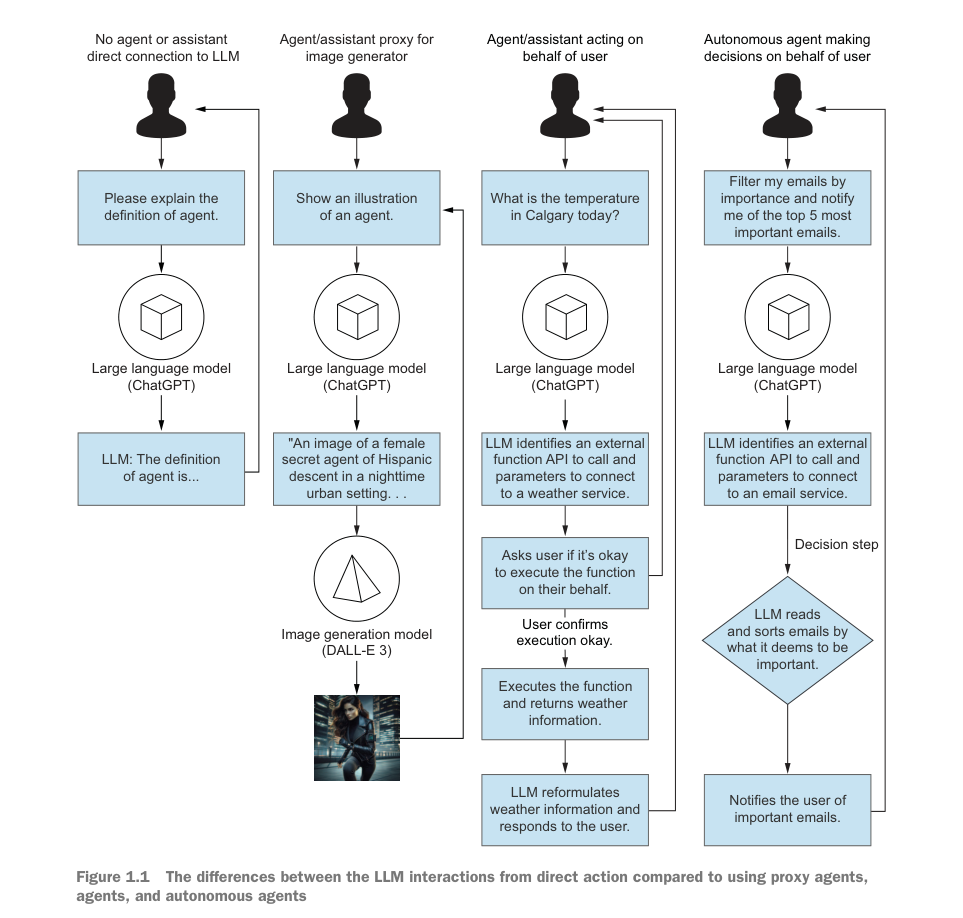
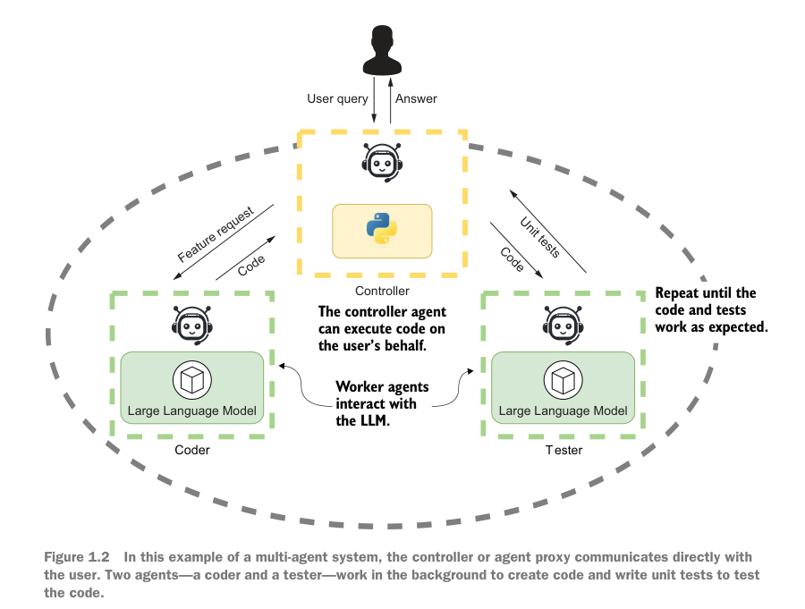
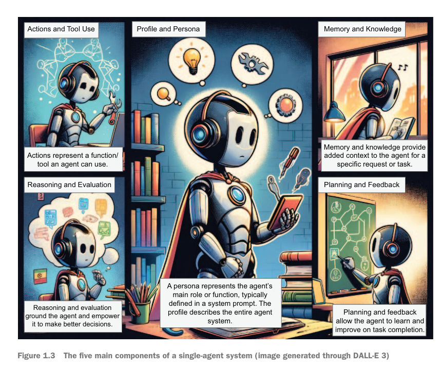
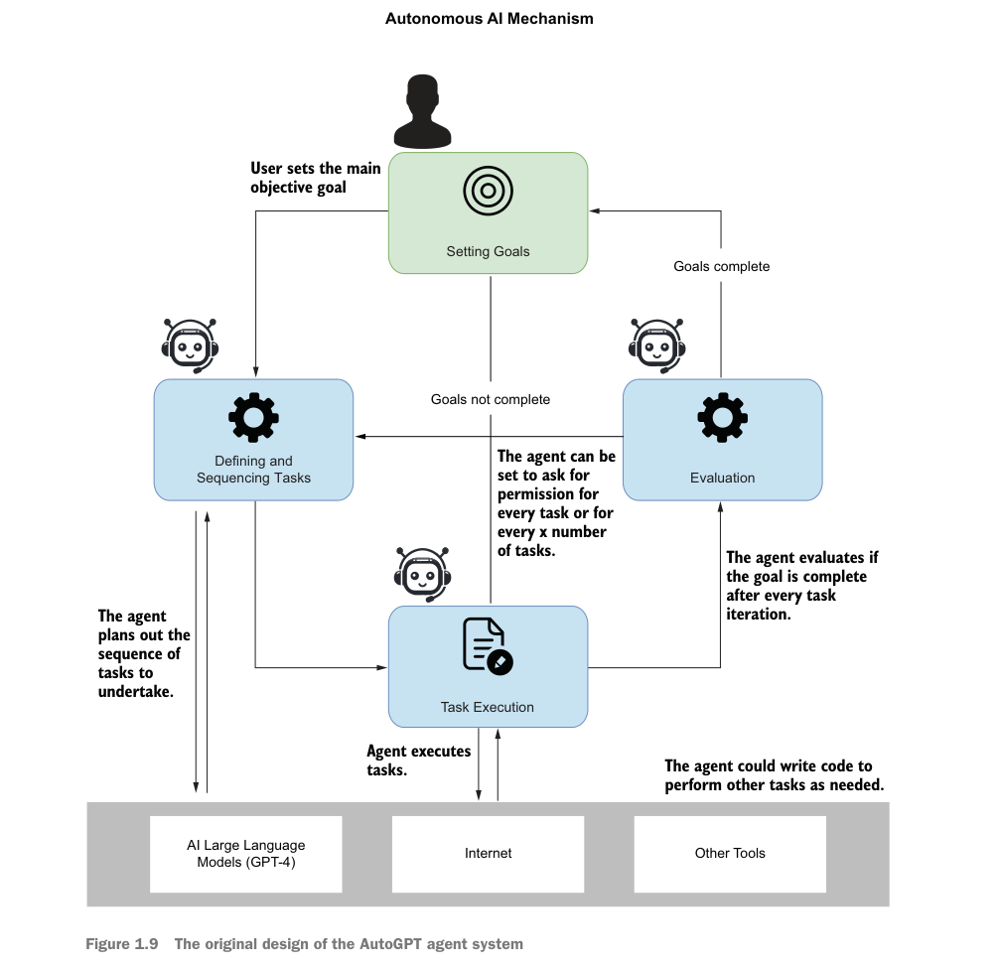
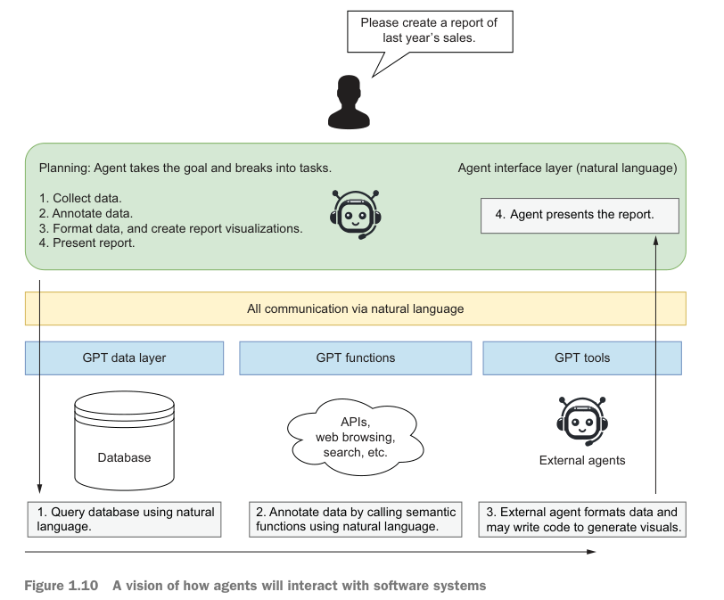
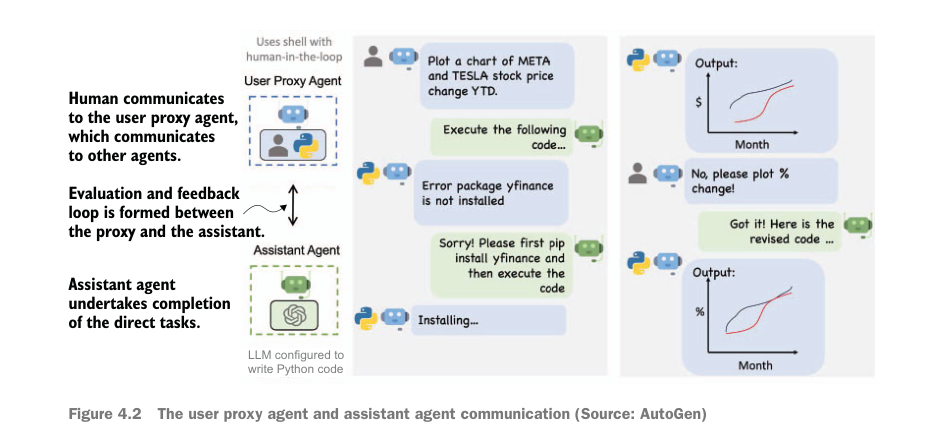

在上篇博客中，我说道我想将 typink AI 升级为一个agents，以便提高返回代码的准确率，但是我不知道一个 coding agent 该怎么去实现，我从 cline 的源码中获得了一点点启发，又从 huggingface smolagents 里面了解到基本的 coding agents 能做的事，这是我对于 AI agents 的实现已知的所有信息。我可以继续去抄 cline 的代码，一行一行移植到我的项目中，但是我觉得我应该对于 AI agents 有一个系统性的认知，再去做写代码的事。于是我从zlib上发现了 《AI Agents in Action》这本书，粗读之下，觉得写的很好，前几页就把我吸引了，因此我决定趁着清明假期仔细阅读一下，做点笔记，融会贯通，然后再开始写代码。

## 什么是 AI Agents

### AI Agents 的进化

虽然我们目睹了从22年底 ChatGPT 的发布到现在各种AI大放异彩的全过程，但是有必要梳理一下这两年AI有了哪些进步。

从上图可以看出，

1. 最早我们是直接跟 AI 交互，比如说去 chatgpt 官网聊天，
2. 后来 chatgpt有了生图功能，但是我们知道LLM是不会生成图片的，所以是底层集成了一个生图的模型，也就是 DALL-E，这时候chatgpt网站就是一个小助手了，它会识别用户的意图，决定是交给语言模型来生成响应，还是交给图片模型来生成响应。
3. 智能体，需要用户来决策，这时候AI能够使用工具，让用户决定是否要调用工具，并且把工具的结果返回给AI，AI在组织文字返回给用户
4. 智能体，自动做决策，自动调用一些工具，不需要用户确认

目前网上的教人用提示词的，还只是停留在第一步，抖音上那些人天天炒冷饭，看到别人用AI生成ppt，自己做了一遍，然后把提示词一发，就让大家去评论区抄他的提示词来做。这种做法固然可以解决一些问题，但是大脑不是这样思考的，大脑往往要多遍交互才能深刻理解问题，从而给出最好的解法，跟网上那些人学提示词，去一键生成xxx，学了也没用。

### 多智能体系统

在上面说到智能体可以向用户请求查询天气预报，也可以自动帮用户整理邮件，还有一种更牛的架构叫多智能体系统，就是一个需求由多个智能体一起分工合作完成。

在上图中介绍了一个编码的智能体，用户是跟这个 controller 通信，controller 调用编码模型生成代码，然后交给第二个模型去生成测试用例，controller 执行测试，如果发现通过了就返回给用户，如果发现没过就让第一个模型再生成一遍代码。

看到这个图我对于智能体的理解又更深入了，Coder 这个智能体就相当于 deepseek, claude，我可以直接跟它对话，它也能生成高质量的代码，但是我得自己去粘贴到项目中，然后再找第二个 Tester 智能体去生成测试用例来测，很麻烦，要用户介入的步骤很多。但是通过上面这个 Controller 智能体就简单多了，用户只要给它提需求就行，省去了很多手动的操作。

### 智能体的组成部分

上面2节大致介绍了什么是智能体，这里作者开始系统性的对智能体做了一个解剖，在这里他细化了一下智能体的组成部分。

1. profile: 也许可以翻译为人格，就是要设置一个系统提示词表明这个AI是什么人，能做什么，比如我的 typink AI 我在系统提示词里就告诉它，它是一个 typst 编程助手
2. Action and Tool Use：这个大概就是说智能体要能调用工具，还要能对用户行为作出反应
3. memory and knowledge: 记忆和知识，要能记住之前对话的上下文，也要能从多个数据源（数据库，嵌入）获取相关知识，从而增强AI的能力
4. reasoning and evaluation：推理和评估能力，不要只思考一次就把结果返回给用户，要有自己的评估体系，多思考几次再返回
5. planning and feedback: 智能体在返回结果给用户是要规划一下，是否要用户介入操作，主要就是自动和半自动的区别，如果智能体觉得不需要用户介入就会自动执行工具把工作都做完，如果觉得需要用户授权就会一步一步返回，等用户授权了一步操作，执行完了再返回下一步的内容

看到这里我对智能体的作用理解又加深了，我一直以为AI工程师就是接口套壳，然后设计提示词，设计返回格式，解析消息，没想到细分之下可以做的事情这么多，尤其是最后 planning 那一步，我终于明白 cline 为啥要有一个循环发送请求的方法了，他不是像普通聊天机器人那样，用户说一句它回一句，而是用户说一句，它回半句，然后等用户授权执行某个工具，再基于上一步的反馈和结果，再回复剩下的半句话。

### 为什么要使用智能体

22年底chatgpt刚出现的时候，大家对AI的探索基本停留在提示词工程上，那时候好的提示词跟坏的提示词得到的结果差别很大，但是到现在提示词的好坏对于结果的影响已经不大了。这两年来，大家都认可最佳的AI交互方式是一轮一轮的对话，所以别再指望设计很精巧的提示词就能得到高质量的回答了，就像抖音教人用AI做ppt的那样，就算抄了你的提示词又咋样，第一遍拿到的大纲就是这样，你再给提示词添加更多语境也没用，比如说生成教案，加上你是小学几年级的老师，你讲课风格是怎样，对于第一遍的生成影响不大。

作者在这章介绍了 AutoGPT 这个库，说这是第一个自动化智能体的库，其它智能体都是受到这个库的启发做的，并且说目前大家都认可 planning, iteration, repetition 是解决复杂问题的最好办法。

看到这我不禁又联想到我做的 typink AI，只是套了个llm接口的壳而已，根本没做 planning, iteration, repetition，难怪生成的回复质量这么差，经常需要人工介入改一点小问题。我之前还老是想优化提示词，加上一些 negative 提示词，比如告诉它哪些语法是错的等等，我列举了一些常见的typst的错误语法，但是提升不大，幸好我没有花大力气去优化这个系统提示词，否则就白费功夫了。

接下来作者又说到自动化的agent需要付出很大的信任度，因为AI做的不一定对，所以大部分生产环境的系统都是需要用户交互一下AI才会继续往下走。看到这里我又想到了豆包的对话式文档生成功能，我在旁边对话，确实AI能理解我的意思，并且能感知到编辑器内容，根据我的需求修改编辑器内容，但是它自动就给我编辑器修改了，也不告诉我改了哪几段，哪几行，真的要找只能去历史记录里面对比每个版本的变更。真的很让人疑惑，豆包就这么信任自己的AI改的内容是对的吗？还是说豆包文档根本不在乎你生成的文档质量，反正都是自媒体洗稿用，生成了文字就行，谁管你好不好，毕竟大部分文章也没几个人读。还是说最后一种可能性就是豆包文档底层很难生成diff，不像代码改了哪几行有明确diff，如果豆包文档没有diff，那么也就没有AI返回diff，然后用户去接受或者拒绝diff一说。我个人感觉原因都有，毕竟严肃排版也不会用豆包，而自媒体用豆包讲究的是快速生成，谁在乎改了啥。字节作为数据驱动的公司，没人反馈这方面问题也许就不愿意花力气去优化这块，正好给我的 typink 提供了发挥空间。

上图描述了自动agent工作流程，用户提出一个大的目标，AI将它拆分为一系列任务，自动执行这些任务，然后交给一个评估系统判断是否完成了用户的需求，如果是则返回给用户。有了这个理论基础，难怪从去年下半年开始 cursor 这类编程代理进展突飞猛进，用户只需要提需求 cursor 就生成项目代码，非程序员也能使用它来开发网站。

### 回到AI交互界面

这章作者说通过AI agent，传统的软件开发和软件交互形式都变了，以前用户要通过UI来跟软件交互，现在也许就是说一句话的事，以前程序员要通过调用 API 来跟其它软件交互，未来也许也就是一句话的事。这块我的感触又大了，网上一堆教人用 word, excel 的，我看着都复杂，先要鼠标选中xxx，然后鼠标点击xxx，然后勾选 xxx，然后xxx 最后完成了目标，看起来很简单，鼠标点点点就搞定了，但是未来的办公软件还会是这样的操作方式吗？月薪3000的打工人还要学这么多办公软件操作技巧吗？我想答案是否定的，word 的出现已经快40年了，随着AI浪潮，这种交互方式肯定会被取代，以后打工人要排版/修改一个文档，也许就是一句话的事，然后点击一下确定就行，这不就是我的 typink 目前的操作方式吗？看到这我对于typink又更有信心了。

在这张图中，作者设想了未来软件交互形式，比如他提一个需求要知道去年销售情况，这时候AI就做了一系列事情，最后返回一个报告，想想现在，老板需要知道一个数据，得先给数据产品提需求，产品带着数据工程师收集一堆数据，写一堆sql，最后在BI系统展示这个报表，如果text to code, text to sql 稳定了，这些步骤完全可以由AI去做，又能省下不少程序员。对于企业来说，要将企业内的数据库集成到AI还比较难，但是目前我已经看到了一些项目，能理解 excel 表格，然后根据用户的自然语言来生成可视化的图表和报告了，能通过自然语言生成报表，未来还有人会傻乎乎去excel里用手一个一个做图表吗？

## LLM的力量

这是第二章，主要讲了 LLM  是如何工作的，这块我想大部分人都知道，就是将用户的输入编码为一串token，大模型拿到这串token，基于内部的算法不断预测下一个token，最后再编码为字符串返回用户。至于模型内部的原理，我想普通人不必深究，甚至就算对于AI训练者来说都搞不明白AI是如何思考的，他们也只是知道这么训练能产生出会思考的AI而已。

然后还讲了一下什么是微调，就是通过微调让模型对于某方面的内容更擅长，这块我想普通人也不必操心，会用通用的大模型接口就行了，自己拿个基础模型微调出来的效果还不一定比得上通用大模型。之前看过网上一个新闻，有个创业者花了很多功夫去收集数据做特定领域的微调，结果AI一次更新就让他的努力白费，真是可惜，所以微调这块我肯定是不会去碰。之前 typink AI 生成的 typst 代码总是出错，我曾经相关是不是因为这些通用大模型学的 typst 代码太少了，要不要自己去微调一下，但是最终还是被我克制住了这个念头。

接下来教了如何使用 openai api，如何使用 lmstudio，这些没啥可看的，不过还教了一些写出更优秀提示词的技巧，如：

1. 尽量描述清楚你的语境，不要问 what's agent, 要问 what's GPT agent, please give some examples.
2. 系统提示词设置 profile
3. 合理使用分隔符，例如一些重要的语句可以使用 xml 标签包起来，方便AI识别重点
4. 指定步骤，这样可以让AI复用上一步的信息
5. 提供例子，我在写 typink 的提示词时就写了很多例子让它生成diff
6. 指定输出长度，AI一般会很罗嗦，指定输出长度可以让它回答简明扼要，省得返回一堆无用信息

接下来讲了一下挑选LLM的方法，这个我觉得也没啥可看的，对我来说就是价格最重要，虽然 claude 3.7 sonnet 写代码最厉害，但我还是优先选择deepseek，就是因为便宜。

## 拥抱 AI 助手

这章介绍了什么是 GPT Assistant，以及如何使用助手，我没使用过 chatgpt 的 assistant builder，但是在我看来所谓助手就是套壳api，提供更多上下文，提供了一些内置的触发词，做了一些特定领域的事情，比如在这章，作者设置了很长的系统提示词，构建了一个数据科学家的助手，用户上传一个 csv 文件，它能基于系统提示词里的规则去分析这个文件，然后输出报表。这里我觉得已经算是个智能体了，因为有了调用工具的能力。用户安装这个 GPT Assistant 后，就可以在 chatgpt的对话窗口通过某些触发词去触发执行这个 agent。难怪23年GPT market 出来后那么多人欣喜若狂，说以后想做什么都能找到对应的助手来做，不过后续这个功能似乎并没有很火，因为大家发现还只是回答对话而已，如果这个功能真的有价值，我不信 deepseek 会不跟进。目前在 deepseek 官网就是一个提示词库，给出了一些常见场景的提示词，方便用户照抄。

## 探索多智能体系统

这章介绍创建多智能体系统，那么上一章肯定就是创建单智能体应用，所以可以认为 GPT assistant 就是一个单智能体。

### 入门介绍

这张图介绍了一个简单的多智能体架构，用户跟一个 UserProxy Agent 对话，这个代理收到请求后，交给后面的一个 Coding Agent，这个 Coding Agent 被设置为了一个很擅长python语言的AI，所以它能准确返回python代码，这个 User Proxy Agent 收到返回的代码后，做一些解析，然后尝试在本地lint 和运行，看看有没报错，确定没问题就返回给用户，这张图到此就停了，没说用户反馈之后智能体是如何基于用户反馈再次思考的，不过也已经展示了很多东西了。如果没有这个智能体自动去帮用户评估AI返回的代码，用户很可能大部分时候拿到的代码都是不可用的，这时候用户就会抱怨什么SB AI，返回的代码都是错的。回想上文提到的，现在业内普遍共识AI第一遍回答不是很准，需要多次交互才能给出精准回复，所以智能体的这个循环大大提高了AI的准确性，虽然花了更多时间，浪费了更多token，但是收益也是明显的。

