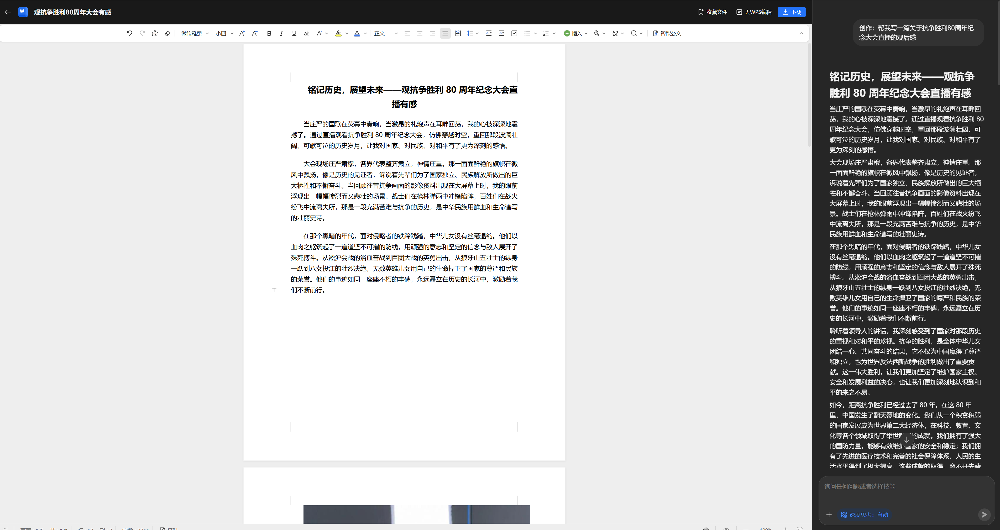
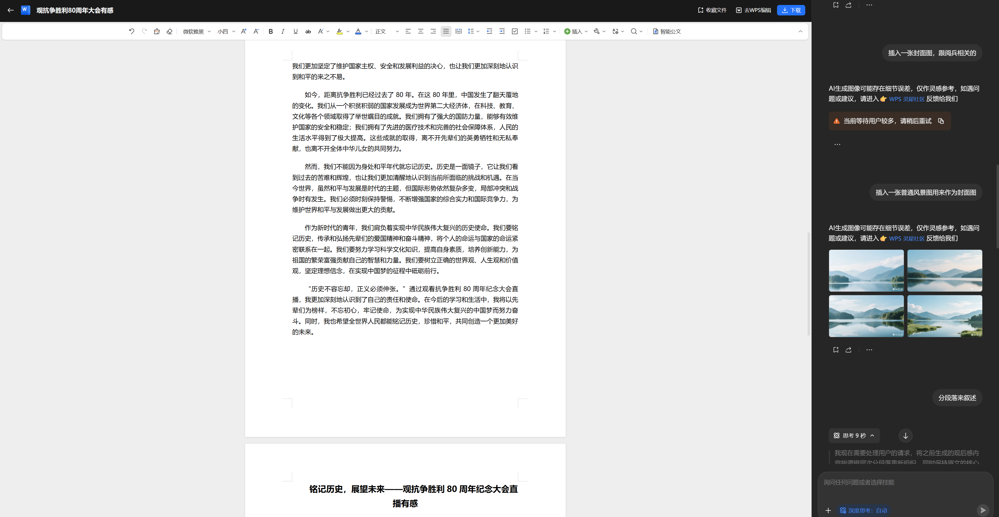
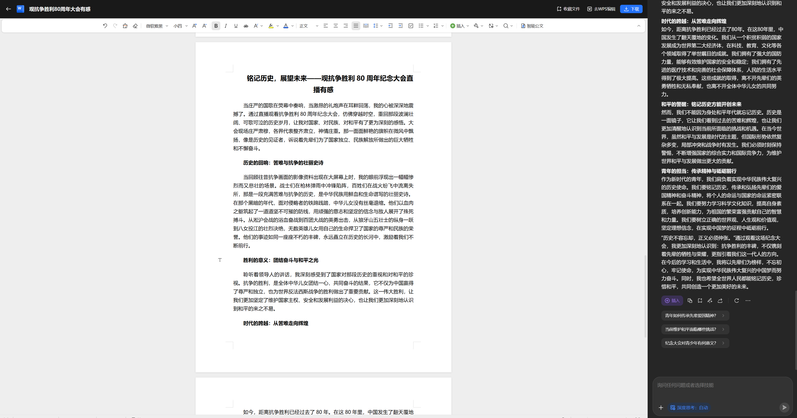
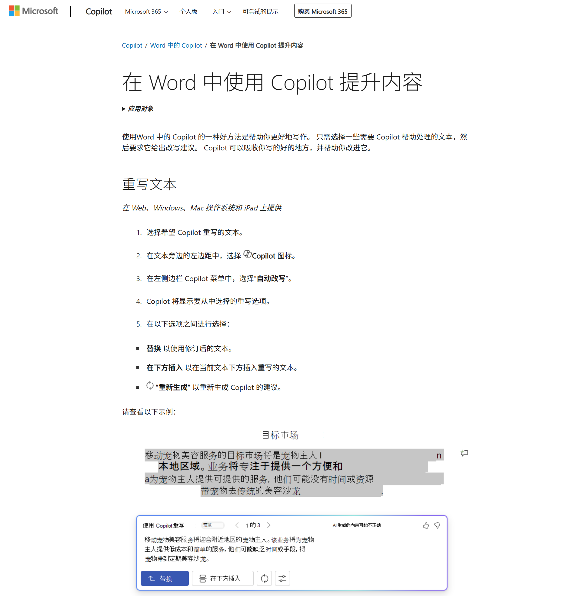
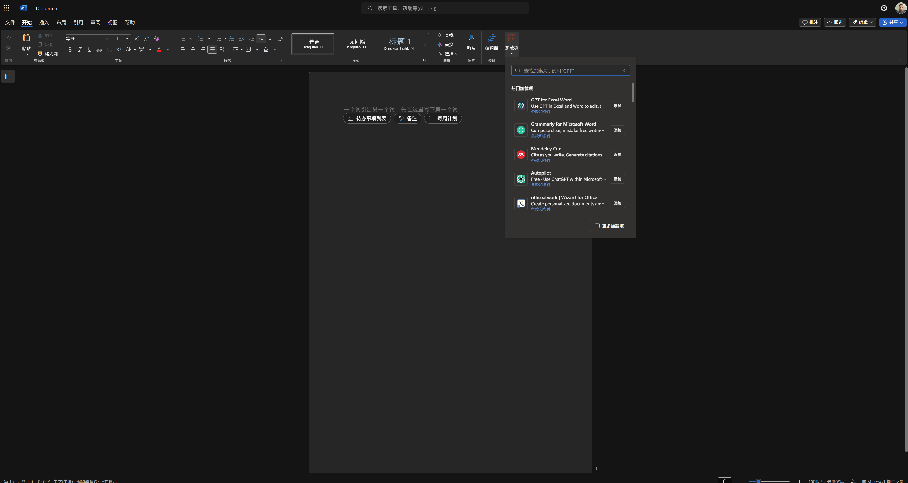
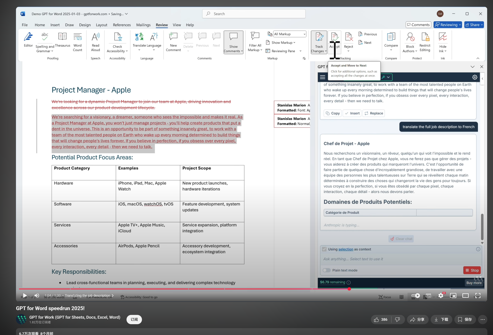
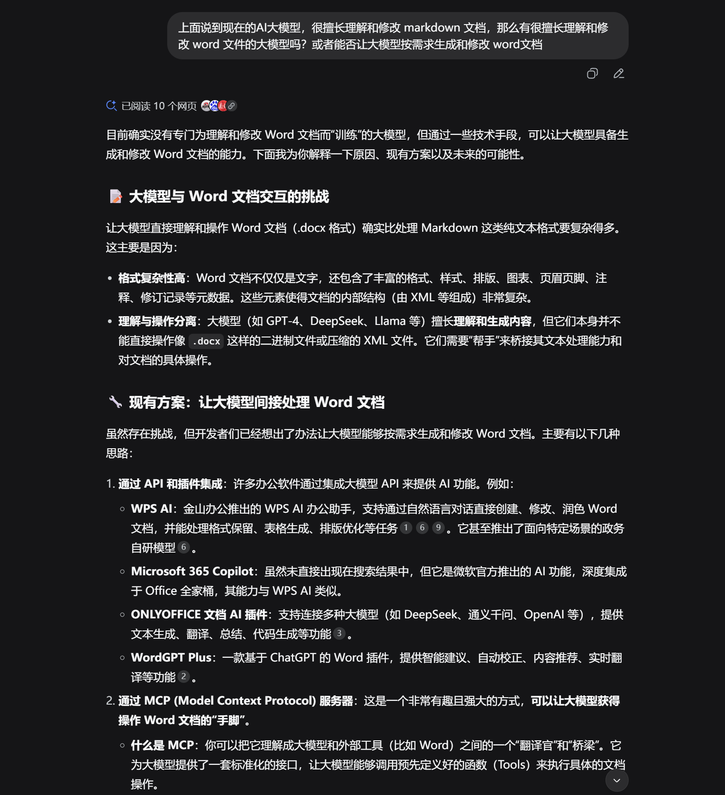
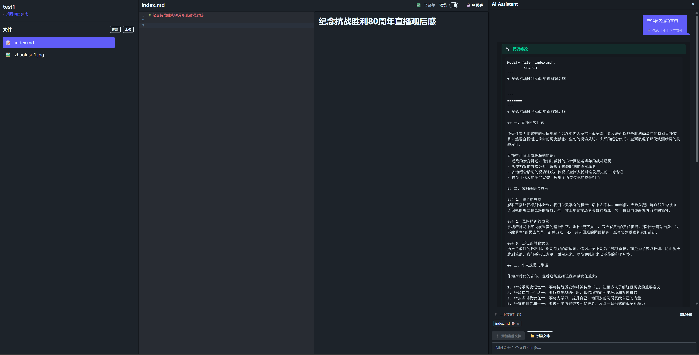
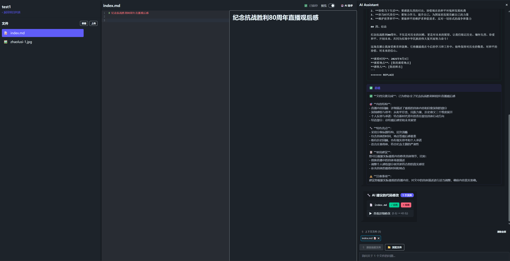
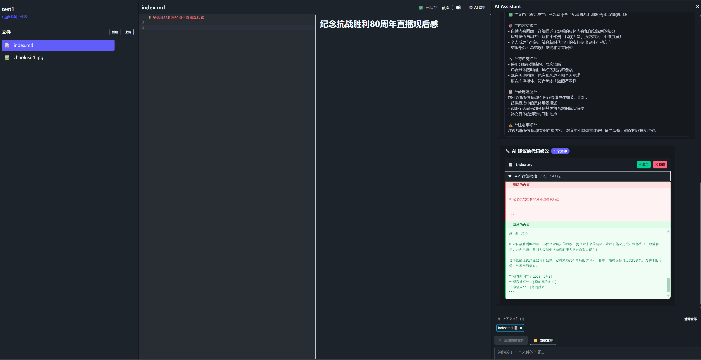

上半年做的 typink 编辑器还是花了我不少时间的，那时候AI能力还不够强，还没有 claude code/gemini-cli 这类工具，还无法 vibe coding，所以基本大部分代码都是我跟AI合作写出来的。

那时候做了：

- 实时文件编辑
- typst.ts 本地预览
- 图片上传和嵌入
- 手动调用 deepseek AI 接口生成typst代码
- 手动维护提示词，处理响应

这些事都挺花时间的，毕竟都得人工参与和调试，但是后来在一些网站上推广了一下，没啥反响也就放弃了。

最近工作比较稳定了，闲着没事又想做点什么东西，我首先想到的还是上半年那个在线编辑器，虽然可能还是一条死路，但是还想继续探索看看。我先是调研了一下目前别的在线文档的AI功能

## 在线文档 AI 功能分析

### WPS AI

这是从 wps官网截图的产品介绍，接下来我在网页上登录了它们的产品，体验了一下AI写作的流程

首先我选择要写作，然后给AI提需求，先是在一个类似 deepseek 对话的界面，对话完成我点击创造，就给我带到了编辑器界面，如下：

这里可以看出，wps 的AI写作也是没用到联网搜索的功能，因为我的需求其实是写一篇前几天阅兵直播的观后感，但是我没明说，我只说了抗战胜利80周年纪念大会，其实就是同一个东西，结果写出来的内容一眼就能看出是AI胡编的。

接下来我又让它插入一张图片，因为自媒体写作除了写文章，还得会插图：

首先我让他生成一张跟阅兵相关的图片，它没生成出来，然后换了个更简单的风景图，倒是生成出来了，但是我没找到插入按钮，也就是说我只能下载到本地，然后再用wps的插入图片的功能，才能插入图片，这点我觉得不太方便，因为是在线编辑器，要是能通过拖动图片将图片插入到对应位置，那就很方便了，省去了一个步骤。

然后我又让它分段落来叙述，因为我感觉上面那段文字就是在堆字数，毫无逻辑，我想看看他能怎么分段：

段落倒是分了，但是内容还是之前的内容，我本来以为会修改我之前编辑的内容，就像AI agent自动修改代码编辑器里的代码那样，但是我想错了，它是在对话框生成了内容，底部有一个插入按钮，一点就会将这篇文章插入到当前光标处。我一开始光标是在正文中间，一点插入按钮，把我整个文档都毁了，因为在中间插入了一份新的文档，赶紧按 Ctrl-Z 撤销改动，并且将光标放到文末，再点击插入，这时候才有了上面这个截图。

总体来说还是比较失望，毕竟对于WPS这种文档办公大厂来说，AI体验做成这样，有点难以接受，不过也可能是这个功能用的人少，所以团队没把重点放这里，但是不管怎样，AI时代，你不专心探索AI技术，赋能主营业务，都是很危险的事情。

### Office AI

这个是从一个文档里面截图的，看起来是有一个copilot能够改写文档内容，因为我电脑上没买office 365订阅，所以我只能去网站上体验一下，看看有没有内置AI功能

这是第一个页面，找了一下没看到 AI 相关的按钮，但是在加载项里有很多第三方开发的AI插件，我点开了第一个 GPT For Word 这个，但是要注册，所以我没继续下去，不过我点开了他们下面放在 youtube 视频，体验了一下，链接见：

[youtube](https://www.youtube.com/watch?v=OxyIPGsYf0w)

看起来是比 WPS AI 更强，因为能够选择一段话作为上下文提供给AI，并且提需求，但是要将AI的响应应用回文档里还是很麻烦的，所以它的选项里只有 replace 和 insert，大致意思就是用AI生成的内容，替换掉选中的文本，或者在光标处插入新生成的文本，这些都是比较低级的修改，就好比我们拿 vscode copilot, cursor 写代码一样，如果AI只会改选中的代码，或者只会在光标后面插入代码，那这个AI会有人用吗？视频最后，这个作者来了个大招，让AI将这份因为的岗位描述，翻译成法语，这次AI做了很大的修改，因为文档中间还有一个表格，也被翻译了，这点很棒，但是就是没法在原文上修改。作者最后还是在文尾插入了这个新的法语的文档。

我觉得这就是这个插件所有的能力了吧，能够理解word的上下文，这点很棒，因为我们知道 word 文件规范是 xml，很多文档编辑器都兼容了这个规范，但是最终的 docx 文件，是压缩的 xml，因此可以认为 docx 文件是一个二进制文件，不知道现在有没有哪个AI专门基于 word 文档做过针对性的训练，就我所知，目前主流的 LLM 大模型，如 claude, qwen, gemini, deepseek 等，都有编程能力，但是人家生成的代码都是 python, js等主流编程语言，很少听说能生成word的。

我自己眼界有限，不确定AI能不能修改 word，所以问了一下 deepseek，回答如下：

也就是说 deepseek 也认为让AI去修改word文档很困难，因为这个格式太复杂了，不太适合AI生成。我虽然不知道复杂在哪，但是肯定比 html, css 复杂。

调研了2个在线文档的巨头，粗略使用了一下，发现AI编辑的体验都不好。我心中的AI文档编辑，应该是像AI生成代码那样，我在输入框里提需求，AI就自动思考，给出修改建议，我可以预览变更，然后决定是否要采用AI的修改。

## 我的 AI 文档编辑器

上半年做的 typink，为了创新，我采用的文档格式是 typst，这个格式一般人都没听说过，好不容易搞定了前端编译和渲染，终于能实时预览之后，集成AI那里又出了问题，因为25年3月份的AI，生成 typst 代码的能力还是很差的，那时候只有 deepseek v3, claude sonnet v3.7，对这个小众语言，明显没有优化过。前几天我又用最新的 grok fast code 让它给我生成一个 typst 格式的课件pdf，第一次也没生成可用的代码，反复调教了几次，好不容易生成出来了，但是是没有使用模板的黑白的课件，排版效果还不如不排版。因此这次我决定一步一步来，先从最基本的 markdown 格式开始。

整体流程：

我先写了一个标题，然后在右侧的 AI 聊天界面，让AI帮我补齐这篇文档，AI很快按照设计的思路，帮我分析

最后他给出了一个diff

这个 diff 可以展开和折叠，默认我是折叠起来的，展开后如下：

可以看出，它将我那个老的标题删了，从新写了一大段文字，如果我觉得ok，就可以点击接受，这时候会自动应用修改到编辑器里。AI编程代理里面，很难做好的一个地方其实就是 diff and apply这块，因为AI生成的文本是个黑盒，没人能严格要求它生成出100%符合语法规范的代码，但是很可能它生成的代码，diff，就是无法直接应用，所以需要很多工程方面的判断，处理各种情况，方便让方便应用这种非结构化的diff

我这个产品的核心竞争力在于AI，我希望多模仿cline的写法，让我这个文档编辑器变为一个在线的AI编辑器，让普通人写markdown文件就像写代码一样。markdown的表现能力肯定是不如 word, ppt 这么强大的，但是在国内反内卷，反形式化的背景下，以前你需要雇佣一个外包团队帮忙做ppt，现在内容优先了，你不需要很精美的ppt模板，只要把内容做好就行，这么看来AI生成markdown，你拿去保存为word或者pdf文件，甚至直接一个网页，也不是不行。
