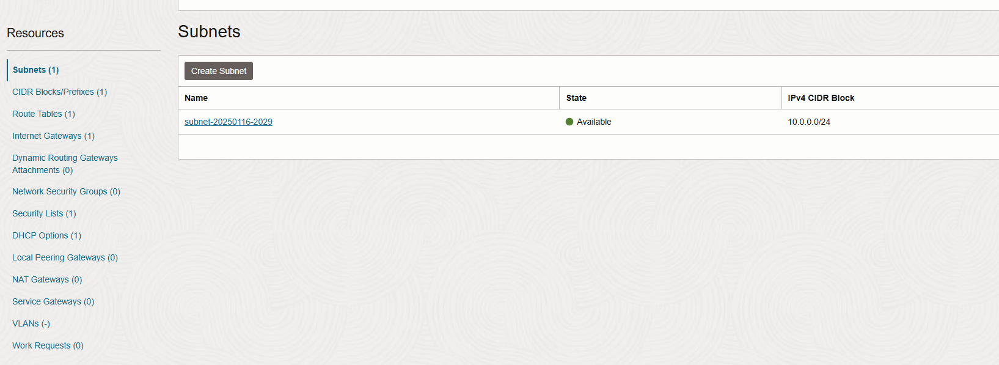
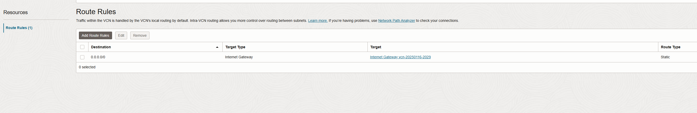
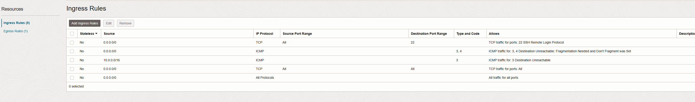
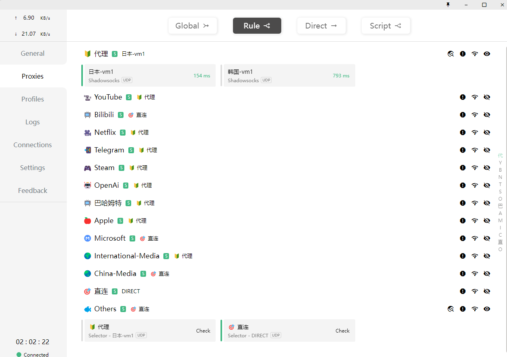

之前用的机场订阅大概每个月30块钱，一个季度90块钱，每个月提供700GB的流量，相对来说是良心价格了，到1月20号这个季度的订阅就到期了，要选择是否续费，这次我想不续费了，打算将我的闲置vps利用起来，走自己的专线，而不是跟大家共享线路。

## vps 配置

我现在有2台vps，一台是廉价的日本的vps，每个月7块钱，一台是白嫖的oracle的vps，永久免费，在这两台机器上面装好代理软件，就能给我的电脑或者手机提供代理服务了。

### 安装软件

安装 ss

```bash
sudo apt install shadowsocks-libev
```

装完后会自动启动服务器，可以通过 `ps aux | grep -i shadow` 查看。

默认的 配置文件在 `/etc/shadowsocks-libev/config.json` 需要进行一些修改

主要改密码和加密算法，如下：

```json
{
    "server":["0.0.0.0"],
    "mode":"tcp_and_udp",
    "server_port":8388,
    "local_port":1080,
    "password":"xxx",
    "timeout":86400,
    "fast_open": true,
    "method":"xchacha20-ietf-poly1305"
}
```

### 配置防火墙

防火墙还是比较麻烦的，那台日本的vps默认就没开防火墙，专门卖给翻墙的人的。那台oracle 的vps，默认安全设置就比较高了，首先在网络层要配置 `internet gateway`，在配置 `routing table`，再配置 `security rule`就是开放哪些端口，最后还要手动关闭操作系统的防火墙。

这是 vcn 的配置界面



这是路由规则，下面这条路由意思应该是这台服务器能被互联网上任意的ip访问



这是防火墙规则，实在懒得配置，干脆开放所有端口和协议


oracle 这个 vcn 在我理解可能是路由器上的一些规则，跟服务器还是不在一起的，所以就算路由器允许了流量的进出，还是可能被操作系统拦截，所以还要再执行

```shell
sudo iptables -F
```

清空操作系统的规则。这服务器是白嫖的永久免费，就算安全性低，也不会损失个人数据。

## clash 配置

上面将vps配置好后，2台vps使用一模一样的配置文件，此时服务端已经是ok的了，接下来就是配置本机的客户端软件。

之前机场的订阅url，已经被clash解析为了几千行的 yaml 文件，保存在 `~/.config/clash/profiles`，原来这份配置用得挺习惯的，所以也不大改了，直接删掉那些没用的服务器，只保留我那2个节点就行

所以最终的yaml最重要的部分类似于：

```yaml
proxies:
  - name: 韩国-vm1
    server: 18.10.9.24
    port: 8388
    type: ss
    cipher: xchacha20-ietf-poly1305
    password: xxx
    udp: true
  - name: 日本-vm1
    server: 4.6.23.19
    port: 8388
    type: ss
    cipher: xchacha20-ietf-poly1305
    password: xxx
    udp: true
proxy-groups:
  - name: 🔰 代理
    type: select
    proxies:
      - 日本-vm1
      - 韩国-vm1
  - name: 📹 YouTube
    type: select
    proxies:
      - 🔰 代理
  - name: 📺 Bilibili
    type: select
    proxies:
      - 🎯 直连
      - 🔰 代理
  - name: 🎥 Netflix
    type: select
    proxies:
      - 🔰 代理
```

将新的yaml文件导入到 clash里，就能看到新的 profile 了



接下来我要更新我手机上的代理配置，只要把这份自定义的yaml文件发到手机上，然后导入到 clash 就行了

## 总结

借着订阅还有4天到期的时间，把自己的2台vps利用起来搭建了一个简单的机场，然后基于已有的clash配置文件制作自己的配置文件，在手机和电脑之间共享，成功给我每个月省了30块钱，又能多吃一份外卖了！
