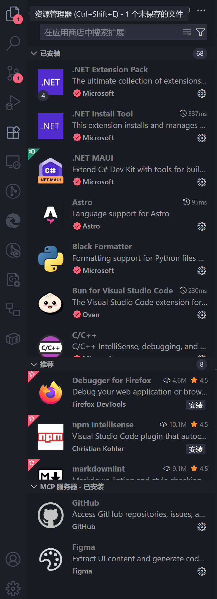
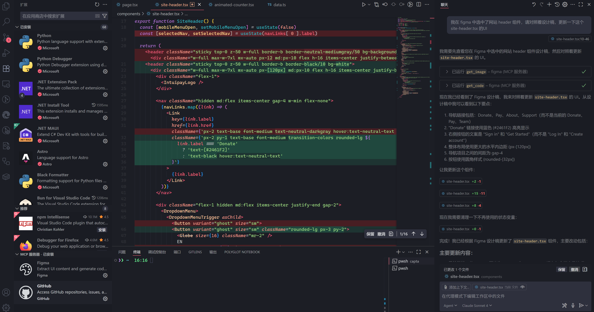

做前端一个很麻烦的问题就是切图，所谓切图就是将设计师的 figma 设计稿，转为前端代码，如 html, jsx 等。在团队中切图的工作一般是交给初级工程师做的，因为这个活没太大技术含量，资深工程师和初级工程师都是花差不多的时间，一点一点对照着设计稿，看边距、字体、颜色等

最近找了个兼职工作，要写一些前端界面，要对照着设计稿写出完美匹配的页面来。这个对我来说挑战很大，之前在公司的时候全职写后端，偶尔要做点前端也是偏功能性的改动，或者一些小的UI改动。后来做全栈开发，基本直接从网上找开源的模板，开源的组件库自己拼页面，或者是让 AI 生成页面，自己主要写点交互的js代码。现在在团队里做全栈开发，没办法只能严格按照设计稿来。

figma 切图有很多方便的插件可以使用，比如说使用 `Figma to Code` 可以将一个 frame 导出为 tailwindcss 或者 jsx，这样布局就不用自己写了，先导出，然后慢慢优化代码结构。

但是这种方式还是不够智能，因为设计画设计稿的时候无法做到响应式，虽然很多设计师会提供多个屏幕尺寸的设计稿，但是这样导出的代码就可能到处充斥着 `w-[1440px]` 这种绝对长度，还是需要比较多精力去修改。

## 目前最新的解决方案

大概是5月还是6月份，vscode 内置了 MCP 功能，然后在6月份，figma 出了一个 MCP server，现在是7月，也就是说现在可以在 vscode 里面，通过 figma mcp server，用自然语言，让 AI 去帮我们读取figma设计稿，生成代码。

6月4号 figma 官方发布的 devmode-mcp-server 的博客 [https://www.figma.com/blog/introducing-figmas-dev-mode-mcp-server/](https://www.figma.com/blog/introducing-figmas-dev-mode-mcp-server/)

使用教程：[https://help.figma.com/hc/en-us/articles/32132100833559-Guide-to-the-Dev-Mode-MCP-Server](https://help.figma.com/hc/en-us/articles/32132100833559-Guide-to-the-Dev-Mode-MCP-Server)

使用方法还是很简单的，首先要在 vscode 里面安装 MCP server，有一个内置的市场，从这个市场里安装，我装完后，会显示：

可以看到我装了 2 个 MCP server，也就是说我可以通过 github copilot，使用自然语言，跟 github 或者 figma 交互

这个 figma 的 mcp server 监听的是 `http://127.0.0.1:3845/sse` 也就是说这是在本机跑的，这要求我们下载 figma 桌面 app，在这个 app 里面开启 mcp 功能后，就会监听 3845 端口，这样 vscode 就能使用这个端口

## 跟 figma mcp server 交互

有两种提示词可以触发AI去调用 figma mcp server，第一种最简单的就是告诉AI你已经选中了figma上的一个frame，让AI去看看之类的。就像我这个提示词一样：

还有另一种方式是从 figma desktop app 里面复制出链接，贴到 vscode 对话框里，这样告诉AI你当前看的是哪个页面。

## 总结

这篇文章介绍了如何使用figma 的 MCP 让AI直接去看设计稿，然后生成前端代码，我自己简单测试了一下，效果还是很不错的，以后前端和切图的工作门槛会越来越低，因为AI生成代码的能力越来越强。要想不被AI取代，要么成为技术大牛，要么精通业务。
