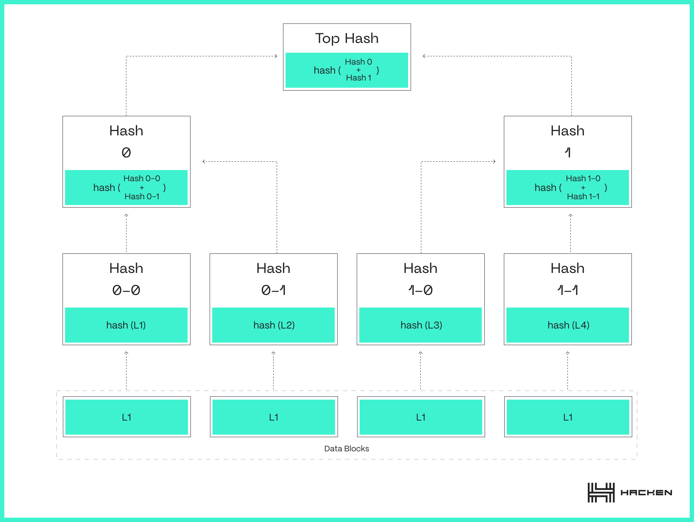

在 [上篇博客](/posts/build-a-proxy-on-blockchain) 中提到了在区块链上构建一个代理服务，然后让大家贡献自己的闲置带宽从而获取收益的想法。在写智能合约的过程中首先遇到了一个比较麻烦的问题就是如何管理白名单。前期如果只有几十个人加入我们的活动，跑我们的代理，校验这几十人的身份是很简单的，配置个白名单地址数组到合约里，定时维护就行。但是如果未来这个名单扩展到好几百几千，维护这么大的一个数组，开销就比较大了，因此在前期就应该考虑这个问题。

## 什么是 Merkle Tree

默克尔树是一个二叉树，用来快速校验一个元素是否包含在树中。这个数据结构在区块链中很常见。我们都知道区块链的一个区块是打包了几十上百笔交易的，那么在保存交易的时候是否把整个交易的数据结构序列化后再保存到硬盘的呢？答案是否定的。在区块链中只保存状态，然后给个证据证明这个状态的存在是合理的就行。

因此假设一笔交易的数据结构是这样的话：

```rs
pub struct Transaction {
    id: u128;
    from: u128;
    to: u128;
    amount: u128;
}
```

一笔交易占了4个u128，就是64个byte。那么如果一个区块打包了100笔交易，就要占用 `100 * 64 = 6400` bytes 用来保存交易记录。节点在校验一笔交易是否在这个区块中的时候，只要拿到id去遍历这100笔交易比对id就行。看起来很简单，但是实际中不是这么做的，因为太浪费存储空间了。

实际中每笔交易都有一个hash，100笔交易就有100个hash，根据这100个hash构造一棵 merkle 树，将树根的hash保存到区块链上就行。不用保存100个hash的数组也能同样实现快速校验的需求。



看起来跟二叉查找树(Binary Search Tree)很像。

### BST 搜索过程

```rs
pub struct BstNode {
    pub left: Option<Rc<BstNode>>,
    pub right: Option<Rc<BstNode>>,
    pub data: usize,
}
```

构造好一棵bst，序列化到硬盘，查找的时候从硬盘恢复到内存，然后拿待查找的元素递归地去比较就行。

### Merkle Tree 搜索过程

因为merkle tree 只保存了根hash，所以要查找的时候没法遍历树挨个节点比较，只能根据待校验的 hash，以及默克尔路径（merkle proof）去计算，看能不能恢复出相等的树根从而判断是否在树中。

## 用 merkle tree 校验白名单的实际例子

回到上面的白名单的例子，如何用merkle tree 来快速校验呢？

### js 代码

```ts
import { StandardMerkleTree } from "@openzeppelin/merkle-tree";

const whitelist = [
    '0x0000000000000000000000000000000000200001',
    '0x0000000000000000000000000000000000200002',
    '0x0000000000000000000000000000000000200003',
    '0x0000000000000000000000000000000000200004',
];

function generateMerkleRoot(whitelist: string[]): string {
    const values = whitelist.map((address) => [address]);

    const tree = StandardMerkleTree.of(values, ["address"]);
    console.log('tree', JSON.stringify(tree));
    return tree.root;
}

function generateMerkleProof(whitelist: string[], address: string) {
    const values = whitelist.map((addr) => [addr]);

    const tree = StandardMerkleTree.of(values, ["address"]);
    return tree.getProof([address]);
}
```

在这里我有5个地址的白名单，调用 openzepplin 的库就能自动计算出这5个地址的 merkle root，将这个值更新到智能合约里面。就等于在智能合约定义好了白名单。

### 智能合约的写法

```solidity
import "@openzeppelin/contracts/utils/cryptography/MerkleProof.sol";
import {Ownable} from "@openzeppelin/contracts/access/Ownable.sol";

function setMerkleRoot(bytes32 _merkleRoot) public onlyOwner {
    merkleRoot = _merkleRoot;
}

function isWhitelist(address user, bytes32[] memory proof) public returns (bool) {
    bytes32 leaf = keccak256(abi.encodePacked(keccak256(abi.encode(user))));
    return MerkleProof.verify(proof, merkleRoot, leaf);
}
```

从这里可以看出要在合约内校验是否在白名单中，需要传入用户地址和默克尔证明。`MerkleProof.verify(proof, merkleRoot, leaf)` 这个验证过程其实就是按路径从下往上恢复树根的过程，如果发现计算到的树根与保存的树根不同就说明不在白名单内。

这里对用户地址做了2次`keccak256` hash，是因为官方在实现这个库的时候为了安全考虑才决定的，见：[https://github.com/OpenZeppelin/merkle-tree?tab=readme-ov-file#standard-merkle-trees](https://github.com/OpenZeppelin/merkle-tree?tab=readme-ov-file#standard-merkle-trees)

> The leaves are double-hashed to prevent second preimage attacks.

## 存在的问题

用这种方式管理员更新白名单的时候只要把线下计算出来的树根更新到合约中就行，但是客户端在调用合约的时候就得多传一个 merkle proof 进去。如果白名单很少，这个路径也不长，但是因为这是一棵二叉树，当白名单数量达到1024以上的时候，merkle proof 的长度就大于10了，可能会导致每笔交易的gas增多。如何解决这个问题呢？问了AI也没有很好的办法，暂且这么做吧。
