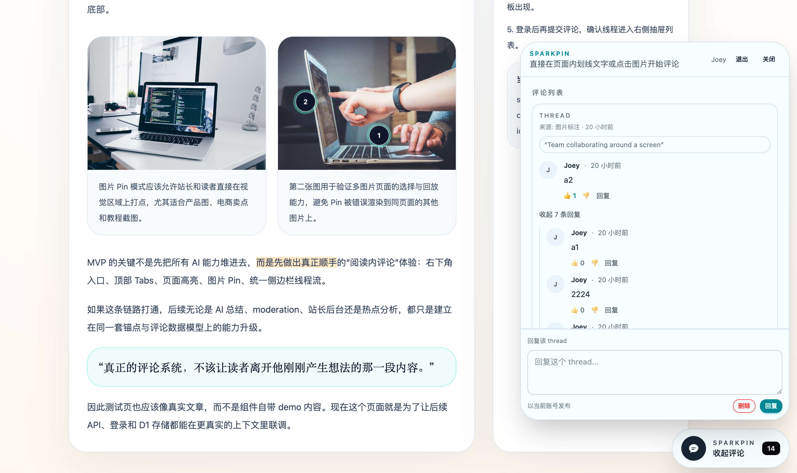
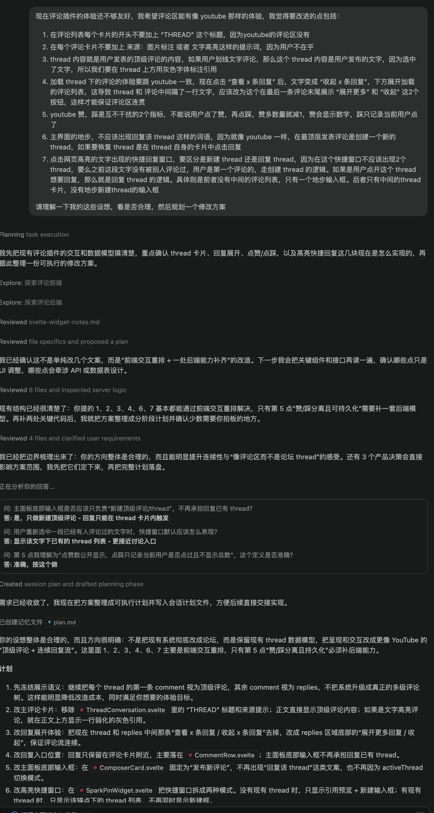
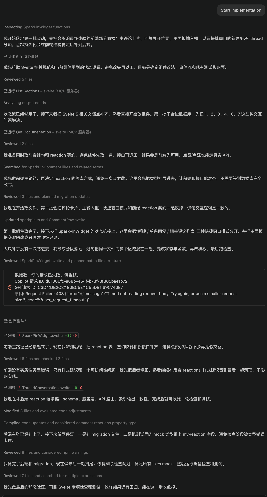
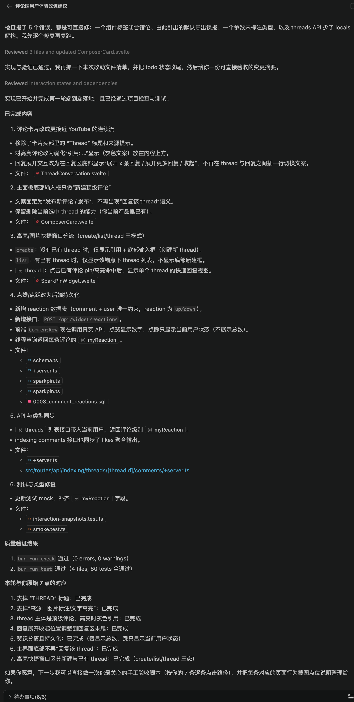
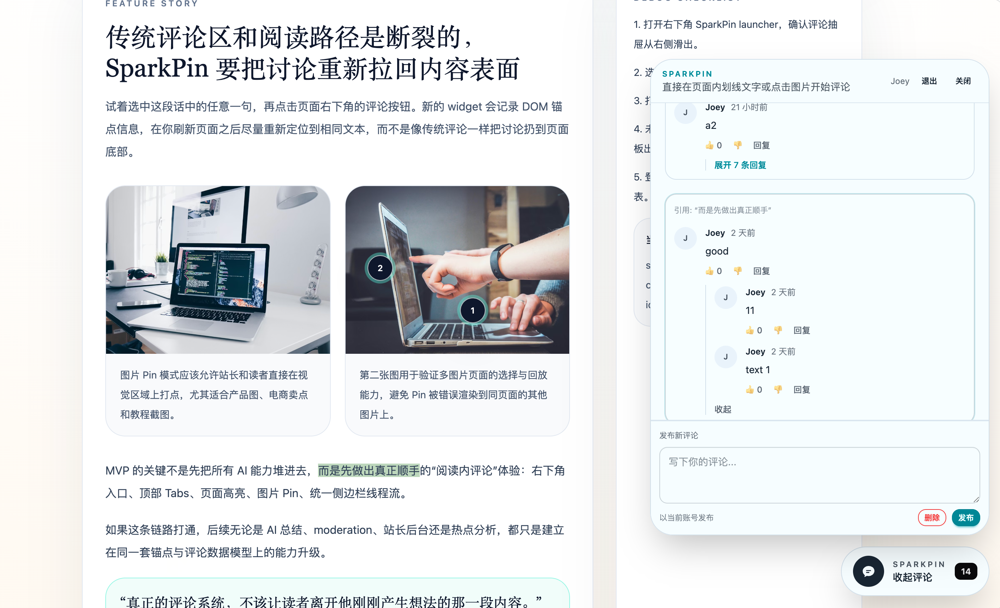

最近AI coding agent 能力又更新了，能长时间连续生成代码，所以想体验一下一行代码不写，全程让AI工作的流程，在工作中不敢这么放权给AI，因为它不一定能正确理解业务需求，生成的代码也要一行一行确认和修改，但是这种个人项目完全没负担。

我想做的是一个网页评论插件，就像 disqus 这种一样，能外挂到已有的网站上，然后底部就出现一个悬浮按钮，点击后出现弹窗，在这个弹窗可以跟访问网页的其他人对话聊天。

这个产品我去年这会儿也做过，当时应该连续做了一个多月：见： [markflow](/posts/markflow-now-support-pin-comment)，先做了 chrome 插件，又做了网页 widget，存储数据结构，网页定位都是自己设计的，因为那时候的AI设计能力还不强，只能按需求去补齐一些代码，所以对人的要求还是很高的。现在我承认AI的水平比我高，尝试一下放权完全由AI来生成代码。

## 首次生成的效果



可以看到现在右下角的按钮已经出现了，并且弹窗也加载了。评论风格我参考的是 youtube 和抖音这些的模式，也就是顶级评论是 thread，每个 thread 下面可以挂一系列评论列表。

整个项目的代码基本都是 AI 写的，我只是使用工具创建了项目的脚手架代码，通过

```shell
bunx sv create my-app
```

我选择的技术栈是：

- svelte 5
- tailwindcss 4
- daisyui
- better-auth
- cloudflare workers
- drizzle orm

## 如何跟 AI 对话

很简单，我就是把需求描述清楚，一次性自己很难把需求想全面，所以有了一些基本的想法后，就先用 copilot 的 plan mode 跟 AI 讨论一些需求



在讨论需求时，AI会把一些不明确的点提取出来，让我再确认一遍，所以就算第一次没想全，用 planmode AI也会帮你完善思路。

基本一轮沟通就够了，就可以让 AI 去实现，我一般不会提很复杂的需求也不会在 plan mode 里反复改需求，在聊天框有一个 start implementation 按钮，点击就切换到 agent 模式自主基于上面的需求开始编码



AI 怎么生成代码的就不管了，反正质量不错，写完代码还会遵守 AGENTS.md 里面的开发规范，例如跑一遍 build 和 test 流程看看是否报错，我因为使用的是 svelte 框架，还会通过官方提供的 mcp 将代码发给官方的一个服务去检测代码质量，确保符合规范。

现在的 AI agent 都有记忆能力，所以 plan mode 生成的明确开发计划会传递给 agent，agent 在执行中如果崩溃了，也能从 session 里恢复出上下文，从而继续上次的进度，在上面的截图中就可以看出 agent 奔溃过一次，因为接口超时了，但是没关系直接点击重试就解决了，之前生成的代码都还在。



## 实现的效果

半小时左右做完上面7个需求，不算快，但是比人工已经快多了，而且全程不需要人接入，因为我配置了自动通过。只有中途网络断了2次，我点了一下重试，跟去年比起来，连续做需求的能力提升了很多。



比我想的全多了，UI也按照AI的审美来，我觉得还挺好看的。

## 集成到我的博客

我自己是这个挂件的第一个用户，所以我在我的博客先试用一下。集成也很简单，先去 SaaS 后台创建站点，得到 siteId, siteKey，然后在博客的布局页引入 js 文件，然后在合适的地方插入 web component 组件。我的博客全静态的，所以我就在base layout 引入，然后在全局展示这个评论区按钮。

```html {3, 8}
<html>
	<head>
		<script defer src="https://sparkpin.xyz/widget/sparkpin-widget.js?v2"></script>
	</head>
	<body>
        <!-- 省略了其它网页模版 -->

		<spark-pin site-id="site_xxx" site-key="spk_live_xxx" api-origin="https://sparkpin.xyz" />
	</body>
</html>
```

就是插入2行代码搞定，未来不想要了，直接删掉这2行代码就行