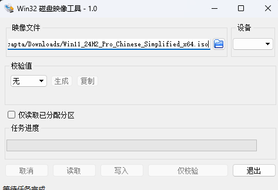
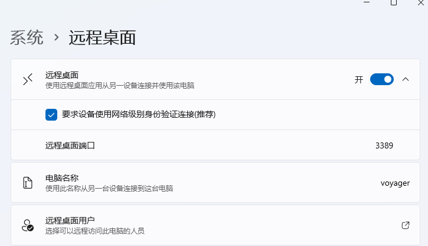
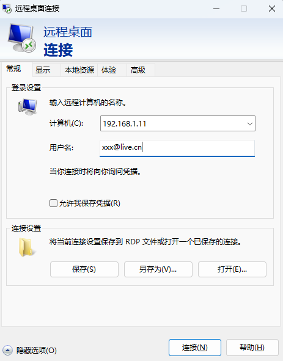
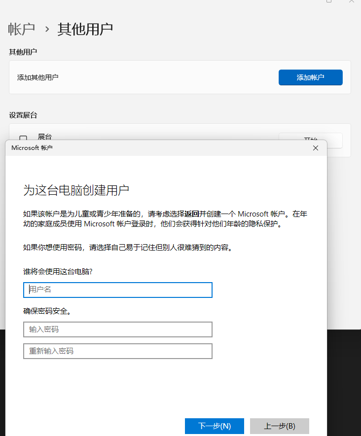
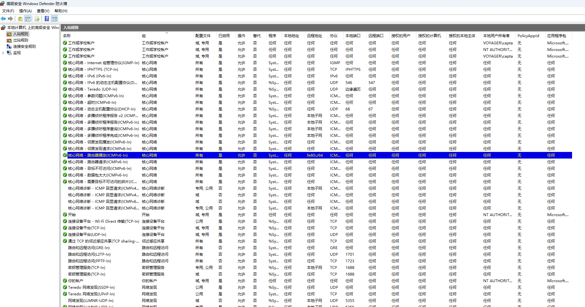
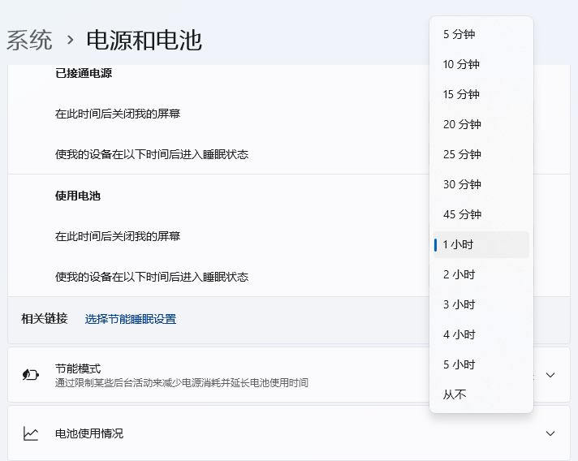

家里这台 minisforum 的 x400 小电脑闲置了快一年了，昨晚媳妇说她的笔记本电池损耗了不耐用，我就提议把家里这台电脑装好环境，然后用 小米平板6s pro 远程连接这台电脑，这样携带方便，跑专业软件也方便，尤其是待机时间长。1w mAh 的电量还是很给力的。

说干就干，首先要刻盘装 windows 系统，然后就是配置网络，检查是否可以远程连接。

## 下载 Windows 11 系统

现在都不需要下载什么 PE 装机软件了，微软提供了 ISO 文件的下载链接，直接搜索下载就好，我下载的是 `Win11_24H2_Pro_Chinese_Simplified_x64.iso` 专业版， 5.4G

## 刻录到 U 盘

这步比较烦，耽误了比较多时间，我本机安装的刻录软件是 `Win32DiskImager`，默认选项就开始刻，但是拿到那台 x400 机器上却一直没法检测到启动盘。

我还以为这个软件出问题了，或者是下错了 ISO，又一通排查。后来先尝试了下载 `UltraISO` 这个老牌刻盘软件，搜出了一堆广告，下下来安装要么是让我装 360 全家桶，要么是让我付费购买正版的。在此鄙视一下百度和360，真是不要脸，啥有用的都搜不到，净看广告了。

卸载完着急忙慌装的那几个 `UltraISO` 广告软件后，有点后怕，万一电脑被这些垃圾软件种木马病毒了咋办，开 Defender 扫描了一下，没发现问题，万幸，以后可千万不能随便安装从百度下载的软件了，切记切记。

后来又搜了一下 `Rufus` 这是另一个老牌的刻系统的软件，免安装，有官网，口碑信得过，直接下载刻盘，插入到x400 USB口开机进入bios找启动盘，还是找不到。

到此已经耽误了我一两个小时了，我这个U盘写入速度很慢，只有20M的速度，每次写5G的内容，还是挺浪费时间的，但是又不想放弃，后来终于灵光一闪，会不会我插的USB口有问题，导致无法检测到启动盘，我这个机器是有4个USB的，2个插了键盘鼠标，只剩下2个用来插U盘，赶紧给他们换个位置，这回终于检测到我的U盘了，难题告破。

在这里总结一下经验，遇事不要慌，没检测到启动盘不一定是刻录软件出错了，也不一定是下载的ISO出错了，不要急着去百度搜解决办法，多少年没从百度上搜过软件，装过软件了，果然还是那个百度，搜到的都是假的。就装了3个盗版软件，希望别给我电脑种病毒，求求了。

## 安装操作系统

装机这里就简单了，插入U盘后，开机界面长按 <kbd>ESC</kbd> 键，进入 BIOS，这里直接切换到最右边菜单栏 `Boot & Exit`，里面有 `Boot Override` 选项，找到插入的U盘，按回车就会进入 U 盘里的安装程序了。

经典的安装程序，选择安装的硬盘，输入 Windows 账号，联网更新，完事。

这里很烦的一点在于，Windows 账号现在跟微软账号绑定了，登录必须要联网才行，不能像以前那样创建离线账号了。

## 激活Windows

又是百度搜如何激活Windows，又给我引导到广告上了，下载了一个激活软件，点开是让我付费的，说扫30块钱就能永久激活。这个我是不信的，现在这台笔记本上的windows系统前几年安装的时候是从淘宝6块钱买的激活码。换bing搜索，终于搜到了我要的内容，免费的激活码。这种方式说不定啥时候就被封，但无所谓，这台电脑也不知道要用多久。

## 启用远程桌面

以前开启远程桌面要配置好多地方，什么选择用户，开启服务，配置防火墙啥的，这几年也许微软改进了用户体验，一键就能开启远程桌面了。

然后来到我的笔记本上，测试下能不能远程登录到这台刚配置好的 x400 主机上。

计算机名当然就是这个新系统的ip地址，用户名我选择的是我的微软邮箱账号，这时候密码不知道填啥了，因为装系统创建账号的时候没输入密码啊，
只填了一个邮箱地址，然后手机上就收到 `2FA` 验证的数字，点一下授权就通过了，然后又创建了一个 PIN 码，这玩意也不是密码吧，反正试了几次
都提示 Credential 不对的报错。经过一番google搜索，才知道原来很多人也遇到类似的问题，给的解法是创建一个本机的有密码的账户。

虽然不太方便，但还是照做吧，安全性更高点。

在 `账户` > `其他` 里面新建用户，输入用户名密码就行，然后回到远程桌面的配置那里，添加这个用户到允许远程登录里面。
这时候回到我的笔记本上，再用新建的这个用户登录就成功了。

windows的远程桌面，只允许一个用户使用，所以如果我在笔记本上远程连接，我的x400上的用户就会被踢下线，挺不方便的，像linux的ssh远程登录就能同时允许几十个用户同时在线，
不知道是什么原理，可能是要抢占图形输出口吧。

## 配置网络和防火墙

我家的运营商是北京移动，默认给了ipv6，所以很幸运我这台电脑有ipv6地址，这也说明能直接通过ipv6访问到我家的这台服务器。想从笔记本上ping一下看看用ipv6到这台服务器的速度怎样，
但是死活ping不通，搞得我都有点怀疑是不是windows没启用ipv6，但是明明显示有ipv6地址。

从路由器上找到了路由器的ipv6地址，从我一台有ipv6的vps上，ping了一下我家的路由器，这个链路是通的，所以唯一的可能就是windows操作系统，屏蔽了外界对我这个x400机器ipv6地址
的icmp协议。

找了一下防火墙，还真找到了这个规则，看配置，应该是只允许 `fe80::/64` 这个子网的机器去 ping，也就是说只能在本机才能ping通这个网卡，局域网内互相ping ipv6都不行，windows默认的
安全配置还挺高的，我记得之前装linux，默认防火墙都是开放了ipv6 的ping的。

但是为啥我在笔记本上，用x400机器的 ipv6 地址，远程连接又能连上呢？说明windows防火墙对于远程登录的请求还是允许了，不管是通过ipv4还是v6，不管是局域网还是广域网，这点还挺人性化的。
这里也能理解微软为啥默认要求用户创建一个新的账号来进行远程连接了，通过一个公开的远程登录协议获取到 Administrator 权限，还是比较危险。

到这里就算是配置好了，默认的防火墙规则够安全的了，不需要自己再配置，不过因为ipv6地址是公开访问的，所以最好不要随意发到互联网上，运营商也对ipv6地址做了一些安全性设置，就是
隔一段时间换一个地址。这点安全性是有了，但是易用性又下降了，如果我出差好几天在外地，就无法知道最新的ipv6地址，从而导致无法连接上。

## DDNS

怎么解决ipv6地址更新的问题呢？我能想到一个简单的做法，就是写一个脚本，定时执行 `ipconfig`，匹配出最新的 ipv6 地址，判断跟上次有没有变化，如果有就将最新的ip更新到一个服务器上。
这个办法在linux系统上倒是好解决，但是在windows上如何写定时任务我都不会，挺烦人的。

搜了一下网上有人说刷了 `OpenWrt` 的路由器有插件能将ipv6地址，动态更新到 dnspod，也就是腾讯云用的域名服务商上，这种做法的思路跟我上面的是一样的，不过人家的定时任务是内置在
路由器上的。要迁移到本机上也不难，不过要调用腾讯云的接口，我有腾讯云账号，买个域名也不贵，不过问题还是回到windows定时任务这块，得学习如何创建定时任务。

还有一点要注意的，windows 11桌面版，为了节能，默认是会休眠的，所以就算设置了定时任务，也要测试下，如果系统休眠了，调度器是否还会到时间唤醒系统执行更新ip的脚本，然后继续去休眠。
这个自动休眠很烦人，因为会导致远程桌面也断开连接。如果连接断了，又休眠了，可能就连不上了。

## 解决Windows自动休眠

要解决这个问题有2个办法，1是禁止休眠

将休眠时间改为从不就是了，不过windows开机可能比较耗能，所以微软默认是1小时没使用就休眠。这个问题我在linux系统上没遇到过，可能是因为linux服务器默认不启动桌面，只是一些后台软件在运行
不太耗能，所以没加自动休眠这个选项吧。

还有一个办法是 `Wake On LAN`，这个要去 BIOS 上设置，当检测到网卡有请求进来的时候，唤醒操作系统，我没试过这个办法，听起来不错，唯一担心的点在于，我可能无法获取到最新的 ipv6 地址，导致
无法正确唤醒这个机器，如果我在外地的话。

## 总结

本文梳理了一下安装windows的过程，以及遇到的一些问题，留下了一个跑定时任务的问题待学习
